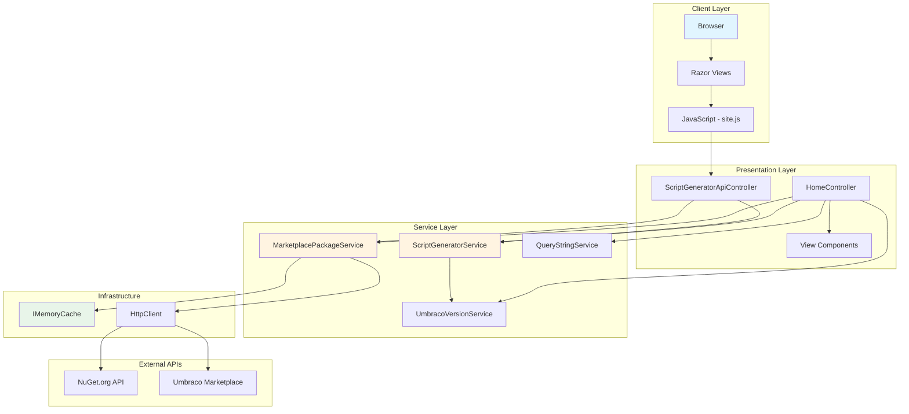
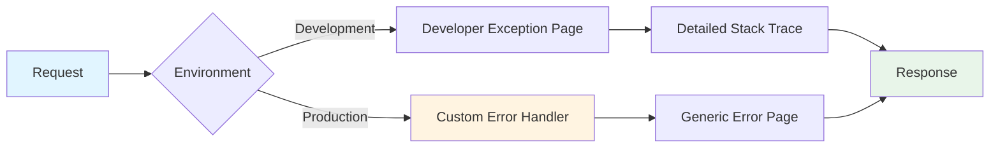

# Architecture

## High-Level Architecture



## Application Layers

### 1. Presentation Layer

**Controllers**: Handle HTTP requests and orchestrate responses

- **HomeController.cs**: Main MVC controller for page rendering
  - Handles GET/POST requests for the main page
  - Loads/manages package options from query strings
  - Caches package and template data (60-minute TTL)
  - Orchestrates script generation

- **ScriptGeneratorApiController.cs**: RESTful API for script generation
  - `POST /api/scriptgeneratorapi/generatescript` - Generates installation scripts
  - `POST /api/scriptgeneratorapi/getpackageversions` - Fetches NuGet package versions
  - `GET /api/scriptgeneratorapi/clearcache` - Clears in-memory cache

- **UUIController.cs**: Umbraco Unified Interface sandbox

**View Components**: Modular UI sections (10+ components)

| Component | Purpose |
|-----------|---------|
| `PackageViewComponent` | Displays package selection cards with checkboxes |
| `InstallScriptViewComponent` | Shows generated script with syntax highlighting |
| `OptionsViewComponent` | Configuration form for project settings |
| `UmbracoVersionsViewComponent` | Version lifecycle table with LTS/STS status |
| `TabNavigationViewComponent` | Tab navigation between sections |
| `SiteHeaderViewComponent` | Site header and branding |
| `SiteFooterViewComponent` | Site footer with links |
| `AboutViewComponent` | About section and project info |
| `PopularScriptsViewComponent` | Pre-configured popular script templates |
| `ShareViewComponent` | URL sharing and localStorage management |

### 2. Service Layer

Business logic services with clear separation of concerns:

| Service | Responsibility |
|---------|---------------|
| **ScriptGeneratorService** | Generates shell scripts for Umbraco installation |
| **MarketplacePackageService** | Fetches packages from Umbraco Marketplace and NuGet.org |
| **QueryStringService** | Converts between query strings and view models |
| **UmbracoVersionService** | Manages Umbraco version lifecycle data |

All services are registered with **Scoped** lifetime in the DI container.

### 3. Infrastructure Layer

**Caching**:
- **IMemoryCache**: In-memory cache with 60-minute expiration
- Cache keys: `all-packages`, `package-versions-{packageId}`, `umbraco-templates`
- Provides 100x performance improvement over non-cached requests

**HTTP Client**:
- **HttpClientFactory**: Factory-based HTTP client management
- Used for external API calls to NuGet.org and Umbraco Marketplace
- Proper connection pooling and disposal handling

**Middleware**:
- **SecurityHeadersMiddleware**: Adds security headers to all responses
- Custom middleware for adding `X-Frame-Options`, `X-Content-Type-Options`, etc.

## Project Structure

```
src/PSW/
├── Components/              # View Components (10+ files)
│   ├── AboutViewComponent.cs
│   ├── InstallScriptViewComponent.cs
│   ├── OptionsViewComponent.cs
│   ├── PackageViewComponent.cs
│   ├── PopularScriptsViewComponent.cs
│   ├── ShareViewComponent.cs
│   ├── SiteFooterViewComponent.cs
│   ├── SiteHeaderViewComponent.cs
│   ├── TabNavigationViewComponent.cs
│   └── UmbracoVersionsViewComponent.cs
├── Config/                  # Configuration
│   └── PSWConfig.cs        # App settings model
├── Constants/               # Global constants
│   ├── DefaultValues.cs    # Default project values
│   └── GlobalConstants.cs  # Template constants
├── Controllers/             # MVC & API Controllers
│   ├── HomeController.cs   # Main page controller
│   ├── ScriptGeneratorApiController.cs
│   └── UUIController.cs
├── Dictionaries/           # Template mappings
│   └── TemplateDictionary.cs
├── Enums/                  # Enumerations
│   └── DatabaseType.cs
├── Extensions/             # Extension methods
│   └── UriExtensions.cs
├── Middleware/             # Custom middleware
│   └── SecurityHeadersMiddleware.cs
├── Models/                 # Data models
│   ├── PackagesViewModel.cs       # Main view model (20+ properties)
│   ├── GeneratorApiRequest.cs     # API request DTO
│   ├── PagedPackages.cs           # Marketplace feed (500+ lines)
│   └── NuGet models/              # NuGet API responses
├── Services/               # Business logic (5 files)
│   ├── IScriptGeneratorService.cs
│   ├── IPackageService.cs
│   ├── IQueryStringService.cs
│   ├── IUmbracoVersionService.cs
│   ├── ScriptGeneratorService.cs
│   ├── MarketplacePackageService.cs
│   ├── QueryStringService.cs
│   └── UmbracoVersionService.cs
├── Views/                  # Razor templates (21 files)
│   ├── Home/
│   │   └── Index.cshtml           # Main page
│   ├── Shared/
│   │   ├── Components/            # View component templates
│   │   ├── _Layout.cshtml
│   │   └── Error.cshtml
│   └── UUI/                       # Umbraco Unified Interface views
├── wwwroot/                # Static assets
│   ├── css/
│   │   ├── bootstrap/
│   │   └── site.css
│   ├── js/
│   │   ├── site.js                # Main JavaScript (740+ lines)
│   │   └── prettyprint/           # Syntax highlighting
│   ├── images/
│   └── lib/
├── appsettings.json        # Application configuration
├── appsettings.Development.json
├── Program.cs              # Application entry point
└── PSW.csproj             # Project file
```

## Technology Stack

| Category | Technology | Purpose |
|----------|-----------|---------|
| **Framework** | ASP.NET Core 9.0 | Web application framework |
| **Language** | C# 13 | Primary programming language |
| **Frontend** | Razor Pages | Server-side rendering |
| **JavaScript** | Vanilla JS (740+ lines) | Client-side interactivity |
| **UI Framework** | Bootstrap 5 | Responsive design and components |
| **HTTP Client** | HttpClientFactory | External API communication |
| **Caching** | IMemoryCache | In-memory data caching |
| **Serialization** | System.Text.Json | JSON parsing and generation |
| **XML Processing** | XmlSerializer | NuGet feed parsing |
| **Build Tools** | .NET SDK, dotnet format | Build and code formatting |
| **Security** | Custom Middleware | Security headers |

## Component Interaction

### View Components Architecture

```mermaid
graph TD
    A[Index.cshtml - Main Page] --> B[SiteHeaderViewComponent]
    A --> C[TabNavigationViewComponent]
    A --> D[PackageViewComponent]
    A --> E[OptionsViewComponent]
    A --> F[InstallScriptViewComponent]
    A --> G[PopularScriptsViewComponent]
    A --> H[AboutViewComponent]
    A --> I[UmbracoVersionsViewComponent]
    A --> J[ShareViewComponent]
    A --> K[SiteFooterViewComponent]

    D --> D1[Package Cards with Checkboxes]
    D --> D2[Version Dropdowns]
    D --> D3[Search Filter]

    E --> E1[Template Selection]
    E --> E2[Project Configuration]
    E --> E3[Database Settings]
    E --> E4[Docker Options]

    F --> F1[Script Output Pre Block]
    F --> F2[Copy Button]
    F --> F3[Syntax Highlighting]

    style A fill:#e1f5ff
    style D fill:#fff4e1
    style E fill:#fff4e1
    style F fill:#fff4e1
```



## File Statistics

| Metric | Count |
|--------|-------|
| C# Files | 49 |
| Razor Views (.cshtml) | 21 |
| View Components | 10+ |
| JavaScript LOC | 740+ |
| ScriptGeneratorService LOC | 327 |
| Total Project Lines | 4,000+ |
| Supported Umbraco Versions | 7-21+ |
| External API Integrations | 2 (NuGet.org, Umbraco Marketplace) |

## Design Patterns

### Dependency Injection

All services use constructor injection with interface-based contracts:

```csharp
public class ScriptGeneratorService : IScriptGeneratorService
{
    private readonly PSWConfig _pswConfig;
    private readonly IUmbracoVersionService _umbracoVersionService;

    public ScriptGeneratorService(
        IOptions<PSWConfig> pswConfig,
        IUmbracoVersionService umbracoVersionService)
    {
        _pswConfig = pswConfig.Value;
        _umbracoVersionService = umbracoVersionService;
    }
}
```

### Repository Pattern (Simplified)

Services act as repositories for external data:
- `IPackageService` - Repository for package data
- No direct database access (stateless application)

### Factory Pattern

- `HttpClientFactory` for creating HTTP clients
- Ensures proper lifecycle management

### View Component Pattern

Modular UI components that can be independently rendered:

```razor
@await Component.InvokeAsync("Package", new { model = Model })
@await Component.InvokeAsync("Options", new { model = Model })
```

## Scalability Considerations

### Current Limitations

1. **Single-Server Architecture**: In-memory cache doesn't scale horizontally
2. **No Database**: All data fetched from external APIs
3. **Synchronous Processing**: Script generation is synchronous

### Potential Improvements for Scale

1. **Distributed Caching**: Redis or SQL Server cache for multi-server deployments
2. **CDN Integration**: Serve static assets from CDN
3. **API Rate Limiting**: Protect against abuse
4. **Background Jobs**: Queue-based script generation for complex requests
5. **WebSocket Support**: Real-time script updates

## Error Handling



**Exception Handling Strategy**:
- Development: Full stack traces for debugging
- Production: User-friendly error pages via `/Home/Error`
- No sensitive information exposed in production errors

---

[← Back to Documentation Index](documentation.md)
