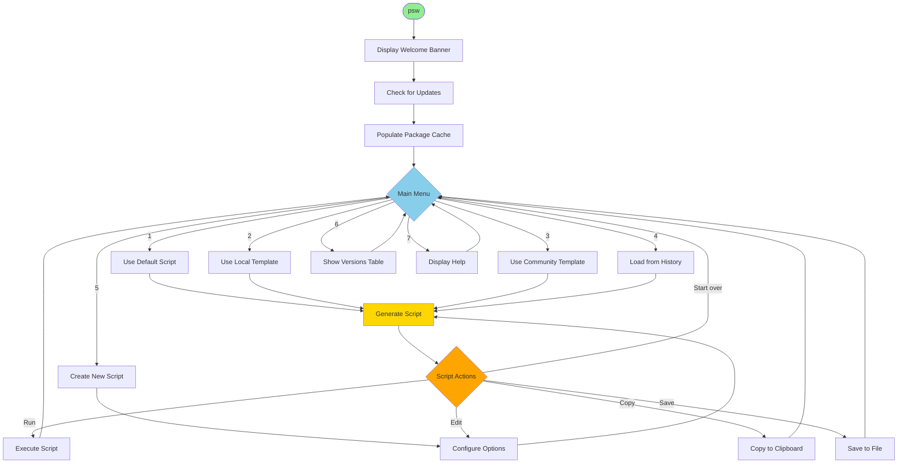
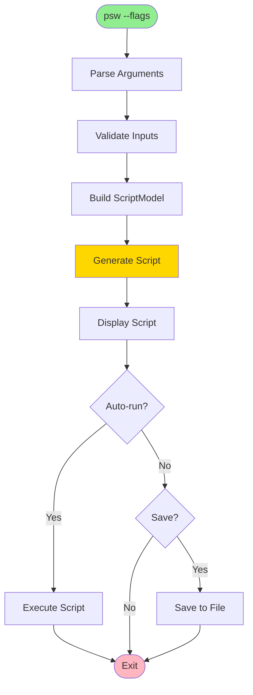

# Package Script Writer CLI - Technical Documentation

Welcome to the complete technical documentation for the Package Script Writer CLI tool. This documentation provides comprehensive coverage of all aspects of the CLI application, from architecture to advanced usage.

---

## 🌟 Project Overview

**Package Script Writer CLI** (`psw`) is a command-line interface for generating Umbraco CMS installation scripts. Built with .NET 10.0 and Spectre.Console, it provides both an interactive terminal UI and command-line automation capabilities.

### Key Features

- 🎨 **Interactive Terminal UI** - Beautiful Spectre.Console interface
- 🚀 **Dual Mode Operation** - Interactive OR CLI automation
- 📦 **500+ Packages** - Browse Umbraco Marketplace packages
- 💾 **Template System** - Save and reuse configurations
- 📊 **History Tracking** - Automatic script generation history
- 🔒 **Security** - Command validation and secure input
- 🔄 **Resilient** - Automatic retry with exponential backoff
- 🐳 **Docker Support** - Optional container configuration

### Package Information

**NuGet Package**: [PackageScriptWriter.Cli](https://www.nuget.org/packages/PackageScriptWriter.Cli/)
**Version**: 1.0.0 (Stable)
**Command**: `psw`
**Framework**: .NET 10.0

---

## 📚 Documentation Structure

The documentation is organized into the following sections:

### Getting Started

#### [🚀 Quick Start](../src/PackageCliTool/README.md)
Everything you need to get up and running quickly.

**Topics**:
- Installation from NuGet
- First time setup
- Basic usage examples
- Quick command reference

[➡️ Read Quick Start Guide](../src/PackageCliTool/README.md)

---

### User Guides

#### [🎯 Interactive Mode Guide](cli/interactive-mode.md)
Complete guide to using the interactive menu-driven interface.

**Topics**:
- Main menu options and navigation
- Default script generation
- Template loading and management
- Community templates
- History browsing and re-running
- Custom script configuration
- Umbraco versions table
- Keyboard shortcuts and navigation tips

**Includes**: Visual examples of all menus and prompts

[➡️ Read Interactive Mode Guide](cli/interactive-mode.md)

---

#### [📋 Default Script Guide](cli/default-script.md)
Quick script generation with sensible defaults.

**Topics**:
- What's included in default scripts
- When to use default scripts
- Customizing defaults
- CLI mode vs interactive mode
- Examples and use cases

[➡️ Read Default Script Guide](cli/default-script.md)

---

#### [🎨 Custom Script Guide](cli/custom-script.md)
Building fully customized scripts with complete control.

**Topics**:
- Template and project settings
- Package selection and versions
- Starter kit configuration
- Docker support
- Unattended install setup
- Output format options
- Configuration workflow
- Best practices

[➡️ Read Custom Script Guide](cli/custom-script.md)

---

### Features

#### [💾 Templates System](cli/templates.md)
Save and reuse script configurations.

**Topics**:
- Creating templates
- Loading templates
- Template file format (YAML)
- Importing and exporting
- Template validation
- Overriding template values
- Template management commands

[➡️ Read Templates Guide](cli/templates.md)

---

#### [🌍 Community Templates](cli/community-templates.md)
Using and contributing community-shared templates.

**Topics**:
- Browsing community templates
- Using community templates
- Creating your own templates
- Contributing to the repository
- Template security guidelines
- YAML format specifications

[➡️ Read Community Templates Guide](cli/community-templates.md)

---

#### [📊 History System](cli/history.md)
Automatic tracking of all generated scripts.

**Topics**:
- Viewing history
- Re-running scripts
- History details and metadata
- Managing history entries
- History commands reference
- File locations and storage

[➡️ Read History Guide](cli/history.md)

---

#### [🔒 Security Features](cli/security.md)
Security measures and command validation.

**Topics**:
- Command allowlist
- Validation process
- Secure password input
- Script regeneration (not storage)
- Security best practices
- Reporting security issues

[➡️ Read Security Guide](cli/security.md)

---

### Reference

#### [📖 CLI Command Reference](cli-documentation.md)
Complete command-line reference with all flags and options.

**Topics**:
- All CLI flags and options
- General commands
- Script configuration
- Docker options
- Unattended install
- Output options
- Template commands
- History commands
- Examples for all commands

[➡️ Read CLI Reference](cli-documentation.md)

---

#### [📊 Umbraco Versions Reference](cli/umbraco-versions.md)
Umbraco CMS version information and support timelines.

**Topics**:
- Version table and status
- LTS vs Latest vs EOL
- Version selection guide
- Package compatibility
- Support timelines
- Migration paths

[➡️ Read Umbraco Versions Reference](cli/umbraco-versions.md)

---

### Release Information

#### [📝 Release Notes](cli/release-notes.md)
Version history and changelog.

**Topics**:
- Version 1.0.0 release notes
- Feature list
- Package information
- Acknowledgments

[➡️ Read Release Notes](cli/release-notes.md)

---

## 🏗️ Technical Architecture

### Technology Stack

- **Framework**: .NET 10.0
- **UI Library**: Spectre.Console (v0.49.1)
- **Logging**: Serilog
- **Resilience**: Polly (retry policies)
- **Serialization**: YamlDotNet (templates), System.Text.Json
- **HTTP**: HttpClient with retry logic

### Project Structure

```
src/PackageCliTool/
├── Program.cs                  # Entry point
├── Workflows/
│   ├── InteractiveModeWorkflow.cs    # Interactive mode logic
│   ├── CliModeWorkflow.cs            # CLI automation logic
│   ├── TemplateWorkflow.cs           # Template commands
│   ├── HistoryWorkflow.cs            # History commands
│   └── CommunityTemplateWorkflow.cs  # Community templates
├── Services/
│   ├── ApiClient.cs                  # API communication
│   ├── ScriptGeneratorService.cs    # Script generation
│   ├── PackageSelector.cs           # Package selection UI
│   ├── HistoryService.cs            # History tracking
│   ├── TemplateService.cs           # Template management
│   ├── CommunityTemplateService.cs  # Community templates
│   ├── ScriptExecutor.cs            # Script execution
│   └── ResilientHttpClient.cs       # HTTP with retries
├── UI/
│   ├── ConsoleDisplay.cs            # Display utilities
│   ├── InteractivePrompts.cs        # User prompts
│   ├── ConfigurationDisplay.cs      # Config summaries
│   └── ErrorHandler.cs              # Error display
├── Models/
│   ├── ScriptModel.cs               # Configuration model
│   ├── HistoryEntry.cs              # History entry
│   ├── TemplateModel.cs             # Template model
│   └── CommandLineOptions.cs        # CLI options
└── Validation/
    ├── CommandValidator.cs          # Security validation
    └── InputValidator.cs            # Input validation
```

### Key Components

#### **Workflows**
Orchestrate the different modes and commands:
- **InteractiveModeWorkflow** - Main menu and interactive prompts
- **CliModeWorkflow** - Command-line flag processing
- **TemplateWorkflow** - Template save/load/manage
- **HistoryWorkflow** - History list/show/rerun

#### **Services**
Business logic and external communication:
- **ScriptGeneratorService** - Local script generation
- **ApiClient** - Marketplace package fetching (with retries)
- **PackageSelector** - Interactive package/template selection
- **HistoryService** - JSON-based history tracking
- **TemplateService** - YAML template management

#### **UI Components**
Terminal interface using Spectre.Console:
- Rich formatting and colors
- Interactive selection prompts
- Multi-select lists
- Progress spinners
- Tables and panels
- Syntax highlighting

---

## 🔄 Process Flows

### Interactive Mode Flow



### CLI Mode Flow



[➡️ View Detailed Flow Diagrams](CLI-Interactive-Mode-Flow.md)

---

## 📡 API Integration

The CLI tool integrates with the Package Script Writer web API:

**Base URL**: `https://psw.codeshare.co.uk`

**Endpoints Used**:
- `POST /api/scriptgeneratorapi/getpackageversions` - Get package versions
- `GET /api/scriptgeneratorapi/getallpackages` - Get marketplace packages

**Resilience**:
- Automatic retry with exponential backoff (3 attempts)
- Fallback to cached data on failure
- Comprehensive error logging

[➡️ Full API Documentation](api-reference.md)

---

## 💻 Development Guide

### Building from Source

```bash
# Clone repository
git clone https://github.com/prjseal/Package-Script-Writer.git
cd Package-Script-Writer

# Build CLI tool
cd src
dotnet build PackageCliTool -c Release

# Run locally
cd PackageCliTool
dotnet run

# Or pack and install globally
dotnet pack -c Release
dotnet tool install --global --add-source ./bin/Release PackageScriptWriter.Cli
```

### Running Tests

```bash
# From src directory
dotnet test

# With coverage
dotnet test --collect:"XPlat Code Coverage"
```

### Code Structure Guidelines

- **Workflows** - Orchestration, no business logic
- **Services** - Business logic, reusable
- **UI** - Display only, minimal logic
- **Models** - Data structures, validation attributes
- **Validation** - Security and input validation

### Logging

Logging uses Serilog with file and console sinks:

**Log Locations**:
- `logs/psw-cli-{Date}.log`
- Console (colored output)

**Log Levels**:
- Debug: `--verbose` flag
- Information: Default
- Warning: Issues, retries
- Error: Failures

**Enable Verbose**:
```bash
psw --verbose
# or
export PSW_VERBOSE=1
```

---

## 🔧 Configuration

### User Data Locations

**Templates**:
- Linux/macOS: `~/.psw/templates/`
- Windows: `%USERPROFILE%\.psw\templates\`

**History**:
- Linux/macOS: `~/.psw/history/history.json`
- Windows: `%USERPROFILE%\.psw\history\history.json`

**Cache**:
- Linux/macOS: `~/.psw/cache/`
- Windows: `%USERPROFILE%\.psw\cache\`

**Logs**:
- `logs/psw-cli-{Date}.log` (current directory)

### Application Settings

**appsettings.json**:
```json
{
  "ApiBaseUrl": "https://psw.codeshare.co.uk",
  "Logging": {
    "LogLevel": {
      "Default": "Information"
    }
  },
  "Polly": {
    "RetryCount": 3,
    "RetryDelaySeconds": 2
  }
}
```

---

## 🐛 Troubleshooting

### Common Issues

#### Tool Not Found After Install

**Problem**: `psw: command not found`

**Solution**:
```bash
# Ensure .NET tools path is in PATH
# Linux/macOS
export PATH="$PATH:$HOME/.dotnet/tools"

# Windows (PowerShell)
$env:PATH += ";$env:USERPROFILE\.dotnet\tools"
```

#### Package Cache Issues

**Problem**: Package list not loading

**Solution**:
```bash
# Clear cache
psw --clear-cache

# Or manually
rm -rf ~/.psw/cache/
```

#### Template Not Loading

**Problem**: Template validation failed

**Solution**:
- Check YAML syntax
- Validate with: `psw template validate <file>`
- Ensure all required fields present

### Getting Help

1. Check this documentation
2. Review [GitHub Issues](https://github.com/prjseal/Package-Script-Writer/issues)
3. Enable verbose logging: `psw --verbose`
4. Check log files in `logs/` directory
5. Open a new issue with logs

---

## 🤝 Contributing

We welcome contributions! See [Development Guide](development-guide.md) for details.

**Areas for Contribution**:
- Bug fixes
- New features
- Documentation improvements
- Community templates
- Testing

---

## 📖 Related Documentation

### Web Application

- **[Main Documentation](documentation.md)** - Web app documentation
- **[API Reference](api-reference.md)** - REST API
- **[Architecture](architecture.md)** - System architecture

### External Resources

- **[Umbraco Documentation](https://docs.umbraco.com)** - Umbraco CMS
- **[Spectre.Console](https://spectreconsole.net)** - Terminal UI library
- **[.NET Documentation](https://docs.microsoft.com/dotnet)** - .NET platform

---

## 📊 Statistics

**Lines of Code**: ~5,000
**Dependencies**: 6 NuGet packages
**Supported Packages**: 500+
**Commands**: 20+
**Documentation Pages**: 10+

---

## 📝 License

MIT License - See [LICENSE](../LICENSE) file for details.

## 👨‍💻 Author

**Paul Seal**
- Website: [codeshare.co.uk](https://codeshare.co.uk)
- GitHub: [@prjseal](https://github.com/prjseal)
- Twitter: [@codeshare](https://twitter.com/codeshare)

---

<div align="center">

**Package Script Writer CLI** - Made with ❤️ for the Umbraco Community

[Quick Start](../src/PackageCliTool/README.md) · [Interactive Guide](cli/interactive-mode.md) · [CLI Reference](cli-documentation.md) · [Issues](https://github.com/prjseal/Package-Script-Writer/issues)

</div>
