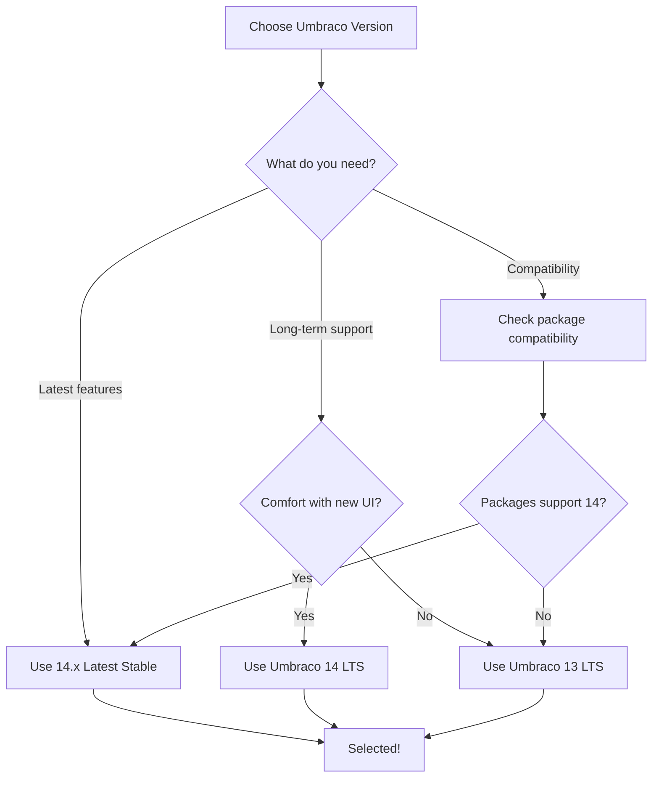

# Umbraco Versions Reference

## Overview

This guide provides information about Umbraco CMS versions, support timelines, and how to view version information in the CLI tool.

## Viewing Versions in CLI

### Interactive Mode

```bash
psw
# Select "Load Umbraco versions table" from the main menu
```

### CLI Mode

```bash
psw versions
```

## Version Table

The versions table shows:

```
Umbraco CMS Versions

┌─────────┬────────────────┬─────────────────┬──────────────────┐
│ Version │ Status         │ Release Date    │ Support Until    │
├─────────┼────────────────┼─────────────────┼──────────────────┤
│ 14.3.0  │ ✓ Latest       │ Dec 2024        │ Active           │
│ 14.2.0  │ ✓ Stable       │ Nov 2024        │ Active           │
│ 14.1.0  │ ✓ Stable       │ Oct 2024        │ Active           │
│ 14.0.0  │ ✓ LTS          │ May 2024        │ May 2027         │
│ 13.5.2  │ ✓ LTS          │ Apr 2024        │ Dec 2026         │
│ 13.4.1  │ ✓ LTS          │ Mar 2024        │ Dec 2026         │
│ 13.3.0  │ ✓ LTS          │ Feb 2024        │ Dec 2026         │
│ 13.2.0  │ ○ Maintenance  │ Jan 2024        │ Dec 2025         │
│ 13.1.0  │ ○ Maintenance  │ Dec 2023        │ Jun 2025         │
│ 13.0.0  │ ✗ End of Life  │ Jun 2023        │ Ended            │
│ 12.3.6  │ ✗ End of Life  │ May 2023        │ Ended            │
│ 10.8.7  │ ✗ End of Life  │ Dec 2022        │ Ended            │
└─────────┴────────────────┴─────────────────┴──────────────────┘

Legend:
  ✓ - Actively supported
  ○ - Maintenance mode
  ✗ - No longer supported
```

## Version Status Types

### ✓ Latest
- The most recent stable release
- Includes newest features
- Fully supported
- Recommended for new projects

### ✓ Stable
- Production-ready releases
- Fully supported with updates
- May not have latest features
- Good for stability-focused projects

### ✓ LTS (Long Term Support)
- Extended support period (typically 3 years)
- Security updates and critical bug fixes
- **Recommended for production/enterprise**
- Slower feature updates but more stable

### ○ Maintenance Mode
- Security fixes only
- No new features
- Support ending soon
- Plan migration to newer version

### ✗ End of Life
- No longer supported
- No security updates
- Should not be used for new projects
- Migrate existing projects immediately

## Umbraco Version History

### Umbraco 14 (Current)
**Release**: May 2024  
**Support**: May 2027 (LTS)  
**Framework**: .NET 8+

**Major Features**:
- Bellissima backoffice (new UI)
- Improved performance
- Modern architecture
- Enhanced content delivery API

**When to use**: New projects, modern requirements

### Umbraco 13
**Release**: June 2023  
**Support**: December 2026 (LTS)  
**Framework**: .NET 8

**Major Features**:
- Content Delivery API
- Enhanced block editor
- Performance improvements

**When to use**: Projects requiring stability, LTS support

### Umbraco 12
**Release**: June 2023  
**Support**: Ended  
**Framework**: .NET 7

**Status**: End of Life - migrate to 13 or 14

### Umbraco 10
**Release**: June 2022  
**Support**: Ended  
**Framework**: .NET 6

**Status**: End of Life - migrate to 13 or 14

### Umbraco 9
**Release**: September 2021  
**Support**: Ended  
**Framework**: .NET 5

**Status**: End of Life

### Umbraco 8
**Release**: February 2019  
**Support**: Ended February 2024  
**Framework**: .NET Framework 4.7.2

**Status**: End of Life - critical to migrate

## Choosing a Version

### Decision Matrix

| Your Need | Recommended Version |
|-----------|---------------------|
| **New production project** | 14.0.0 LTS |
| **Latest features** | 14.x Latest |
| **Long-term stability** | 14.0.0 LTS or 13.x LTS |
| **Enterprise/mission-critical** | 14.0.0 LTS |
| **Quick prototype** | 14.x Latest |
| **Learning Umbraco** | 14.x Latest |

### Quick Selection Guide



## Package Compatibility

Different Umbraco versions require different package versions:

### Umbraco 14
- uSync 17.x
- Umbraco.Forms 14.x
- Most packages with v14 in version number

### Umbraco 13
- uSync 13.x - 16.x
- Umbraco.Forms 13.x
- Most packages with v13 in version number

### Umbraco 12 (EOL)
- uSync 12.x
- Umbraco.Forms 12.x

**Note**: Always check package documentation for compatibility.

## Support Timelines

### LTS Policy

Umbraco LTS versions receive:
- **3 years of support** from release date
- Security updates throughout support period
- Critical bug fixes
- No new features (stability focus)

### Current LTS Versions

| Version | Released | Support Ends |
|---------|----------|--------------|
| 14.0.0  | May 2024 | May 2027     |
| 13.x    | Jun 2023 | Dec 2026     |

## Migration Paths

### From Umbraco 8
```
Umbraco 8 → Umbraco 10 → Umbraco 13/14
```

**Tools**: 
- Content Migration Tool
- uSync for content
- Manual code updates required

### From Umbraco 10
```
Umbraco 10 → Umbraco 13 → Umbraco 14
```

**Tools**:
- Standard upgrade process
- Package updates
- Minor code changes

### From Umbraco 13
```
Umbraco 13 → Umbraco 14
```

**Tools**:
- Straightforward upgrade
- UI changes (Bellissima)
- Package version updates

## Setting Version in CLI

### Interactive Mode

When configuring a script, you'll be prompted:

```
Select template version:
> Latest Stable (14.3.0)
  Latest LTS (14.0.0)
  Previous LTS (13.5.2)
  Specific version...
```

### CLI Mode

```bash
# Latest stable
psw -t "Umbraco.Templates"

# Specific version
psw -t "Umbraco.Templates|14.0.0"

# Latest LTS (specified in template)
psw template load my-lts-template
```

### In Templates

```yaml
configuration:
  template:
    name: Umbraco.Templates
    version: "14.0.0"  # Specific LTS version
    # or
    version: ""        # Latest stable
```

## Version-Specific Features

### Umbraco 14 Only
- Bellissima backoffice
- New management API
- Enhanced content delivery API v2
- Improved media library

### Umbraco 13 Only
- Original backoffice
- Content delivery API v1
- Block list/grid editors

### Checking Features

Before choosing a version, check:
1. **Package availability** - Are your required packages compatible?
2. **Framework requirements** - Do you need .NET 8?
3. **Hosting requirements** - Does your host support the version?
4. **Team familiarity** - Is your team trained on the version?

## Resources

### Official Umbraco Resources

- **Umbraco Documentation**: [docs.umbraco.com](https://docs.umbraco.com)
- **Release Notes**: [umbraco.com/products/umbraco-cms/releases](https://umbraco.com/products/umbraco-cms/releases)
- **Marketplace**: [marketplace.umbraco.com](https://marketplace.umbraco.com)
- **Community**: [community.umbraco.com](https://community.umbraco.com)

### Version-Specific Docs

- **Umbraco 14**: [docs.umbraco.com/umbraco-cms/v/14](https://docs.umbraco.com/umbraco-cms/v/14)
- **Umbraco 13**: [docs.umbraco.com/umbraco-cms/v/13](https://docs.umbraco.com/umbraco-cms/v/13)
- **Migration Guide**: [docs.umbraco.com/umbraco-cms/fundamentals/setup/upgrading](https://docs.umbraco.com/umbraco-cms/fundamentals/setup/upgrading)

## Related Documentation

- **[Interactive Mode](interactive-mode.md)** - Using the interactive menu
- **[Custom Script](custom-script.md)** - Configuring custom scripts
- **[Templates Guide](templates.md)** - Saving version-specific templates
- **[CLI Documentation](../cli-documentation.md)** - Complete CLI reference

---

<div align="center">

**🏠 [Back to Interactive Mode](interactive-mode.md)** | **📖 [CLI Documentation](../cli-documentation.md)**

</div>
