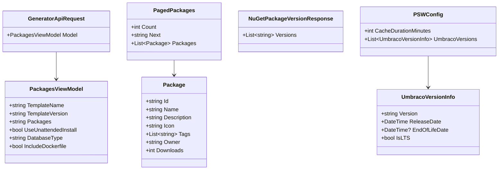

# Data Models

Complete reference for all data models and structures used in the Package Script Writer application.

## Table of Contents
- [Overview](#overview)
- [PackagesViewModel](#packagesviewmodel)
- [PagedPackages](#pagedpackages)
- [NuGet Models](#nuget-models)
- [Configuration Models](#configuration-models)
- [API Models](#api-models)
- [Model Relationships](#model-relationships)

---

## Overview

The application uses strongly-typed models for all data transfer:
- **View Models**: Represent form state and UI data
- **API Models**: Request/response DTOs for external APIs
- **Configuration Models**: Application settings from `appsettings.json`

**Location**: `src/PSW/Models/`

---

## PackagesViewModel

**File**: `Models/PackagesViewModel.cs`

**Purpose**: Main view model containing all user selections and configuration for script generation.

### Properties

```csharp
public class PackagesViewModel
{
    // Template Configuration
    public string TemplateName { get; set; }
    public string TemplateVersion { get; set; }

    // Project Configuration
    public bool CreateSolutionFile { get; set; }
    public string SolutionName { get; set; }
    public string ProjectName { get; set; }

    // Database Configuration
    public bool UseUnattendedInstall { get; set; }
    public string DatabaseType { get; set; }
    public string ConnectionString { get; set; }

    // User Credentials
    public string UserFriendlyName { get; set; }
    public string UserEmail { get; set; }
    public string UserPassword { get; set; }

    // Package Selection
    public string Packages { get; set; }
    public bool IncludeStarterKit { get; set; }
    public string StarterKitPackage { get; set; }

    // Docker Configuration
    public bool CanIncludeDocker { get; set; }
    public bool IncludeDockerfile { get; set; }
    public bool IncludeDockerCompose { get; set; }

    // Output Options
    public bool OnelinerOutput { get; set; }
    public bool RemoveComments { get; set; }
}
```

### Property Details

#### Template Configuration

| Property | Type | Required | Description | Example |
|----------|------|----------|-------------|---------|
| `TemplateName` | string | Yes | Template package name | `"Umbraco.Templates"` |
| `TemplateVersion` | string | No | Specific version or "LTS" | `"14.3.0"`, `"LTS"` |

#### Project Configuration

| Property | Type | Required | Description | Example |
|----------|------|----------|-------------|---------|
| `CreateSolutionFile` | bool | No | Create solution file | `true` |
| `SolutionName` | string | Conditional | Solution name (if CreateSolutionFile is true) | `"MySolution"` |
| `ProjectName` | string | Yes | Project name | `"MyProject"` |

#### Database Configuration

| Property | Type | Required | Description | Example |
|----------|------|----------|-------------|---------|
| `UseUnattendedInstall` | bool | No | Use unattended install | `true` |
| `DatabaseType` | string | Conditional | Database type | `"SQLite"`, `"LocalDb"`, `"SQLServer"`, `"SQLAzure"`, `"SQLCE"` |
| `ConnectionString` | string | Conditional | Database connection string (for SQL Server/Azure) | `"Server=..."` |

#### User Credentials

| Property | Type | Required | Description | Validation |
|----------|------|----------|-------------|------------|
| `UserFriendlyName` | string | Conditional | Admin user name | Min 1 character |
| `UserEmail` | string | Conditional | Admin email | Valid email format |
| `UserPassword` | string | Conditional | Admin password | Min 10 characters |

#### Package Selection

| Property | Type | Required | Description | Format |
|----------|------|----------|-------------|--------|
| `Packages` | string | No | Comma-separated package list | `"PackageId|Version,PackageId2|Version2"` |
| `IncludeStarterKit` | bool | No | Include starter kit | `false` |
| `StarterKitPackage` | string | Conditional | Starter kit package name | `"Umbraco.TheStarterKit"` |

**Packages String Format**:
```
Package1|1.0.0,Package2|2.0.0|--prerelease,Package3
```

- Package ID and version separated by `|`
- Multiple packages separated by `,`
- Optional `|--prerelease` flag after version
- Missing version means "latest"

#### Docker Configuration

| Property | Type | Required | Description | Notes |
|----------|------|----------|-------------|-------|
| `CanIncludeDocker` | bool | No | Docker available for this version | Calculated based on template/version |
| `IncludeDockerfile` | bool | No | Include Dockerfile | Only for Umbraco templates v10+ |
| `IncludeDockerCompose` | bool | No | Include Docker Compose | Only for Umbraco templates v10+ |

#### Output Options

| Property | Type | Required | Description | Default |
|----------|------|----------|-------------|---------|
| `OnelinerOutput` | bool | No | Output as one-liner (commands joined with &&) | `false` |
| `RemoveComments` | bool | No | Remove comment lines from output | `false` |

### Example Instances

#### Basic Configuration

```csharp
var model = new PackagesViewModel
{
    TemplateName = "Umbraco.Templates",
    TemplateVersion = "14.3.0",
    ProjectName = "MyProject"
};
```

#### Full Configuration

```csharp
var model = new PackagesViewModel
{
    TemplateName = "Umbraco.Templates",
    TemplateVersion = "14.3.0",
    CreateSolutionFile = true,
    SolutionName = "MyCompany.Web",
    ProjectName = "MyCompany.Web.Site",
    UseUnattendedInstall = true,
    DatabaseType = "SQLite",
    UserFriendlyName = "Administrator",
    UserEmail = "admin@example.com",
    UserPassword = "SuperSecret123",
    Packages = "Umbraco.Community.BlockPreview|1.6.0,Diplo.GodMode|3.0.3",
    IncludeDockerfile = true,
    IncludeDockerCompose = true,
    CanIncludeDocker = true,
    OnelinerOutput = false,
    RemoveComments = false
};
```

---

## PagedPackages

**File**: `Models/PagedPackages.cs` (500+ lines)

**Purpose**: Represents the response from Umbraco Marketplace API containing package listings.

### Structure

```csharp
public class PagedPackages
{
    public int Count { get; set; }
    public string Next { get; set; }
    public List<Package> Packages { get; set; }
}

public class Package
{
    public string Id { get; set; }
    public string Name { get; set; }
    public string Description { get; set; }
    public string Icon { get; set; }
    public string Owner { get; set; }
    public List<string> Tags { get; set; }
    public string Url { get; set; }
    public string Category { get; set; }
    public DateTime Created { get; set; }
    public DateTime Updated { get; set; }
    public int Downloads { get; set; }
    public bool IsFeatured { get; set; }
}
```

### Property Details

#### PagedPackages Properties

| Property | Type | Description |
|----------|------|-------------|
| `Count` | int | Total number of packages in response |
| `Next` | string | URL for next page (pagination) |
| `Packages` | List&lt;Package&gt; | List of package objects |

#### Package Properties

| Property | Type | Description | Example |
|----------|------|-------------|---------|
| `Id` | string | Unique package identifier | `"umbraco-community-blockpreview"` |
| `Name` | string | Display name | `"Umbraco Community Block Preview"` |
| `Description` | string | Package description | `"Preview Umbraco Block content in the content tree"` |
| `Icon` | string | Icon URL | `"https://..."` |
| `Owner` | string | Package owner | `"rickbutterfield"` |
| `Tags` | List&lt;string&gt; | Category tags | `["backoffice", "editor"]` |
| `Url` | string | Package URL | `"https://marketplace.umbraco.com/..."` |
| `Category` | string | Primary category | `"Backoffice Extensions"` |
| `Created` | DateTime | Creation date | `2021-06-15T10:00:00Z` |
| `Updated` | DateTime | Last update date | `2024-11-20T14:30:00Z` |
| `Downloads` | int | Download count | `5420` |
| `IsFeatured` | bool | Featured package flag | `false` |

### JSON Example

```json
{
  "count": 150,
  "next": null,
  "packages": [
    {
      "id": "umbraco-community-blockpreview",
      "name": "Umbraco Community Block Preview",
      "description": "Preview Umbraco Block content in the content tree",
      "icon": "https://marketplace.umbraco.com/media/.../icon.png",
      "owner": "rickbutterfield",
      "tags": ["backoffice", "editor", "content"],
      "url": "https://marketplace.umbraco.com/package/umbraco-community-blockpreview",
      "category": "Backoffice Extensions",
      "created": "2021-06-15T10:00:00Z",
      "updated": "2024-11-20T14:30:00Z",
      "downloads": 5420,
      "isFeatured": false
    }
  ]
}
```

---

## NuGet Models

**Files**: `Models/NuGet*.cs`

**Purpose**: Represent responses from NuGet.org API for package version retrieval.

### NuGetPackageVersionResponse

```csharp
public class NuGetPackageVersionResponse
{
    public List<string> Versions { get; set; }
}
```

### NuGetSearchResponse

```csharp
public class NuGetSearchResponse
{
    public int TotalHits { get; set; }
    public List<NuGetPackageSearchResult> Data { get; set; }
}

public class NuGetPackageSearchResult
{
    public string Id { get; set; }
    public string Version { get; set; }
    public string Description { get; set; }
    public List<string> Versions { get; set; }
    public string IconUrl { get; set; }
    public List<string> Tags { get; set; }
}
```

### JSON Example (Version Index)

```json
{
  "versions": [
    "1.0.0",
    "1.1.0",
    "1.2.0",
    "1.3.0",
    "1.4.0",
    "1.5.0",
    "1.6.0"
  ]
}
```

### JSON Example (Search Response)

```json
{
  "totalHits": 1,
  "data": [
    {
      "id": "Umbraco.Community.BlockPreview",
      "version": "1.6.0",
      "description": "Preview Umbraco Block content",
      "versions": [
        { "version": "1.6.0" },
        { "version": "1.5.0" }
      ],
      "iconUrl": "https://...",
      "tags": ["umbraco", "block", "preview"]
    }
  ]
}
```

---

## Configuration Models

**File**: `Config/PSWConfig.cs`

**Purpose**: Strongly-typed configuration model for `appsettings.json`.

### PSWConfig

```csharp
public class PSWConfig
{
    public const string SectionName = "PSW";

    public int CacheDurationMinutes { get; set; }
    public List<UmbracoVersionInfo> UmbracoVersions { get; set; }
}

public class UmbracoVersionInfo
{
    public string Version { get; set; }
    public DateTime ReleaseDate { get; set; }
    public DateTime? EndOfLifeDate { get; set; }
    public DateTime? EndOfSecurityDate { get; set; }
    public bool IsLTS { get; set; }
}
```

### Properties

| Property | Type | Description | Example |
|----------|------|-------------|---------|
| `CacheDurationMinutes` | int | Cache TTL in minutes | `60` |
| `UmbracoVersions` | List&lt;UmbracoVersionInfo&gt; | Version lifecycle data | See below |

#### UmbracoVersionInfo Properties

| Property | Type | Description | Example |
|----------|------|-------------|---------|
| `Version` | string | Major version number | `"14"` |
| `ReleaseDate` | DateTime | Release date | `2024-05-30` |
| `EndOfLifeDate` | DateTime? | End of life date | `2027-12-30` |
| `EndOfSecurityDate` | DateTime? | Security updates end date | `2027-12-30` |
| `IsLTS` | bool | Long-term support flag | `true` |

### JSON Configuration Example

```json
{
  "PSW": {
    "CacheDurationMinutes": 60,
    "UmbracoVersions": [
      {
        "Version": "14",
        "ReleaseDate": "2024-05-30",
        "EndOfLifeDate": "2027-12-30",
        "EndOfSecurityDate": "2027-12-30",
        "IsLTS": true
      },
      {
        "Version": "13",
        "ReleaseDate": "2023-12-14",
        "EndOfLifeDate": "2024-12-14",
        "IsLTS": false
      }
    ]
  }
}
```

---

## API Models

### GeneratorApiRequest

**File**: `Models/GeneratorApiRequest.cs`

**Purpose**: Request DTO for script generation API endpoint.

```csharp
public class GeneratorApiRequest
{
    public PackagesViewModel Model { get; set; }
}
```

### PackageVersionRequest

**Purpose**: Request DTO for package version retrieval.

```csharp
public class PackageVersionRequest
{
    public string PackageId { get; set; }
    public bool IncludePrerelease { get; set; }
}
```

### ApiResponse

**Purpose**: Generic response wrapper for API endpoints.

```csharp
public class ApiResponse<T>
{
    public T Data { get; set; }
    public bool Success { get; set; }
    public string Message { get; set; }
    public List<string> Errors { get; set; }
}
```

---

## Model Relationships

### Entity Relationship Diagram



### Data Flow

```
User Input (Form) → PackagesViewModel → GeneratorApiRequest → API → ScriptGeneratorService → Generated Script
                                                                  ↓
                                              MarketplacePackageService → PagedPackages → Package[]
                                                                  ↓
                                               NuGet.org API → NuGetPackageVersionResponse → Version[]
```

---

## Validation Rules

### PackagesViewModel Validation

| Field | Rule | Error Message |
|-------|------|---------------|
| `ProjectName` | Required | "Project name is required" |
| `ProjectName` | Max length: 100 | "Project name too long" |
| `UserPassword` | Min length: 10 (if UseUnattendedInstall) | "Password must be at least 10 characters" |
| `UserEmail` | Valid email format (if UseUnattendedInstall) | "Invalid email format" |
| `TemplateName` | Required | "Template name is required" |
| `SolutionName` | Required if CreateSolutionFile is true | "Solution name required when creating solution file" |

### Validation Attributes

```csharp
public class PackagesViewModel
{
    [Required(ErrorMessage = "Project name is required")]
    [MaxLength(100, ErrorMessage = "Project name too long")]
    public string ProjectName { get; set; }

    [EmailAddress(ErrorMessage = "Invalid email format")]
    public string UserEmail { get; set; }

    [MinLength(10, ErrorMessage = "Password must be at least 10 characters")]
    public string UserPassword { get; set; }
}
```

---

## Default Values

**File**: `Constants/DefaultValues.cs`

```csharp
public static class DefaultValues
{
    public const string DefaultTemplateName = "Umbraco.Templates";
    public const string DefaultTemplateVersion = "LTS";
    public const string DefaultDatabaseType = "SQLite";
    public const string DefaultProjectName = "MyUmbracoProject";
    public const string DefaultSolutionName = "MyUmbracoSolution";
    public const string DefaultUserFriendlyName = "Administrator";
    public const string DefaultUserEmail = "admin@example.com";
    public const bool DefaultUseUnattendedInstall = false;
    public const bool DefaultCreateSolutionFile = false;
    public const bool DefaultIncludeDockerfile = false;
    public const bool DefaultIncludeDockerCompose = false;
    public const bool DefaultOnelinerOutput = false;
    public const bool DefaultRemoveComments = false;
}
```

---

## Serialization

### JSON Serialization

**Library**: `System.Text.Json`

**Configuration**:
```csharp
var options = new JsonSerializerOptions
{
    PropertyNamingPolicy = JsonNamingPolicy.CamelCase,
    WriteIndented = true,
    DefaultIgnoreCondition = JsonIgnoreCondition.WhenWritingNull
};
```

### XML Serialization

**Library**: `System.Xml.Serialization.XmlSerializer`

**Usage**: For legacy NuGet feed parsing (XML format)

---

## Model Evolution

### Version History

| Version | Changes |
|---------|---------|
| 1.0 | Initial models |
| 2.0 | Added Docker support properties |
| 2.1 | Added `OnelinerOutput` and `RemoveComments` |
| 3.0 | Added `CanIncludeDocker` calculated property |

### Backward Compatibility

Query string parameters maintain backward compatibility:
- Old parameter names still supported
- Missing parameters use default values
- Deprecated parameters are ignored

---

[← Back to Documentation Index](documentation.md)
