# Package Script Writer - Technical Documentation

## Table of Contents
- [Overview](#overview)
- [Architecture](#architecture)
- [System Components](#system-components)
- [Process Flows](#process-flows)
- [Data Models](#data-models)
- [Services](#services)
- [Frontend Architecture](#frontend-architecture)
- [API Endpoints](#api-endpoints)
- [Configuration](#configuration)
- [Security](#security)
- [Development Guide](#development-guide)

---

## Overview

**Package Script Writer** is a web-based utility that generates installation scripts for Umbraco CMS projects. Built with ASP.NET Core 9.0, it provides a streamlined interface for developers to create customized Umbraco project setup scripts.

### Key Features
- 🎯 Template selection (Umbraco official & community templates)
- 📦 NuGet package management with version selection
- ⚙️ Project configuration (solution, database, credentials)
- 🐳 Docker support (Dockerfile & Docker Compose)
- 🔗 Shareable configuration URLs
- 💾 Local storage persistence
- 🎨 Syntax-highlighted script output

### Live Site
[https://psw.codeshare.co.uk](https://psw.codeshare.co.uk/)

### Technology Stack
| Category | Technology |
|----------|-----------|
| Framework | ASP.NET Core 9.0 |
| Language | C# 13 |
| Frontend | Razor Pages, Vanilla JavaScript |
| UI Framework | Bootstrap |
| Caching | IMemoryCache (60-minute TTL) |
| HTTP Client | HttpClientFactory |
| Build Tools | .NET SDK, dotnet format |

---

## Architecture

### High-Level Architecture

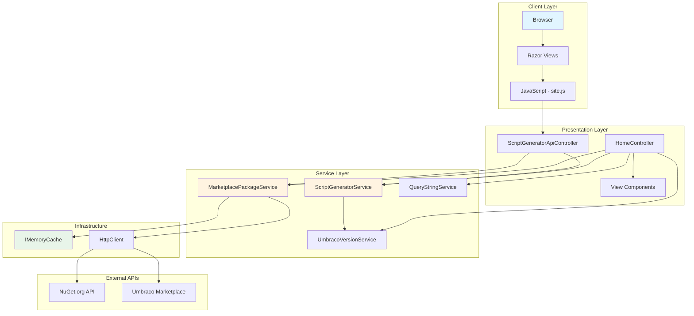

### Application Layers

#### 1. **Presentation Layer**
- **Controllers**: Handle HTTP requests and orchestrate responses
  - `HomeController.cs`: Main MVC controller for page rendering
  - `ScriptGeneratorApiController.cs`: RESTful API for script generation
  - `UUIController.cs`: Umbraco Unified Interface sandbox

- **View Components**: Modular UI sections (10+ components)
  - `PackageViewComponent`: Package selection cards
  - `InstallScriptViewComponent`: Generated script display
  - `OptionsViewComponent`: Configuration form
  - `UmbracoVersionsViewComponent`: Version lifecycle table

#### 2. **Service Layer**
- **ScriptGeneratorService**: Core business logic (327 lines)
- **MarketplacePackageService**: Package data retrieval
- **QueryStringService**: URL parameter handling
- **UmbracoVersionService**: Version management

#### 3. **Infrastructure Layer**
- **Caching**: In-memory cache with 60-minute expiration
- **HTTP Client**: Factory-based HTTP client for external APIs
- **Middleware**: Security headers middleware

---

## System Components

### Project Structure

```
PSW/PSW/
├── Components/              # View Components (10+ files)
│   ├── AboutViewComponent.cs
│   ├── InstallScriptViewComponent.cs
│   ├── OptionsViewComponent.cs
│   ├── PackageViewComponent.cs
│   └── ...
├── Config/                  # Configuration
│   └── PSWConfig.cs        # App settings model
├── Constants/               # Global constants
│   ├── DefaultValues.cs    # Default project values
│   └── GlobalConstants.cs  # Template constants
├── Controllers/             # MVC & API Controllers
│   ├── HomeController.cs   # Main page controller
│   ├── ScriptGeneratorApiController.cs
│   └── UUIController.cs
├── Dictionaries/           # Template mappings
│   └── TemplateDictionary.cs
├── Enums/                  # Enumerations
│   └── DatabaseType.cs
├── Extensions/             # Extension methods
│   └── UriExtensions.cs
├── Middleware/             # Custom middleware
│   └── SecurityHeadersMiddleware.cs
├── Models/                 # Data models
│   ├── PackagesViewModel.cs       # Main view model (20+ properties)
│   ├── GeneratorApiRequest.cs     # API request DTO
│   ├── PagedPackages.cs           # Marketplace feed (500+ lines)
│   └── NuGet models/              # NuGet API responses
├── Services/               # Business logic (5 files)
│   ├── ScriptGeneratorService.cs
│   ├── MarketplacePackageService.cs
│   ├── QueryStringService.cs
│   ├── UmbracoVersionService.cs
│   └── Interfaces/
├── Views/                  # Razor templates (21 files)
│   ├── Home/
│   │   └── Index.cshtml           # Main page
│   ├── Shared/
│   │   └── Components/            # View component templates
│   └── ...
├── wwwroot/                # Static assets
│   ├── css/
│   │   ├── bootstrap/
│   │   └── site.css
│   ├── js/
│   │   ├── site.js                # Main JavaScript (740+ lines)
│   │   └── prettyprint/           # Syntax highlighting
│   └── images/
├── appsettings.json        # Application configuration
├── Program.cs              # Application entry point
└── PSW.csproj             # Project file
```

### File Statistics
- **C# Files**: 49
- **Razor Views**: 21
- **JavaScript LOC**: 740+
- **Core Service LOC**: 327 (ScriptGeneratorService)
- **Total Project Lines**: 4,000+

---

## Process Flows

### 1. User Interaction Flow

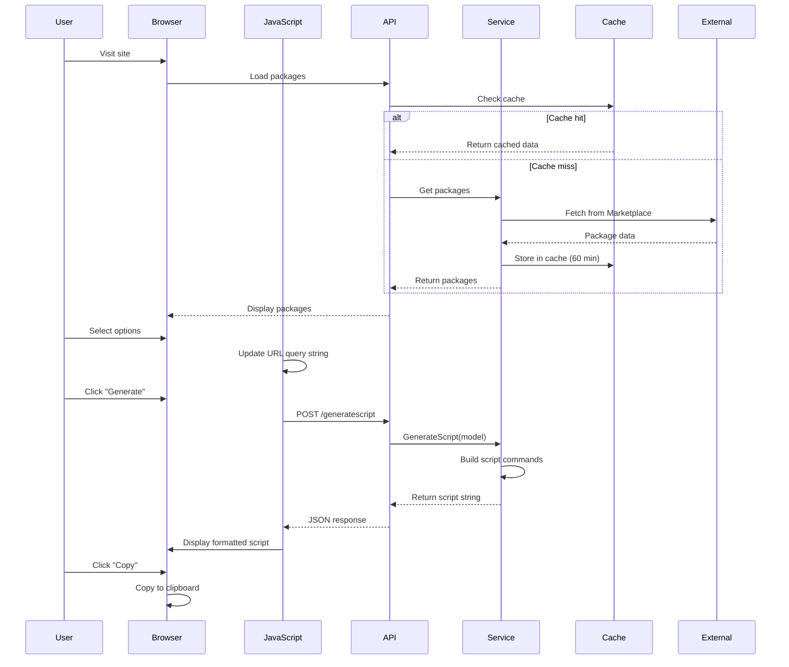

### 2. Script Generation Flow

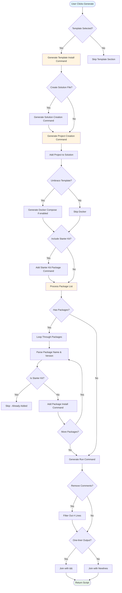

### 3. Package Version Retrieval Flow

```mermaid
flowchart TD
    Start([API Request: Get Package Versions]) --> A[Extract Package ID from Request]

    A --> B{Check Cache}
    B -->|Hit| C[Return Cached Versions]
    B -->|Miss| D[Call NuGet.org API]

    D --> E{Include Prerelease?}
    E -->|Yes| F[GET /v3-flatcontainer/{id}/index.json]
    E -->|No| G[GET /query?q={id}&prerelease=false]

    F --> H[Parse JSON Response]
    G --> H

    H --> I[Extract Version Array]
    I --> J{Valid Response?}
    J -->|Yes| K[Store in Cache - 60 min TTL]
    J -->|No| L[Return Empty Array]

    K --> M[Return Version List]
    L --> End([Return to Client])
    M --> End

    C --> End

    style Start fill:#e1f5ff
    style End fill:#e8f5e9
```

### 4. URL Query String Synchronization

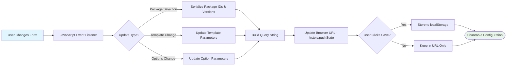

### 5. Application Startup & Dependency Injection

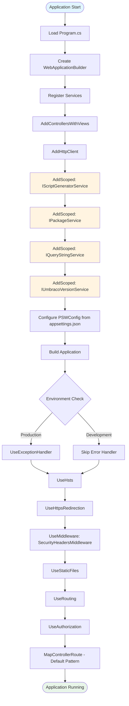

---

## Data Models

### PackagesViewModel

The main view model containing all user selections and configurations.

```csharp
public class PackagesViewModel
{
    // Template Configuration
    public string TemplateName { get; set; }           // e.g., "Umbraco.Templates"
    public string TemplateVersion { get; set; }        // e.g., "14.3.0" or "LTS"

    // Project Configuration
    public bool CreateSolutionFile { get; set; }
    public string SolutionName { get; set; }
    public string ProjectName { get; set; }

    // Database Configuration
    public bool UseUnattendedInstall { get; set; }
    public string DatabaseType { get; set; }           // SQLite, LocalDb, SQLServer, etc.
    public string ConnectionString { get; set; }

    // User Credentials
    public string UserFriendlyName { get; set; }
    public string UserEmail { get; set; }
    public string UserPassword { get; set; }

    // Package Selection
    public string Packages { get; set; }               // Comma-separated: "pkg1|ver1,pkg2|ver2"
    public bool IncludeStarterKit { get; set; }
    public string StarterKitPackage { get; set; }

    // Docker Configuration
    public bool CanIncludeDocker { get; set; }
    public bool IncludeDockerfile { get; set; }
    public bool IncludeDockerCompose { get; set; }

    // Output Options
    public bool OnelinerOutput { get; set; }
    public bool RemoveComments { get; set; }
}
```

### Package Data Flow

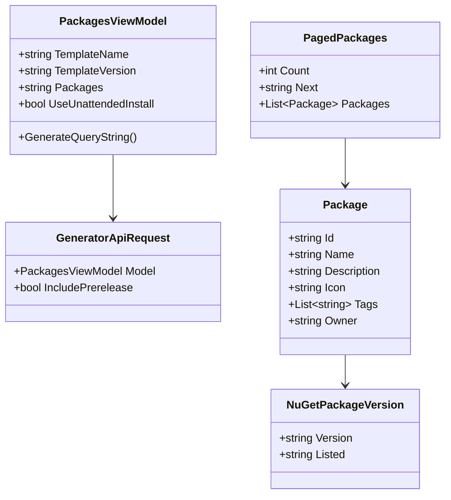

---

## Services

### 1. ScriptGeneratorService

**Purpose**: Generates shell scripts for Umbraco project installation.

**Key Methods**:

```csharp
public class ScriptGeneratorService : IScriptGeneratorService
{
    // Main entry point - orchestrates script generation
    public string GenerateScript(PackagesViewModel model)

    // Generates template installation commands
    public List<string> GenerateUmbracoTemplatesSectionScript(PackagesViewModel model)

    // Creates solution file command
    public List<string> GenerateCreateSolutionFileScript(PackagesViewModel model)

    // Creates project with unattended install options
    public List<string> GenerateCreateProjectScript(PackagesViewModel model)

    // Adds project to solution
    public List<string> GenerateAddProjectToSolutionScript(PackagesViewModel model)

    // Adds starter kit package
    public List<string> GenerateAddStarterKitScript(PackagesViewModel model, bool renderPackageName)

    // Adds NuGet packages
    public List<string> GenerateAddPackagesScript(PackagesViewModel model, bool renderPackageName)

    // Generates run command
    public List<string> GenerateRunProjectScript(PackagesViewModel model, bool renderPackageName)

    // Adds Docker Compose support
    public List<string> GenerateAddDockerComposeScript(PackagesViewModel model)
}
```

**Script Generation Logic**:

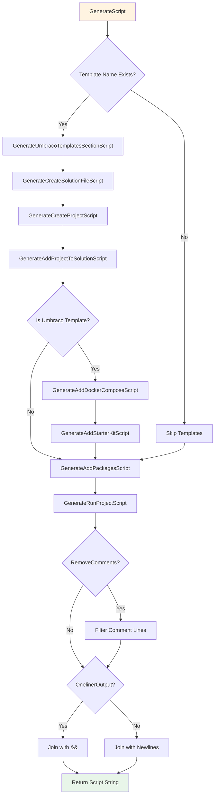

### 2. MarketplacePackageService

**Purpose**: Fetches package data from Umbraco Marketplace and NuGet.org.

**Key Methods**:

```csharp
public class MarketplacePackageService : IPackageService
{
    // Retrieves all packages from Umbraco Marketplace
    public async Task<PagedPackages> GetAllPackages(
        IMemoryCache memoryCache,
        int cacheDurationMinutes)

    // Gets versions for a specific package from NuGet.org
    public async Task<List<string>> GetNugetPackageVersions(
        string packageId,
        bool includePrerelease,
        IMemoryCache memoryCache,
        int cacheDurationMinutes)
}
```

**Caching Strategy**:
- Cache Key: `all-packages` or `package-versions-{packageId}`
- TTL: 60 minutes (configurable via `appsettings.json`)
- Eviction: Time-based absolute expiration

### 3. QueryStringService

**Purpose**: Handles bidirectional conversion between URL query strings and view models.

**Key Methods**:

```csharp
public class QueryStringService : IQueryStringService
{
    // Parses URL query string into PackagesViewModel
    public PackagesViewModel LoadModelFromQueryString(string queryString)

    // Generates shareable URL from model
    public string GenerateQueryString(PackagesViewModel model, string baseUrl)
}
```

**Query String Format**:
```
?TemplateName=Umbraco.Templates
&TemplateVersion=14.3.0
&ProjectName=MyProject
&Packages=Umbraco.Community.BlockPreview|1.6.0,Diplo.GodMode|3.0.3
&UseUnattendedInstall=true
&DatabaseType=SQLite
```

### 4. UmbracoVersionService

**Purpose**: Manages Umbraco version lifecycle data.

**Key Methods**:

```csharp
public class UmbracoVersionService : IUmbracoVersionService
{
    // Returns the latest LTS version
    public string GetLatestLTSVersion(PSWConfig config)

    // Determines if a version is LTS, STS, or EOL
    public VersionStatus GetVersionStatus(string version, PSWConfig config)
}
```

**Version Lifecycle Configuration** (from `appsettings.json`):

```json
{
  "PSW": {
    "CacheDurationMinutes": 60,
    "UmbracoVersions": [
      {
        "Version": "14",
        "ReleaseDate": "2024-05-30",
        "EndOfLifeDate": "2027-12-30",
        "IsLTS": true
      },
      {
        "Version": "13",
        "ReleaseDate": "2023-12-14",
        "EndOfLifeDate": "2024-12-14",
        "IsLTS": false
      }
    ]
  }
}
```

---

## Frontend Architecture

### JavaScript Architecture (site.js)

**Main Object Structure**:

```javascript
var psw = {
    controls: {
        // DOM element references (28 controls)
        packages: document.getElementById('Packages'),
        templateName: document.getElementById('TemplateName'),
        // ... more controls
    },
    buttons: {
        // Button references (7 buttons)
        clearpackages: document.getElementById('clearpackages'),
        reset: document.getElementById('reset'),
        // ... more buttons
    },
    init: function() { ... },
    onPageLoad: function() { ... },
    addListeners: function() { ... },
    // ... 30+ methods
}
```

**Key Functions**:

| Function | Purpose |
|----------|---------|
| `updateUrl()` | Syncs form state to URL query string |
| `updateOutput()` | Calls API to regenerate script |
| `filterPackages()` | Real-time package search |
| `toggleUnattendedInstallControls()` | Shows/hides database fields |
| `toggleDockerControls()` | Enables/disables Docker options |
| `loadPackageVersions()` | Fetches versions for selected package |
| `setFromLocalStorage()` | Restores saved configuration |
| `saveToLocalStorage()` | Persists current configuration |

**Event Flow**:

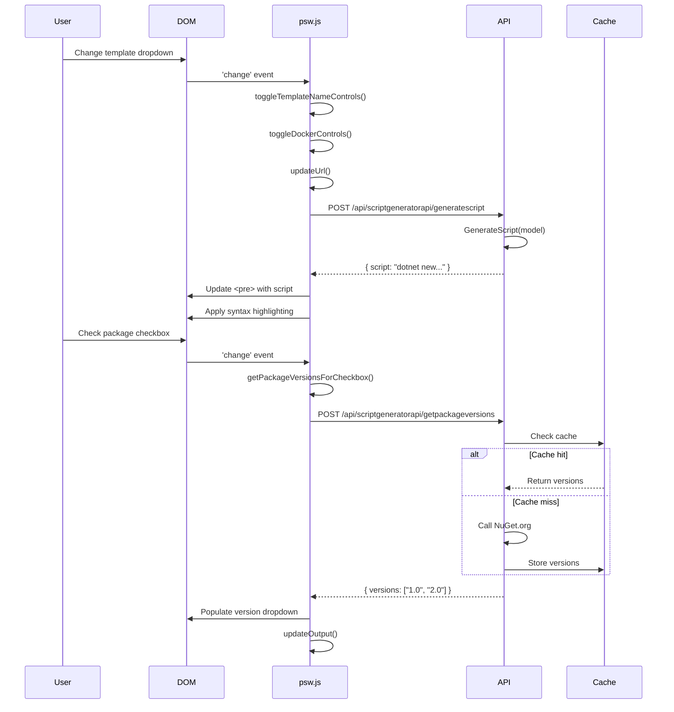

### View Components

**Component Architecture**:

```mermaid
graph TD
    A[Index.cshtml - Main Page] --> B[SiteHeaderViewComponent]
    A --> C[TabNavigationViewComponent]
    A --> D[PackageViewComponent]
    A --> E[OptionsViewComponent]
    A --> F[InstallScriptViewComponent]
    A --> G[PopularScriptsViewComponent]
    A --> H[AboutViewComponent]
    A --> I[UmbracoVersionsViewComponent]
    A --> J[SiteFooterViewComponent]

    D --> D1[Package Cards with Checkboxes]
    D --> D2[Version Dropdowns]
    D --> D3[Search Filter]

    E --> E1[Template Selection]
    E --> E2[Project Configuration]
    E --> E3[Database Settings]
    E --> E4[Docker Options]

    F --> F1[Script Output Pre Block]
    F --> F2[Copy Button]
    F --> F3[Syntax Highlighting]

    style A fill:#e1f5ff
    style D fill:#fff4e1
    style E fill:#fff4e1
    style F fill:#fff4e1
```

**Component Invocation** (in Razor):

```razor
@await Component.InvokeAsync("SiteHeader")
@await Component.InvokeAsync("Package", new { model = Model })
@await Component.InvokeAsync("Options", new { model = Model })
@await Component.InvokeAsync("InstallScript", new { model = Model })
```

---

## API Endpoints

### REST API Reference

#### 1. Generate Script

```http
POST /api/scriptgeneratorapi/generatescript
Content-Type: application/json

{
  "model": {
    "templateName": "Umbraco.Templates",
    "templateVersion": "14.3.0",
    "projectName": "MyProject",
    "packages": "Umbraco.Community.BlockPreview|1.6.0",
    "useUnattendedInstall": true,
    "databaseType": "SQLite"
  }
}
```

**Response**:
```json
{
  "script": "# Ensure we have the version specific Umbraco templates\ndotnet new install Umbraco.Templates::14.3.0 --force\n\n# Create solution/project\ndotnet new sln --name \"MySolution\"\n..."
}
```

#### 2. Get Package Versions

```http
POST /api/scriptgeneratorapi/getpackageversions
Content-Type: application/json

{
  "packageId": "Umbraco.Community.BlockPreview",
  "includePrerelease": false
}
```

**Response**:
```json
{
  "versions": ["1.6.0", "1.5.0", "1.4.0", "1.3.0"]
}
```

#### 3. Clear Cache (Admin)

```http
GET /api/scriptgeneratorapi/clearcache
```

**Response**:
```json
{
  "message": "Cache cleared successfully"
}
```

#### 4. Health Check

```http
GET /api/scriptgeneratorapi/test
```

**Response**:
```json
{
  "status": "ok"
}
```

### API Controller Implementation

```csharp
[Route("api/[controller]")]
[ApiController]
public class ScriptGeneratorApiController : ControllerBase
{
    private readonly IScriptGeneratorService _scriptGeneratorService;
    private readonly IPackageService _packageService;
    private readonly IMemoryCache _memoryCache;

    [HttpPost("generatescript")]
    public IActionResult GenerateScript([FromBody] GeneratorApiRequest request)
    {
        var script = _scriptGeneratorService.GenerateScript(request.Model);
        return Ok(new { script });
    }

    [HttpPost("getpackageversions")]
    public async Task<IActionResult> GetPackageVersions([FromBody] PackageVersionRequest request)
    {
        var versions = await _packageService.GetNugetPackageVersions(
            request.PackageId,
            request.IncludePrerelease,
            _memoryCache,
            _cacheDurationMinutes
        );
        return Ok(new { versions });
    }
}
```

---

## Configuration

### Application Settings (appsettings.json)

```json
{
  "Logging": {
    "LogLevel": {
      "Default": "Information",
      "Microsoft.AspNetCore": "Warning"
    }
  },
  "AllowedHosts": "*",
  "PSW": {
    "CacheDurationMinutes": 60,
    "UmbracoVersions": [
      {
        "Version": "14",
        "ReleaseDate": "2024-05-30",
        "EndOfLifeDate": "2027-12-30",
        "IsLTS": true,
        "EndOfSecurityDate": "2027-12-30"
      },
      {
        "Version": "13",
        "ReleaseDate": "2023-12-14",
        "EndOfLifeDate": "2024-12-14",
        "IsLTS": false
      },
      {
        "Version": "10",
        "ReleaseDate": "2022-06-16",
        "EndOfLifeDate": "2025-12-16",
        "IsLTS": true,
        "EndOfSecurityDate": "2025-12-16"
      }
    ]
  }
}
```

### Dependency Injection Configuration (Program.cs)

```csharp
// Service registration
builder.Services.AddControllersWithViews()
    .AddRazorOptions(options => options.ViewLocationFormats.Add("/{0}.cshtml"));

builder.Services.AddHttpClient();
builder.Services.AddMemoryCache();

// Custom services (Scoped lifetime)
builder.Services.AddScoped<IScriptGeneratorService, ScriptGeneratorService>();
builder.Services.AddScoped<IPackageService, MarketplacePackageService>();
builder.Services.AddScoped<IQueryStringService, QueryStringService>();
builder.Services.AddScoped<IUmbracoVersionService, UmbracoVersionService>();

// Configuration binding
builder.Services.Configure<PSWConfig>(
    builder.Configuration.GetSection(PSWConfig.SectionName)
);
```

### Middleware Pipeline

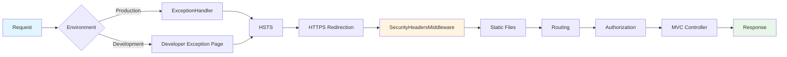

---

## Security

### SecurityHeadersMiddleware

**Implementation**:

```csharp
public class SecurityHeadersMiddleware
{
    private readonly RequestDelegate _next;

    public async Task InvokeAsync(HttpContext context)
    {
        context.Response.Headers.Add("X-Frame-Options", "SAMEORIGIN");
        context.Response.Headers.Add("X-Content-Type-Options", "nosniff");
        context.Response.Headers.Add("Referrer-Policy", "no-referrer");
        context.Response.Headers.Add(
            "Permissions-Policy",
            "accelerometer=(), camera=(), geolocation=(), gyroscope=(), magnetometer=(), microphone=(), payment=(), usb=()"
        );

        await _next(context);
    }
}
```

**Security Headers Explained**:

| Header | Value | Purpose |
|--------|-------|---------|
| `X-Frame-Options` | `SAMEORIGIN` | Prevents clickjacking by disallowing iframe embedding from other domains |
| `X-Content-Type-Options` | `nosniff` | Prevents MIME-sniffing attacks |
| `Referrer-Policy` | `no-referrer` | Doesn't send referrer information to external sites |
| `Permissions-Policy` | Restrictive | Disables browser features (geolocation, camera, etc.) |

### Additional Security Measures

1. **HTTPS Enforcement**:
   - `UseHttpsRedirection()` middleware
   - HSTS enabled (30-day max-age)

2. **No Database**:
   - Stateless application
   - No user data storage
   - Reduced attack surface

3. **Input Validation**:
   - Client-side: Password minimum 10 characters
   - Server-side: Model validation attributes

4. **No Sensitive Data**:
   - All configuration in query strings (no secrets)
   - User credentials only used for script generation (not stored)

---

## Development Guide

### Prerequisites

- .NET 9.0 SDK or later
- Visual Studio 2022 / VS Code / Rider
- Git

### Getting Started

1. **Clone Repository**:
   ```bash
   git clone https://github.com/prjseal/Package-Script-Writer.git
   cd Package-Script-Writer
   ```

2. **Run Application**:
   ```bash
   dotnet watch run --project ./PSW/PSW/
   ```

3. **Access Application**:
   - Navigate to `https://localhost:5001` (or displayed port)

### Testing the API

#### Using REST Client Extension (VS Code)

1. Install [REST Client](https://marketplace.visualstudio.com/items?itemName=humao.rest-client) extension
2. Open `Api Request/API Testing.http`
3. Run the site with `dotnet watch run`
4. Click "Send Request" in VS Code

**Example API Test File**:

```http
### Generate Script
POST https://localhost:5001/api/scriptgeneratorapi/generatescript
Content-Type: application/json

{
  "model": {
    "templateName": "Umbraco.Templates",
    "templateVersion": "14.3.0",
    "projectName": "TestProject"
  }
}

### Get Package Versions
POST https://localhost:5001/api/scriptgeneratorapi/getpackageversions
Content-Type: application/json

{
  "packageId": "Umbraco.Community.BlockPreview",
  "includePrerelease": false
}
```

### Build & Deploy

**Development Build**:
```bash
dotnet build ./PSW/PSW/PSW.csproj
```

**Production Build**:
```bash
dotnet publish ./PSW/PSW/PSW.csproj -c Release -o ./publish
```

**Code Formatting** (runs automatically on build):
```bash
dotnet format ./PSW/PSW/PSW.csproj
```

### Project File Configuration

```xml
<Project Sdk="Microsoft.NET.Sdk.Web">
  <PropertyGroup>
    <TargetFramework>net9.0</TargetFramework>
    <LangVersion>13</LangVersion>
    <Nullable>enable</Nullable>
    <ImplicitUsings>enable</ImplicitUsings>
  </PropertyGroup>

  <Target Name="PreBuild" BeforeTargets="PreBuildEvent">
    <Exec Command="dotnet format" />
  </Target>
</Project>
```

### Contributing

Follow these steps when contributing:

1. **Raise an Issue**:
   - Bug report or feature request
   - Detailed description with expected vs. actual behavior

2. **Discuss Before Coding**:
   - Confirm feature alignment with project goals
   - Avoid spending time on PRs that may not be merged

3. **Fork & Branch**:
   ```bash
   git checkout -b feature/my-new-feature
   ```

4. **Code & Test**:
   - Follow existing code style
   - Test locally with `dotnet watch run`

5. **Create Pull Request**:
   - Describe the problem and solution
   - Include before/after behavior
   - Reference related issue number

### Debugging

**Enable Detailed Errors** (appsettings.Development.json):
```json
{
  "Logging": {
    "LogLevel": {
      "Default": "Debug",
      "Microsoft.AspNetCore": "Debug"
    }
  },
  "DetailedErrors": true
}
```

**VS Code Launch Configuration** (.vscode/launch.json):
```json
{
  "version": "0.2.0",
  "configurations": [
    {
      "name": ".NET Core Launch (web)",
      "type": "coreclr",
      "request": "launch",
      "preLaunchTask": "build",
      "program": "${workspaceFolder}/PSW/PSW/bin/Debug/net9.0/PSW.dll",
      "args": [],
      "cwd": "${workspaceFolder}/PSW/PSW",
      "stopAtEntry": false,
      "serverReadyAction": {
        "action": "openExternally",
        "pattern": "\\bNow listening on:\\s+(https?://\\S+)"
      },
      "env": {
        "ASPNETCORE_ENVIRONMENT": "Development"
      }
    }
  ]
}
```

---

## Performance Optimization

### Caching Strategy

**Cache Keys**:
- `all-packages`: All Umbraco Marketplace packages
- `package-versions-{packageId}`: NuGet package versions
- `umbraco-templates`: Umbraco template versions

**Cache Configuration**:
```csharp
var cacheEntryOptions = new MemoryCacheEntryOptions()
    .SetAbsoluteExpiration(TimeSpan.FromMinutes(cacheDurationMinutes))
    .SetPriority(CacheItemPriority.Normal);
```

**Performance Impact**:
- First request: ~500ms (API call to Marketplace)
- Cached requests: ~5ms (in-memory retrieval)
- 100x performance improvement

### Frontend Optimization

1. **Debouncing Search**:
   ```javascript
   // Wait 300ms after user stops typing before filtering
   let searchTimeout;
   search.addEventListener('keyup', function() {
       clearTimeout(searchTimeout);
       searchTimeout = setTimeout(filterPackages, 300);
   });
   ```

2. **Lazy Loading Package Versions**:
   - Only load versions when package is selected
   - Prevents unnecessary API calls

3. **Static File Caching**:
   - Bootstrap, CSS, JS served with cache headers
   - Browser caching reduces load time

---

## External API Integration

### 1. Umbraco Marketplace API

**Endpoint**: `https://marketplace.umbraco.com/umbraco/api/marketplaceapi/getallpackages`

**Response Format**: JSON (PagedPackages model - 500+ lines)

**Sample Response**:
```json
{
  "count": 150,
  "next": null,
  "packages": [
    {
      "id": "umbraco-community-blockpreview",
      "name": "Umbraco Community Block Preview",
      "description": "Preview Umbraco Block content in the content tree",
      "icon": "https://...",
      "owner": "rickbutterfield",
      "tags": ["backoffice", "editor"]
    }
  ]
}
```

### 2. NuGet.org API

**Version Index Endpoint**:
```
GET https://api.nuget.org/v3-flatcontainer/{packageId}/index.json
```

**Search Endpoint** (non-prerelease):
```
GET https://azuresearch-usnc.nuget.org/query?q={packageId}&prerelease=false
```

**Sample Response**:
```json
{
  "versions": [
    "1.0.0",
    "1.1.0",
    "1.2.0-beta",
    "2.0.0"
  ]
}
```

### API Integration Flow

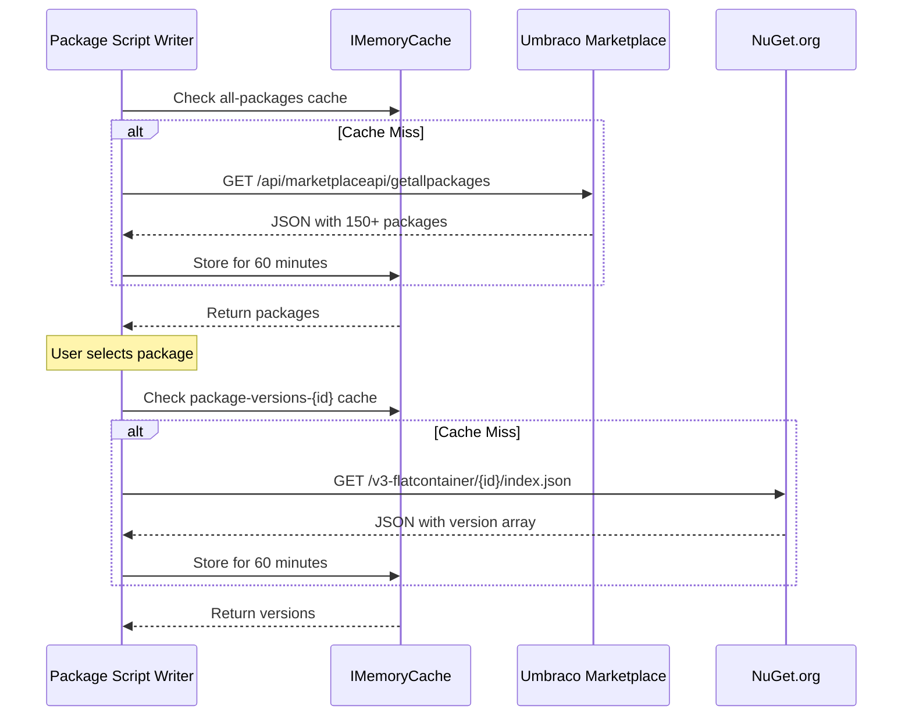

---

## Code Examples

### Example Generated Script

**User Selections**:
- Template: Umbraco.Templates v14.3.0
- Project Name: MyUmbracoBlog
- Solution Name: BlogSolution
- Database: SQLite (unattended install)
- User: admin@example.com / Admin User
- Packages:
  - Umbraco.Community.BlockPreview v1.6.0
  - Diplo.GodMode v3.0.3
- Docker: Enabled (Dockerfile + Docker Compose)

**Generated Script Output**:
```bash
# Ensure we have the version specific Umbraco templates
dotnet new install Umbraco.Templates::14.3.0 --force

# Create solution/project
dotnet new sln --name "BlogSolution"
dotnet new umbraco --force -n "MyUmbracoBlog" --add-docker --friendly-name "Admin User" --email "admin@example.com" --password "SuperSecret123" --development-database-type SQLite
dotnet sln add "MyUmbracoBlog"

#Add Docker Compose
dotnet new umbraco-compose -P "MyUmbracoBlog"

#Add Packages
dotnet add "MyUmbracoBlog" package Umbraco.Community.BlockPreview --version 1.6.0
dotnet add "MyUmbracoBlog" package Diplo.GodMode --version 3.0.3

dotnet run --project "MyUmbracoBlog"
#Running
```

**One-liner Format** (with comments removed):
```bash
dotnet new install Umbraco.Templates::14.3.0 --force && dotnet new sln --name "BlogSolution" && dotnet new umbraco --force -n "MyUmbracoBlog" --add-docker --friendly-name "Admin User" --email "admin@example.com" --password "SuperSecret123" --development-database-type SQLite && dotnet sln add "MyUmbracoBlog" && dotnet new umbraco-compose -P "MyUmbracoBlog" && dotnet add "MyUmbracoBlog" package Umbraco.Community.BlockPreview --version 1.6.0 && dotnet add "MyUmbracoBlog" package Diplo.GodMode --version 3.0.3 && dotnet run --project "MyUmbracoBlog"
```

---

## Future Enhancements

Potential improvements for future versions:

1. **Enhanced Features**:
   - Save multiple configurations (named presets)
   - Export to GitHub Actions workflow
   - Docker Compose with database containers
   - Support for Umbraco Cloud templates

2. **User Experience**:
   - Dark mode support
   - Package popularity/download metrics
   - Package dependency visualization
   - Script diff view when changing options

3. **Technical Improvements**:
   - Redis caching for distributed deployments
   - WebSocket real-time updates
   - GraphQL API alternative
   - Telemetry/analytics (privacy-focused)

4. **Community Features**:
   - Share configurations via short URLs
   - Community script gallery
   - Package recommendations based on selection
   - Integration with Umbraco Discord

---

## Troubleshooting

### Common Issues

#### 1. Package Versions Not Loading

**Symptoms**: Dropdown stays empty after selecting package

**Causes**:
- NuGet.org API rate limiting
- Network connectivity issues
- Cache corruption

**Solutions**:
```bash
# Clear cache via API
curl https://psw.codeshare.co.uk/api/scriptgeneratorapi/clearcache

# Check browser console for errors
# Verify package exists on NuGet.org
```

#### 2. Script Generation Returns Empty

**Symptoms**: "Generate" button produces no output

**Causes**:
- No template selected
- JavaScript errors blocking API call
- Server-side exception

**Solutions**:
1. Check browser console for JavaScript errors
2. Verify template dropdown has a selection
3. Check server logs for exceptions

#### 3. Unattended Install Fields Not Showing

**Symptoms**: Database fields remain hidden

**Causes**:
- Non-Umbraco template selected
- JavaScript not loaded

**Solutions**:
1. Ensure "Umbraco.Templates" is selected
2. Check "Use Unattended Install" checkbox
3. Hard refresh browser (Ctrl+F5)

---

## License & Credits

**License**: MIT License (2022)

**Author**: Paul Seal
- Website: [https://psw.codeshare.co.uk](https://psw.codeshare.co.uk)
- GitHub: [@prjseal](https://github.com/prjseal)

**Technologies**:
- ASP.NET Core (Microsoft)
- Bootstrap (Twitter)
- PrettyPrint.js (Google)

**Data Sources**:
- Umbraco Marketplace API
- NuGet.org API

---

## Appendix

### Glossary

| Term | Definition |
|------|------------|
| **Umbraco** | Open-source ASP.NET Core CMS |
| **LTS** | Long-Term Support version |
| **STS** | Short-Term Support version |
| **NuGet** | .NET package manager |
| **Razor Pages** | ASP.NET Core view engine |
| **View Component** | Reusable Razor component |
| **Unattended Install** | Automated Umbraco setup with predefined settings |
| **Starter Kit** | Pre-configured Umbraco package with content/templates |
| **Docker Compose** | Multi-container Docker application definition |

### Useful Links

- **Live Site**: [https://psw.codeshare.co.uk](https://psw.codeshare.co.uk)
- **GitHub Repository**: [https://github.com/prjseal/Package-Script-Writer](https://github.com/prjseal/Package-Script-Writer)
- **Umbraco Documentation**: [https://docs.umbraco.com](https://docs.umbraco.com)
- **NuGet Gallery**: [https://www.nuget.org](https://www.nuget.org)
- **Umbraco Marketplace**: [https://marketplace.umbraco.com](https://marketplace.umbraco.com)

### Version History

| Version | Date | Changes |
|---------|------|---------|
| 1.0 | 2022 | Initial release with basic script generation |
| 2.0 | 2023 | Added Docker support, one-liner output |
| 3.0 | 2024 | Upgraded to .NET 9.0, added version lifecycle |

---

**Document Version**: 1.0
**Last Updated**: 2025-12-04
**Maintained By**: Package Script Writer Team
