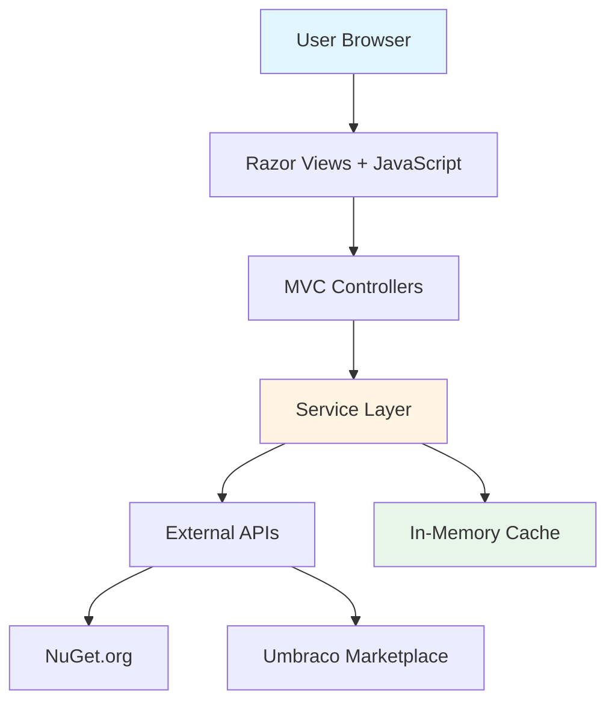

# Package Script Writer - Documentation Index

Welcome to the complete technical documentation for the Package Script Writer project. This documentation provides comprehensive coverage of all aspects of the application, from architecture to deployment.

---

## 🌟 Project Overview

**Package Script Writer** is a web-based utility that generates installation scripts for Umbraco CMS projects. Built with ASP.NET Core 9.0, it provides a streamlined interface for developers to create customized Umbraco project setup scripts.

### Key Features

- 🎯 **Template Selection** - Choose from Umbraco official & community templates
- 📦 **Package Management** - Browse and select from 150+ NuGet packages
- ⚙️ **Project Configuration** - Configure solutions, databases, and credentials
- 🐳 **Docker Support** - Optional Dockerfile and Docker Compose generation
- 🔗 **Shareable URLs** - All configuration encoded in shareable URLs
- 💾 **Persistent State** - Save/restore configurations via localStorage
- 🎨 **Syntax Highlighting** - Clean, readable script output

### Live Site

**Production**: [https://psw.codeshare.co.uk](https://psw.codeshare.co.uk/)

---

## 📚 Documentation Structure

The documentation is organized into the following sections:

### Core Documentation

#### [🏗️ Architecture](architecture.md)
Learn about the application's structure, layers, and design patterns.

**Topics**:
- High-level architecture diagram
- Application layers (Presentation, Service, Infrastructure)
- Project structure and file organization
- Technology stack
- Component interaction
- Design patterns and scalability

[➡️ Read Architecture Documentation](architecture.md)

---

#### [🔄 Process Flows](process-flows.md)
Visual diagrams showing how data and processes flow through the system.

**Topics**:
- User interaction flow
- Script generation flow
- Package version retrieval
- URL synchronization
- Application startup
- Event handling
- External API integration

**Includes**: 10+ Mermaid.js diagrams

[➡️ Read Process Flows Documentation](process-flows.md)

---

#### [⚙️ Services](services.md)
Detailed documentation of the business logic layer.

**Topics**:
- ScriptGeneratorService (327 lines of core logic)
- MarketplacePackageService (API integration)
- QueryStringService (URL handling)
- UmbracoVersionService (version management)
- Service interfaces and dependency injection
- Caching strategies

[➡️ Read Services Documentation](services.md)

---

#### [🌐 API Reference](api-reference.md)
Complete REST API documentation with examples.

**Topics**:
- Generate Script endpoint
- Get Package Versions endpoint
- Clear Cache endpoint
- Request/response formats
- Error handling
- Rate limiting
- Testing with cURL, Postman, REST Client

[➡️ Read API Reference](api-reference.md)

---

#### [💻 Frontend Architecture](frontend.md)
Client-side architecture including JavaScript and UI components.

**Topics**:
- JavaScript architecture (740+ lines)
- View Components
- Event handling
- State management
- URL synchronization
- Syntax highlighting
- Bootstrap UI framework
- Performance optimizations

[➡️ Read Frontend Documentation](frontend.md)

---

#### [📊 Data Models](data-models.md)
All data structures and models used in the application.

**Topics**:
- PackagesViewModel (main view model)
- PagedPackages (Marketplace response)
- NuGet API models
- Configuration models
- API request/response DTOs
- Model relationships and validation

[➡️ Read Data Models Documentation](data-models.md)

---

#### [⚙️ Configuration](configuration.md)
Application settings and configuration guide.

**Topics**:
- appsettings.json structure
- Dependency injection setup
- Middleware configuration
- Caching configuration
- Environment-specific settings
- Logging configuration
- MVC and routing setup

[➡️ Read Configuration Documentation](configuration.md)

---

#### [🔒 Security](security.md)
Security measures and best practices.

**Topics**:
- Security headers middleware
- HTTPS and HSTS
- Input validation
- No database = reduced attack surface
- OWASP Top 10 mitigation
- Dependency security
- Security checklist

[➡️ Read Security Documentation](security.md)

---

#### [🛠️ Development Guide](development-guide.md)
Complete guide for developers to get started.

**Topics**:
- Prerequisites and installation
- Getting started (clone, build, run)
- Development workflow
- Testing (manual, API, unit)
- Building and deployment
- Code style guidelines
- Contributing process
- Troubleshooting

[➡️ Read Development Guide](development-guide.md)

---

## 🚀 Quick Start

### For Users

1. Visit [https://psw.codeshare.co.uk](https://psw.codeshare.co.uk/)
2. Select your Umbraco template and version
3. Choose packages to include
4. Configure project settings
5. Generate and copy your script!

### For Developers

```bash
# Clone repository
git clone https://github.com/prjseal/Package-Script-Writer.git
cd Package-Script-Writer

# Run application
dotnet watch run --project ./PSW/PSW/

# Access at https://localhost:5001
```

See the [Development Guide](development-guide.md) for detailed setup instructions.

---

## 📖 Technology Stack

| Category | Technology | Version |
|----------|-----------|---------|
| **Framework** | ASP.NET Core | 9.0 |
| **Language** | C# | 13 |
| **Frontend** | Razor Pages | - |
| **JavaScript** | Vanilla JS | ES6+ |
| **UI Framework** | Bootstrap | 5.x |
| **Caching** | IMemoryCache | Built-in |
| **HTTP Client** | HttpClientFactory | Built-in |

---

## 🎯 Use Cases

### 1. Quick Umbraco Setup

Generate a script to set up a new Umbraco 14 project with SQLite database:

```bash
dotnet new install Umbraco.Templates::14.3.0 --force
dotnet new umbraco --force -n "MyProject" --development-database-type SQLite
dotnet run --project "MyProject"
```

### 2. Full-Featured Project

Create a complete solution with multiple packages, Docker support, and unattended install.

### 3. Team Collaboration

Share configuration URLs with team members for consistent project setups.

### 4. Training & Tutorials

Generate consistent scripts for training materials and tutorials.

---

## 📊 Project Statistics

| Metric | Count |
|--------|-------|
| C# Files | 49 |
| Razor Views | 21 |
| View Components | 10+ |
| JavaScript LOC | 740+ |
| Service Layer LOC | 327 (ScriptGeneratorService) |
| Total Project Lines | 4,000+ |
| Supported Umbraco Versions | 7-21+ |
| Package Marketplace | 150+ packages |

---

## 🔄 Architecture at a Glance



**Key Components**:
- **Presentation Layer**: Controllers and View Components
- **Service Layer**: Business logic (4 main services)
- **Infrastructure**: Caching and HTTP clients
- **External APIs**: NuGet.org and Umbraco Marketplace

See [Architecture Documentation](architecture.md) for detailed diagrams.

---

## 🤝 Contributing

We welcome contributions! Please see the [Development Guide](development-guide.md#contributing) for detailed instructions.

### Quick Contribution Steps

1. Raise an issue (bug or feature)
2. Discuss approach in the issue
3. Fork the repository
4. Create a feature branch
5. Make your changes
6. Submit a pull request

### Contribution Guidelines

- Follow existing code style
- Test your changes thoroughly
- Update documentation if needed
- Write clear commit messages
- Reference related issues in PR

---

## 📝 License & Credits

**License**: MIT License (2022)

**Author**: Paul Seal
- Website: [https://psw.codeshare.co.uk](https://psw.codeshare.co.uk)
- GitHub: [@prjseal](https://github.com/prjseal)

**Technologies**:
- ASP.NET Core (Microsoft)
- Bootstrap (Twitter)
- PrettyPrint.js (Google)

**Data Sources**:
- Umbraco Marketplace API
- NuGet.org API

---

## 🆘 Getting Help

### Documentation

Browse the documentation sections listed above for detailed information on specific topics.

### Issues

- **Bug Reports**: [Create an issue](https://github.com/prjseal/Package-Script-Writer/issues) with reproduction steps
- **Feature Requests**: [Create an issue](https://github.com/prjseal/Package-Script-Writer/issues) describing the feature and use case
- **Questions**: Check existing issues or create a new one

### Community

- **Umbraco Community**: [https://community.umbraco.com/](https://community.umbraco.com/)
- **Umbraco Discord**: [https://discord.umbraco.com/](https://discord.umbraco.com/)

---

## 🔗 Useful Links

### Project Links

- **Live Site**: [https://psw.codeshare.co.uk](https://psw.codeshare.co.uk)
- **GitHub Repository**: [https://github.com/prjseal/Package-Script-Writer](https://github.com/prjseal/Package-Script-Writer)
- **Issues**: [https://github.com/prjseal/Package-Script-Writer/issues](https://github.com/prjseal/Package-Script-Writer/issues)

### External Resources

- **Umbraco Documentation**: [https://docs.umbraco.com](https://docs.umbraco.com)
- **Umbraco Marketplace**: [https://marketplace.umbraco.com](https://marketplace.umbraco.com)
- **NuGet Gallery**: [https://www.nuget.org](https://www.nuget.org)
- **ASP.NET Core Docs**: [https://docs.microsoft.com/aspnet/core](https://docs.microsoft.com/aspnet/core)

---

## 📅 Version History

| Version | Date | Changes |
|---------|------|---------|
| 3.0 | 2024 | Upgraded to .NET 9.0, added version lifecycle display |
| 2.0 | 2023 | Added Docker support, one-liner output, starter kits |
| 1.0 | 2022 | Initial release with basic script generation |

---

## 🎓 Documentation Navigation

Use the links above to navigate to specific documentation sections, or browse the files in the `.github/` directory:

- **[architecture.md](architecture.md)** - System architecture and design
- **[process-flows.md](process-flows.md)** - Process flow diagrams
- **[services.md](services.md)** - Service layer documentation
- **[api-reference.md](api-reference.md)** - REST API reference
- **[frontend.md](frontend.md)** - Frontend architecture
- **[data-models.md](data-models.md)** - Data structures
- **[configuration.md](configuration.md)** - Configuration guide
- **[security.md](security.md)** - Security documentation
- **[development-guide.md](development-guide.md)** - Development setup

---

**Document Version**: 2.0
**Last Updated**: 2025-12-04
**Maintained By**: Package Script Writer Team

---

**Ready to dive in?** Start with the [Development Guide](development-guide.md) if you're a developer, or explore the [Architecture](architecture.md) to understand how everything works!
