# Process Flows

This document contains all the process flow diagrams that illustrate how the Package Script Writer application works.

## Table of Contents
- [User Interaction Flow](#user-interaction-flow)
- [Script Generation Flow](#script-generation-flow)
- [Package Version Retrieval Flow](#package-version-retrieval-flow)
- [URL Query String Synchronization](#url-query-string-synchronization)
- [Application Startup & Dependency Injection](#application-startup--dependency-injection)
- [Script Generation Logic](#script-generation-logic)
- [Event Flow](#event-flow)
- [External API Integration](#external-api-integration)
- [Middleware Pipeline](#middleware-pipeline)
- [Error Handling Flow](#error-handling-flow)

---

## User Interaction Flow

This sequence diagram shows the complete user journey from visiting the site to generating and copying a script.

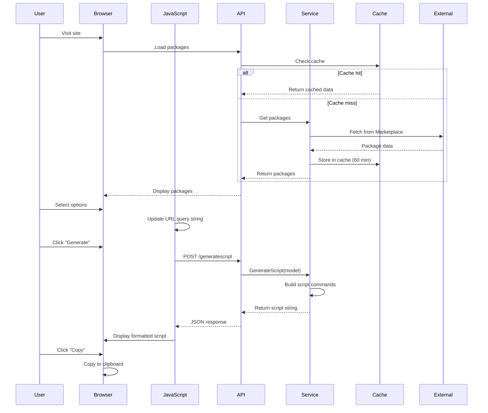

---

## Script Generation Flow

This flowchart shows the detailed logic for generating installation scripts based on user selections.

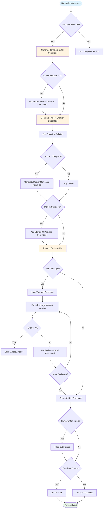

---

## Package Version Retrieval Flow

This flowchart illustrates how package versions are fetched from NuGet.org with caching.

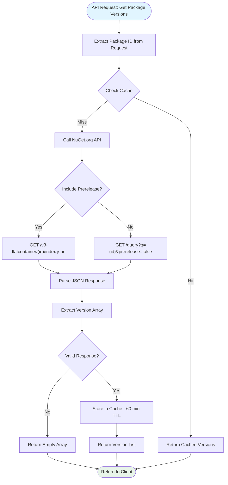

---

## URL Query String Synchronization

This flowchart shows how form state is synchronized with the browser URL for shareable configurations.

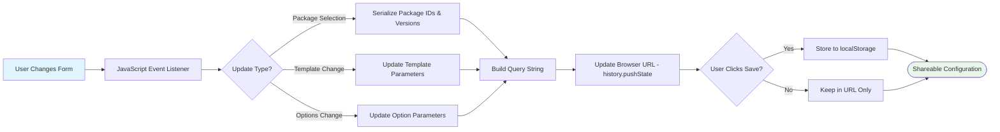

---

## Application Startup & Dependency Injection

This flowchart shows the application initialization process and service registration.

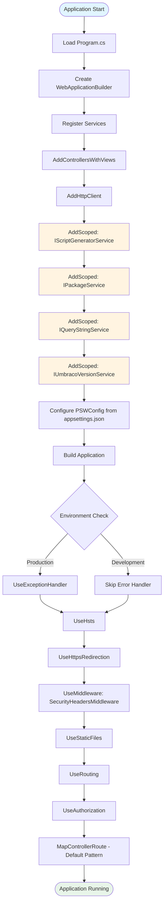

---

## Script Generation Logic

This flowchart shows the internal logic flow within the ScriptGeneratorService.

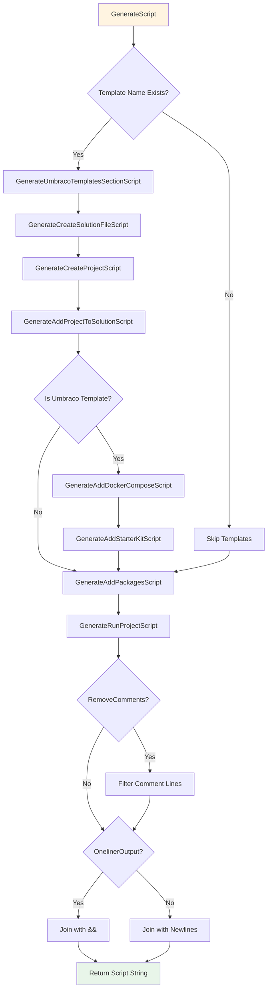

---

## Event Flow

This sequence diagram shows the detailed event flow when a user changes form controls.

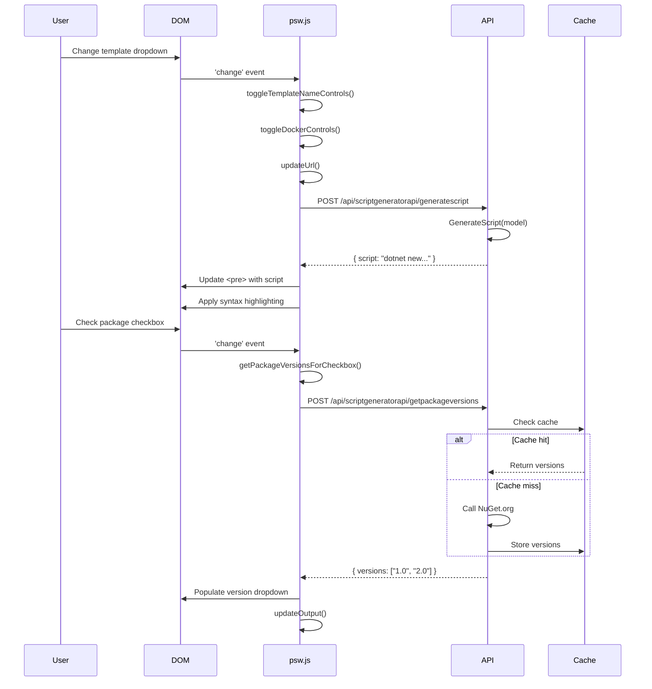

---

## External API Integration

This sequence diagram shows how the application integrates with external APIs.

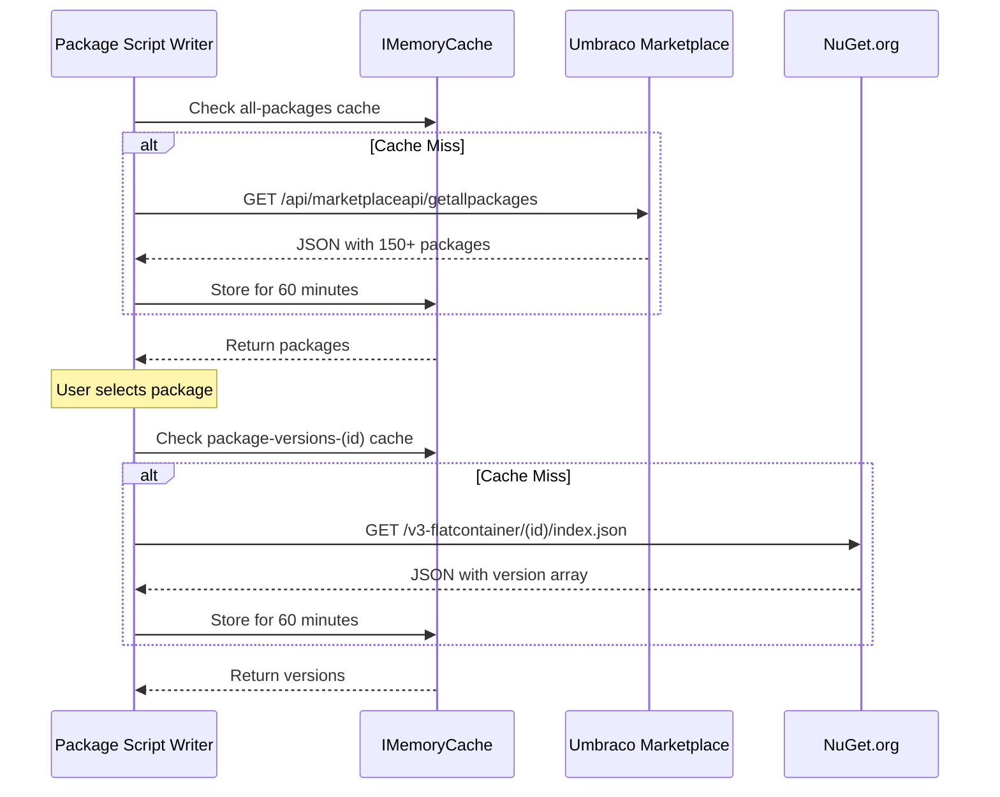

---

## Middleware Pipeline

This diagram shows the HTTP request processing pipeline.

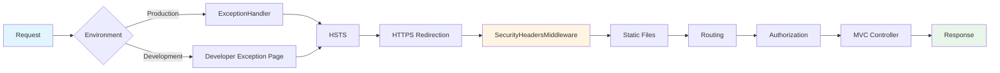

---

## Error Handling Flow

This diagram illustrates how errors are handled based on the environment.

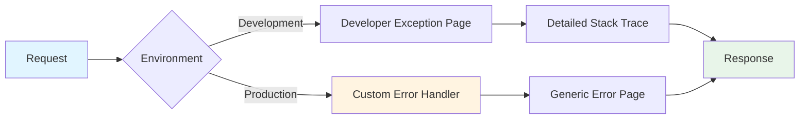

**Error Handling Strategy**:
- **Development**: Full stack traces for debugging (`/Home/Error` with detailed info)
- **Production**: User-friendly error pages without sensitive information
- **API Errors**: JSON responses with error messages
- **Validation Errors**: Model state errors returned to client

---

## Data Flow Summary

Here's a high-level view of how data flows through the system:

1. **User Input** → JavaScript captures form state
2. **URL Sync** → Query string updated via `history.pushState()`
3. **API Call** → POST to `/api/scriptgeneratorapi/generatescript`
4. **Service Layer** → `ScriptGeneratorService.GenerateScript()`
5. **External APIs** → Fetch package data if needed (with caching)
6. **Response** → JSON with generated script
7. **Display** → Update DOM with syntax-highlighted output

## Performance Considerations

### Caching Impact on Flow

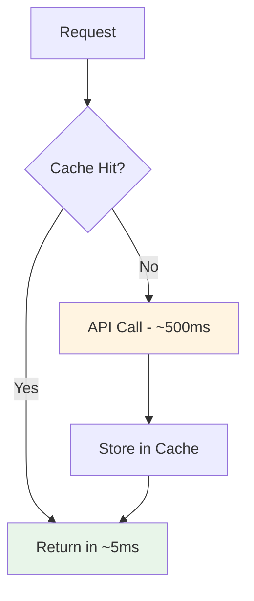

**Performance Metrics**:
- Cached requests: ~5ms
- Non-cached requests: ~500ms
- Cache duration: 60 minutes
- Performance improvement: 100x

---

[← Back to Documentation Index](documentation.md)
