# Template Commands - Process Flow Diagrams

This document contains detailed process flow diagrams for all `psw template` commands using Mermaid flowcharts.

## Table of Contents
- [Template Save](#template-save)
- [Template Load](#template-load)
- [Template List](#template-list)
- [Template Show](#template-show)
- [Template Delete](#template-delete)
- [Template Export](#template-export)
- [Template Import](#template-import)
- [Template Validate](#template-validate)

---

## Template Save

**Command**: `psw template save <name> [options]`

**Purpose**: Saves a template from current configuration to disk.

**File Reference**: `src/PackageCliTool/Workflows/TemplateWorkflow.cs:109-162`

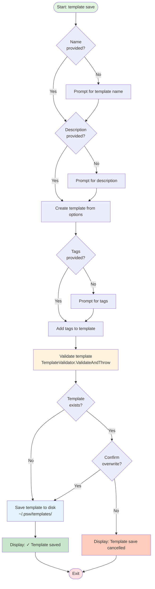

**Key States**:
1. `Initialization` → Input validation
2. `PromptForDetails` → Name, description, tags
3. `CreateTemplate` → Build template object
4. `ValidateTemplate` → Run validation rules
5. `CheckExists` → Check for conflicts
6. `SaveToDisk` → Write YAML file
7. `Exit`

---

## Template Load

**Command**: `psw template load <name> [options]`

**Purpose**: Loads and executes a saved template with optional overrides using standard CLI options.

**File Reference**: `src/PackageCliTool/Workflows/TemplateWorkflow.cs:167-271`

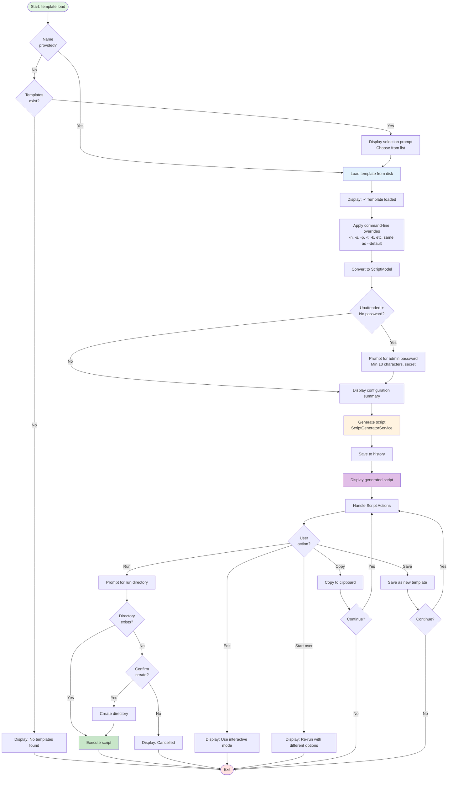

**Key States**:
1. `Initialization` → Check if name provided
2. `ListTemplates` → Show available templates (if no name)
3. `LoadFromDisk` → Read YAML file
4. `ApplyOverrides` → Merge command-line overrides
5. `GenerateScript` → Create installation script
6. `DisplayScript` → Show generated output
7. `ScriptActions` → Interactive action menu
8. `Exit`

---

## Template List

**Command**: `psw template list`

**Purpose**: Lists all available templates in table format.

**File Reference**: `src/PackageCliTool/Workflows/TemplateWorkflow.cs:424-463`

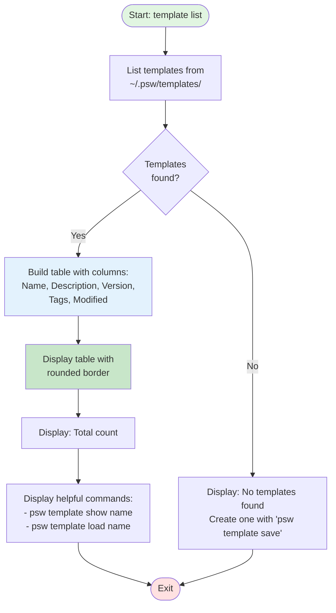

**Key States**:
1. `Initialization`
2. `ListTemplates` → Read all .yaml files
3. `CheckEmpty` → Validate count
4. `DisplayTable` → Show formatted output
5. `Exit`

---

## Template Show

**Command**: `psw template show <name>`

**Purpose**: Displays detailed metadata and configuration of a specific template.

**File Reference**: `src/PackageCliTool/Workflows/TemplateWorkflow.cs:468-527`

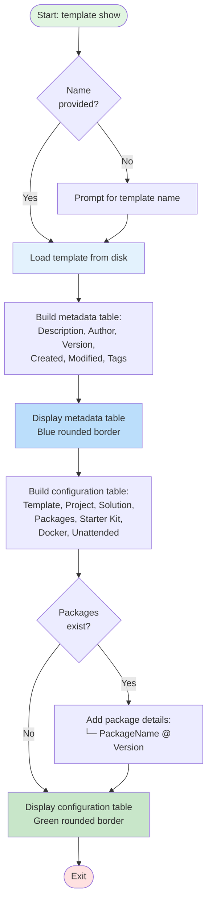

**Key States**:
1. `Initialization` → Check if name provided
2. `LoadTemplate` → Read template from disk
3. `DisplayMetadata` → Show template information
4. `DisplayConfiguration` → Show settings
5. `Exit`

---

## Template Delete

**Command**: `psw template delete <name>`

**Purpose**: Deletes a template after confirmation.

**File Reference**: `src/PackageCliTool/Workflows/TemplateWorkflow.cs:532-553`

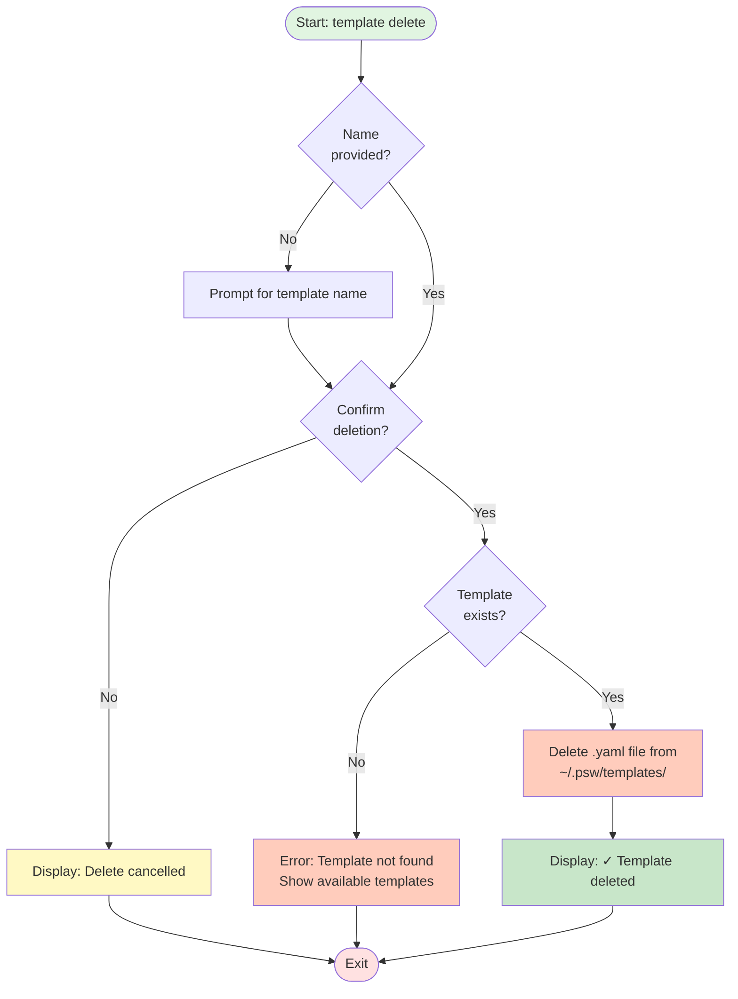

**Key States**:
1. `Initialization` → Check if name provided
2. `PromptConfirmation` → Ask user to confirm
3. `CheckExists` → Validate template exists
4. `DeleteFromDisk` → Remove file
5. `Exit`

---

## Template Export

**Command**: `psw template export <name> [--file <path>]`

**Purpose**: Exports a template to a specific file path.

**File Reference**: `src/PackageCliTool/Workflows/TemplateWorkflow.cs:558-574`

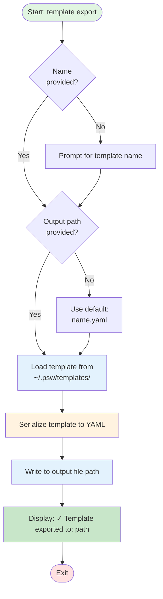

**Key States**:
1. `Initialization` → Validate inputs
2. `LoadTemplate` → Read from templates directory
3. `SerializeYAML` → Convert to YAML format
4. `WriteToFile` → Save to specified path
5. `Exit`

---

## Template Import

**Command**: `psw template import <filepath> [--name <newname>]`

**Purpose**: Imports a template from a file into the templates directory.

**File Reference**: `src/PackageCliTool/Workflows/TemplateWorkflow.cs:579-594`

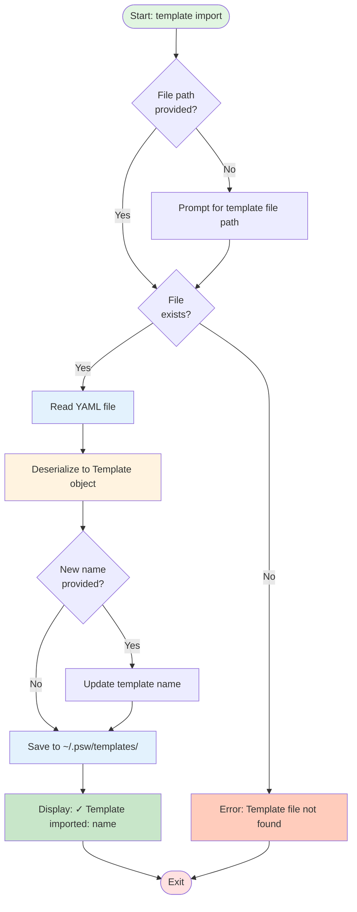

**Key States**:
1. `Initialization` → Check file path
2. `ValidateFile` → Check file exists
3. `ReadYAML` → Load file contents
4. `Deserialize` → Parse YAML to object
5. `RenameOptional` → Apply new name if provided
6. `SaveToTemplates` → Write to templates directory
7. `Exit`

---

## Template Validate

**Command**: `psw template validate <filepath>`

**Purpose**: Validates a template file without importing it.

**File Reference**: `src/PackageCliTool/Workflows/TemplateWorkflow.cs:599-635`

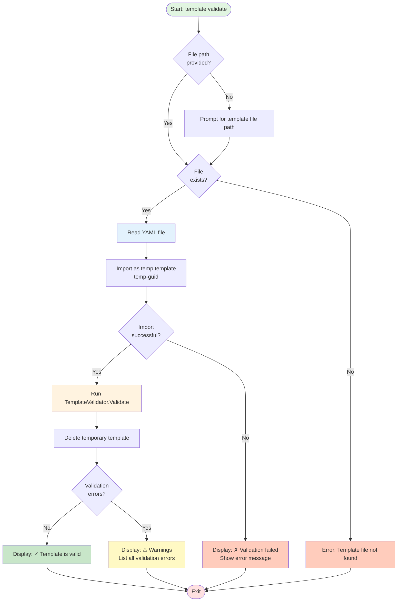

**Key States**:
1. `Initialization` → Check file path
2. `ValidateFile` → Check file exists
3. `TryImport` → Attempt to import as temp
4. `RunValidation` → Execute validation rules
5. `CleanupTemp` → Remove temporary template
6. `DisplayResults` → Show validation outcome
7. `Exit`

---

## Common Workflow Elements

### Script Actions (Post-Generation)

After generating a script from `template load`, users can choose from these actions:

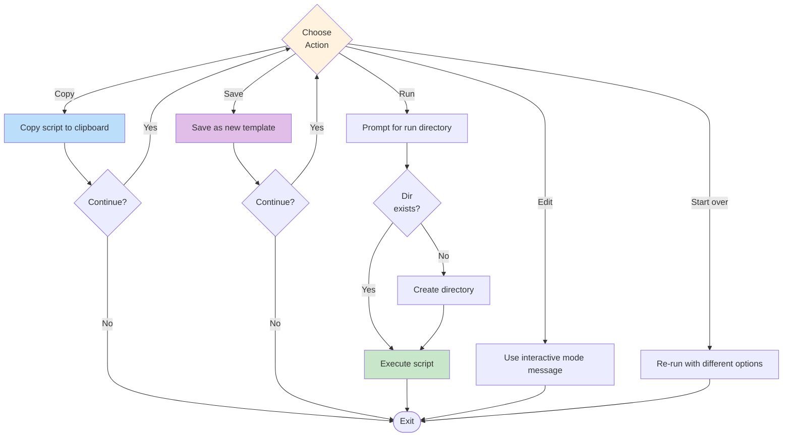

### Error Handling

All template commands include error handling:

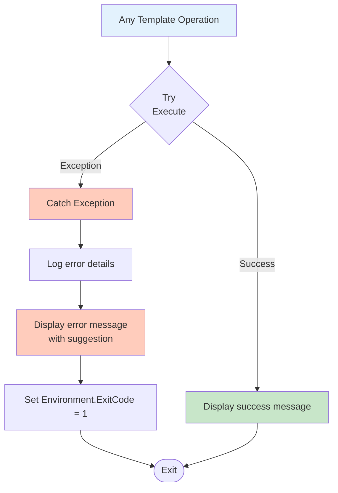

---

## State Transition Summary

### Template Command Router

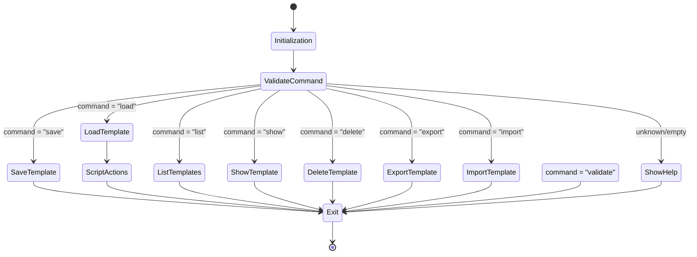

---

## File Locations

**Templates Storage**: `~/.psw/templates/*.yaml`

**Source Files**:
- `src/PackageCliTool/Workflows/TemplateWorkflow.cs` - Main workflow orchestration
- `src/PackageCliTool/Services/TemplateService.cs` - CRUD operations
- `src/PackageCliTool/Models/Templates/Template.cs` - Template model
- `src/PackageCliTool/Validation/TemplateValidator.cs` - Validation rules

---

## Notes

1. All template operations use YAML serialization/deserialization
2. Templates are stored as individual `.yaml` files in the user's home directory
3. Template validation runs automatically on save and import
4. The `load` command supports runtime overrides using standard CLI options (same as `--default` mode)
5. Password fields support three formats: literal, `${ENV_VAR}`, or `<prompt>`
6. Templates include metadata (name, description, author, version, tags, timestamps)
7. Script generation from templates uses the same engine as interactive mode
