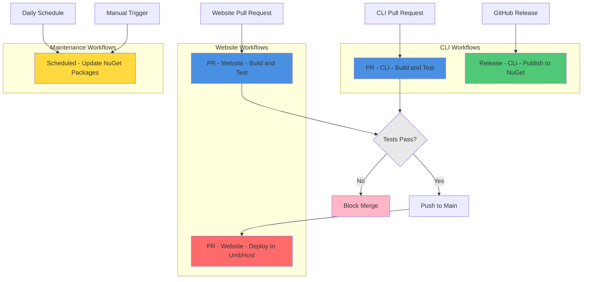
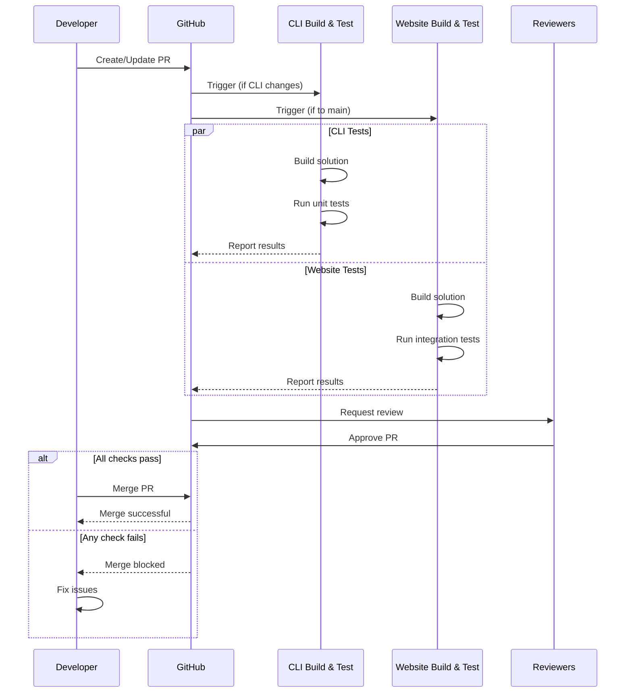
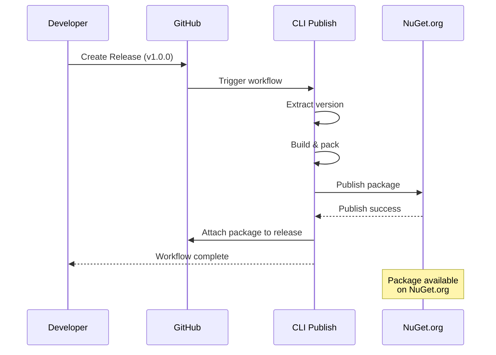
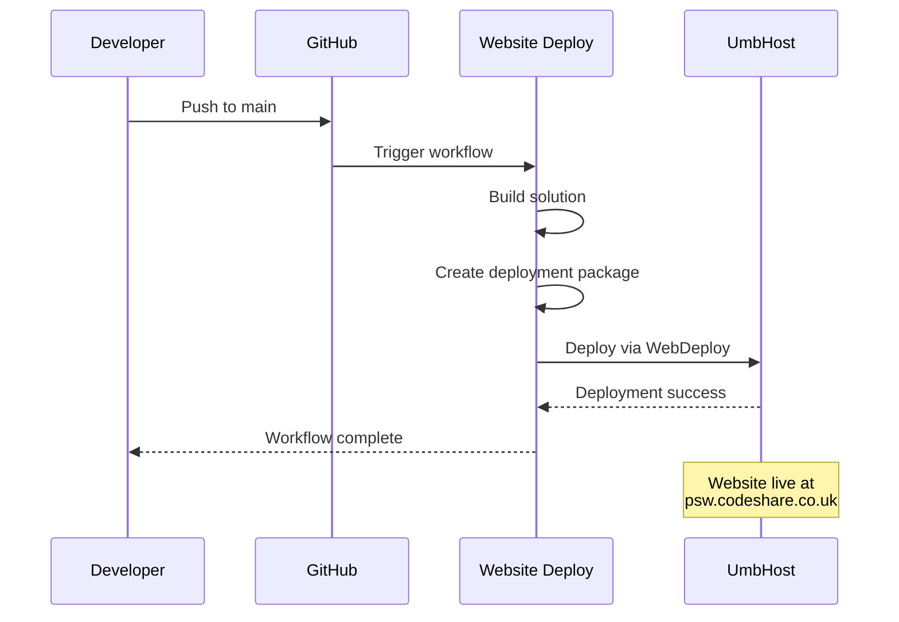

# GitHub Actions Workflows

This directory contains all GitHub Actions workflows for the Package Script Writer project. These workflows automate building, testing, deployment, and maintenance tasks.

## Workflows Overview



## Workflow Files

| Workflow | File | Status | Triggers |
|----------|------|--------|----------|
| [CLI Build and Test](#cli-build-and-test) | `cli-build-and-test.yml` | ✅ Active | PR, Manual |
| [CLI Publish](#cli-publish) | `cli-publish.yml` | ✅ Active | Release |
| [Website Build and Test](#website-build-and-test) | `website-build-and-test.yml` | ✅ Active | PR, Manual |
| [Website Deploy](#website-deploy) | `website-publish.yml` | ✅ Active | Push to main |
| [Update Packages](#update-packages) | `update-packages.yml` | ✅ Active | Schedule, Manual |

## CLI Build and Test

**File**: [`cli-build-and-test.yml`](./cli-build-and-test.yml)
**Documentation**: [cli-build-and-test.md](./cli-build-and-test.md)
**Name**: `PR - CLI - Build and Test`

Validates CLI tool changes on pull requests.

### Purpose
- Builds PackageCliTool solution
- Runs unit tests
- Ensures code quality before merge

### When It Runs
- 📋 Pull requests to any branch
- 🖱️ Manual workflow dispatch

### Quick Start
```bash
# Trigger manually
gh workflow run cli-build-and-test.yml
```

### Key Features
- ✅ .NET 10 build
- 🧪 Automated unit testing
- 📊 Test result artifacts
- 🚫 Blocks merge on failure

---

## CLI Publish

**File**: [`cli-publish.yml`](./cli-publish.yml)
**Documentation**: [cli-publish.md](./cli-publish.md)
**Name**: `Release - CLI - Publish to NuGet`

Publishes CLI tool to NuGet.org when a release is created.

### Purpose
- Extracts version from release tag
- Builds and packs CLI tool
- Publishes to NuGet.org
- Attaches package to GitHub release

### When It Runs
- 🎉 GitHub release published

### Requirements
- `NUGET_API_KEY` secret configured
- Valid semantic version tag (e.g., `v1.0.0`)

### Key Features
- 📦 Automated NuGet publishing
- 🏷️ Version extraction from tags
- 🔄 Prerelease support
- 📎 Release asset attachment

---

## Website Build and Test

**File**: [`website-build-and-test.yml`](./website-build-and-test.yml)
**Documentation**: [website-build-and-test.md](./website-build-and-test.md)
**Name**: `PR - Website - Build and Test`

Validates website changes on pull requests to main.

### Purpose
- Builds PSW website solution
- Runs integration tests
- Ensures functionality before merge

### When It Runs
- 📋 Pull requests to `main` branch
- 🖱️ Manual workflow dispatch

### Quick Start
```bash
# Trigger manually
gh workflow run website-build-and-test.yml
```

### Key Features
- ✅ .NET 10 build
- 🧪 Integration tests with WebApplicationFactory
- 📊 TRX test results
- 🚫 Blocks merge on failure

---

## Website Deploy

**File**: [`website-publish.yml`](./website-publish.yml)
**Documentation**: [website-publish.md](./website-publish.md)
**Name**: `PR - Website - Deploy to UmbHost`

Deploys website to production on push to main.

### Purpose
- Builds website with WebPublish
- Creates deployment package
- Deploys to UmbHost production

### When It Runs
- 🚀 Push to `main` branch

### Requirements
Multiple secrets required:
- `SOLUTION_NAME`
- `WEBSITE_NAME`
- `SERVER_COMPUTER_NAME`
- `USERNAME`
- `PASSWORD`

### Key Features
- 📦 WebDeploy packaging
- 🌐 UmbHost deployment
- 🔄 Automatic production updates
- 🏭 Release configuration

---

## Update Packages

**File**: [`update-packages.yml`](./update-packages.yml)
**Documentation**: [update-packages.md](./update-packages.md)
**Name**: `Scheduled - Update NuGet Packages`

Automatically checks for and updates NuGet packages.

### Purpose
- Checks for package updates daily
- Creates automated pull requests
- Keeps dependencies current and secure

### When It Runs
- 📅 Daily at 08:10 UTC
- 🖱️ Manual workflow dispatch

### Quick Start
```bash
# Dry run (preview only)
gh workflow run update-packages.yml -f dryRun=true

# Include prerelease packages
gh workflow run update-packages.yml -f includePrerelease=true

# Custom NuGet sources
gh workflow run update-packages.yml \
  -f nugetSources="https://custom-feed.com/nuget"
```

### Requirements
- `PAT_TOKEN` secret with repo and PR permissions

### Key Features
- 🤖 Automated dependency updates
- 📝 Auto-generated pull requests
- 🔍 Dry run mode for previewing
- 🎯 Prerelease version support
- 📊 Duplicate PR detection

---

## Workflow Execution Flow

### Pull Request Workflow


### Release Workflow


### Deployment Workflow


## Common Tasks

### Viewing Workflow Runs
```bash
# List all workflow runs
gh run list

# List runs for specific workflow
gh run list --workflow=cli-build-and-test.yml

# View specific run details
gh run view <run-id>

# Watch a running workflow
gh run watch
```

### Triggering Manual Workflows
```bash
# CLI build and test
gh workflow run cli-build-and-test.yml

# Website build and test
gh workflow run website-build-and-test.yml

# Update packages (dry run)
gh workflow run update-packages.yml -f dryRun=true
```

### Downloading Artifacts
```bash
# Download artifacts from specific run
gh run download <run-id>

# Download specific artifact
gh run download <run-id> -n artifact-name
```

## Secrets Configuration

### Required Secrets

| Secret | Used By | Description |
|--------|---------|-------------|
| `NUGET_API_KEY` | cli-publish.yml | NuGet.org API key for publishing |
| `PAT_TOKEN` | update-packages.yml | GitHub PAT for creating PRs |
| `SOLUTION_NAME` | website-publish.yml | Solution file name |
| `WEBSITE_NAME` | website-publish.yml | UmbHost website identifier |
| `SERVER_COMPUTER_NAME` | website-publish.yml | UmbHost server address |
| `USERNAME` | website-publish.yml | UmbHost deployment username |
| `PASSWORD` | website-publish.yml | UmbHost deployment password |

### Setting Up Secrets
1. Go to repository **Settings**
2. Navigate to **Secrets and variables** → **Actions**
3. Click **New repository secret**
4. Enter secret name and value
5. Click **Add secret**

## Monitoring Workflows

### GitHub Actions Dashboard
1. Go to repository **Actions** tab
2. Select workflow from left sidebar
3. View recent runs and status
4. Click on run for detailed logs

### Notifications
Configure notification settings:
1. Go to GitHub **Settings** → **Notifications**
2. Under **Actions**, enable:
   - ✅ Failed workflows
   - ✅ Workflow runs on my projects
   - ⚠️ All workflows (optional)

### Status Badges
Add workflow status badges to README:

```markdown


```

## Troubleshooting

### Common Issues

#### Workflow Not Triggering
- ✅ Check trigger conditions (branch, event type)
- ✅ Verify repository check passes
- ✅ Ensure workflow file is valid YAML
- ✅ Check if workflows are enabled in repository settings

#### Build Failures
- ✅ Review build logs for specific errors
- ✅ Test build locally first
- ✅ Check dependency versions
- ✅ Verify .NET SDK version

#### Secret Issues
- ✅ Verify secrets are configured
- ✅ Check secret names match exactly
- ✅ Ensure secrets have correct permissions
- ✅ Regenerate expired tokens/keys

#### Deployment Failures
- ✅ Verify deployment credentials
- ✅ Check server connectivity
- ✅ Review deployment logs
- ✅ Test deployment manually

### Getting Help

1. **Check workflow logs**: Detailed error messages in Actions tab
2. **Review documentation**: Individual workflow docs linked above
3. **Search issues**: Check if similar issue exists
4. **Create issue**: Report bugs or ask questions

## Best Practices

### For Developers
- ✅ Run workflows locally when possible
- ✅ Fix failing workflows before merging
- ✅ Review workflow logs for warnings
- ✅ Keep dependencies up-to-date
- ✅ Test changes in branches first

### For Maintainers
- ✅ Monitor workflow success rates
- ✅ Update workflows for new .NET versions
- ✅ Rotate secrets periodically
- ✅ Review and approve automated PRs
- ✅ Document workflow changes

### Security
- ✅ Use repository secrets for sensitive data
- ✅ Limit secret access to necessary workflows
- ✅ Use minimal permissions for workflows
- ✅ Review automated PR changes carefully
- ✅ Monitor for unauthorized workflow runs

## Maintenance

### Updating Workflows

1. **Edit workflow file** in `.github/workflows/`
2. **Test changes** in a feature branch
3. **Create PR** with workflow changes
4. **Review and merge** after testing

### Deprecation Notices

Watch for GitHub Actions deprecation warnings:
- Outdated action versions
- Deprecated Node.js versions
- Deprecated workflow commands

Update workflows proactively to avoid breakage.

## Related Documentation

- [Development Guide](../development-guide.md) - Setting up development environment
- [Testing Guide](../testing.md) - Writing and running tests
- [CLI Release Process](../CLI-RELEASE-PROCESS.md) - Releasing the CLI tool
- [Architecture](../architecture.md) - Project architecture overview

## Contributing

When adding new workflows:

1. **Create workflow file** in `.github/workflows/`
2. **Add comprehensive documentation** following existing patterns
3. **Include mermaid diagrams** for visual clarity
4. **Update this README** with new workflow information
5. **Test thoroughly** before merging
6. **Add to monitoring** and notification systems

## Workflow File Structure

All workflows follow this structure:

```yaml
name: Workflow Name

on:
  # Triggers

permissions:
  # Minimal required permissions

env:
  # Environment variables

jobs:
  job-name:
    runs-on: windows-latest  # or ubuntu-latest
    if: github.repository == 'prjseal/Package-Script-Writer'

    steps:
      - name: Step name
        # Step actions
```

## Support

For issues with GitHub Actions workflows:

1. Check individual workflow documentation
2. Review GitHub Actions [documentation](https://docs.github.com/en/actions)
3. Search [GitHub Community](https://github.community/)
4. Create an issue in this repository

---

**Last Updated**: 2025-12-14
**Maintained By**: Development Team
**Questions?**: Open an issue
