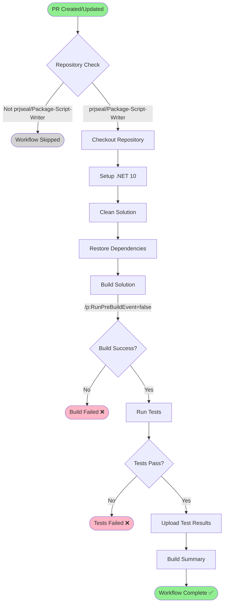

# CLI Build and Test Workflow

**Workflow File**: `.github/workflows/cli-build-and-test.yml`
**Workflow Name**: `PR - CLI - Build and Test`

## Overview

This workflow automatically builds and tests the PackageScriptWriter CLI tool whenever a pull request is created or updated. It ensures code quality and prevents regressions before code is merged.

## Triggers

### Automatic Triggers
- **Pull Requests**: Runs on pull requests targeting any branch (`**`)
- **Repository**: Only runs in `prjseal/Package-Script-Writer`

### Manual Triggers
- **workflow_dispatch**: Can be manually triggered via GitHub Actions UI or CLI

```bash
# Via GitHub CLI
gh workflow run cli-build-and-test.yml
```

## Workflow Diagram



## Workflow Steps

### 1. Repository Check
```yaml
if: github.repository == 'prjseal/Package-Script-Writer'
```
Ensures the workflow only runs in the main repository, not in forks.

### 2. Checkout Repository
```yaml
- uses: actions/checkout@v4
```
Checks out the repository code for the pull request.

### 3. Setup .NET
```yaml
- uses: actions/setup-dotnet@v4
  with:
    dotnet-version: '10.0.x'
```
Installs .NET 10 SDK required for building the CLI tool.

### 4. Clean Solution
```powershell
dotnet clean ./src/PackageCliTool.sln --configuration Release
```
Cleans any previous build artifacts to ensure a fresh build.

### 5. Restore Dependencies
```powershell
dotnet restore ./src/PackageCliTool.sln
```
Restores all NuGet package dependencies for the solution.

### 6. Build Solution
```powershell
dotnet build ./src/PackageCliTool.sln `
  --configuration Release `
  --no-restore `
  /p:RunPreBuildEvent=false
```
Builds the CLI tool in Release configuration.

**Note**: `/p:RunPreBuildEvent=false` prevents `dotnet format` from running during CI builds.

### 7. Run Tests
```powershell
dotnet test ./src/PackageCliTool.sln `
  --configuration Release `
  --no-build `
  --verbosity normal `
  --logger "trx;LogFileName=test-results.trx"
```
Executes all unit tests in the CLI solution and generates TRX test results.

### 8. Upload Test Results
```yaml
- uses: actions/upload-artifact@v4
  with:
    name: test-results-${{ github.event.pull_request.number }}
    path: '**/TestResults/*.trx'
```
Uploads test result files as artifacts for review (runs even if previous steps fail).

### 9. Build Summary
Displays a summary of the build including:
- PR number
- Branch name
- Actor (who triggered the workflow)
- Repository name

## Artifacts

| Artifact | Description | Retention |
|----------|-------------|-----------|
| `test-results-{PR-number}` | TRX test result files | 90 days (default) |

## Environment

- **Runner**: `windows-latest`
- **Solution**: `./src/PackageCliTool.sln`
- **Configuration**: Release
- **.NET Version**: 10.0.x

## Permissions

```yaml
permissions:
  contents: read
  pull-requests: read
```

- **contents**: Read repository contents
- **pull-requests**: Read PR metadata

## Success Criteria

✅ **Workflow succeeds when**:
- Repository check passes
- Build completes without errors
- All tests pass

❌ **Workflow fails when**:
- Build errors occur
- Any test fails
- Dependencies cannot be restored

## Troubleshooting

### Build Failures

**Error**: Build fails with compilation errors
- Check the build output for specific compilation errors
- Ensure all required dependencies are properly referenced
- Verify .NET version compatibility

### Test Failures

**Error**: Tests fail during execution
- Review test output in the workflow logs
- Download test result artifacts for detailed analysis
- Run tests locally to reproduce the issue

### Restore Failures

**Error**: NuGet packages fail to restore
- Check NuGet package sources are accessible
- Verify package versions exist in NuGet.org
- Check for network connectivity issues

## Viewing Results

### Via GitHub UI
1. Navigate to the Pull Request
2. Click the **"Checks"** tab
3. Select **"PR - CLI - Build and Test"** workflow
4. Expand steps to see detailed logs

### Via GitHub CLI
```bash
# List workflow runs
gh run list --workflow=cli-build-and-test.yml

# View specific run
gh run view <run-id>

# Download artifacts
gh run download <run-id>
```

## Related Documentation

- [CLI Release Process](./CLI-RELEASE-PROCESS.md)
- [Testing Guide](./testing.md)
- [Development Guide](./development-guide.md)

## Maintenance

### Updating .NET Version
Update the `dotnet-version` in the Setup .NET step:
```yaml
- uses: actions/setup-dotnet@v4
  with:
    dotnet-version: '11.0.x'  # Update version here
```

### Adding Additional Test Frameworks
If adding new test projects, they will automatically be discovered and run by `dotnet test` on the solution.

## Best Practices

- ✅ Always run this workflow before merging PRs
- ✅ Fix any test failures before requesting review
- ✅ Review test artifacts if tests fail
- ✅ Keep test execution time under 5 minutes
- ❌ Don't skip failing tests
- ❌ Don't merge PRs with failing checks
