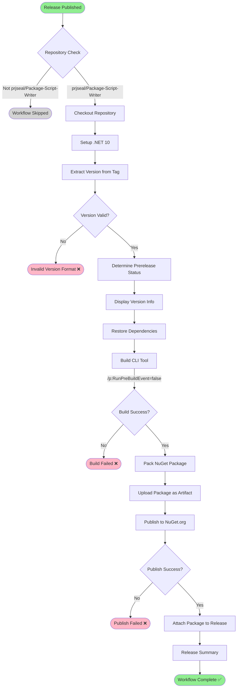
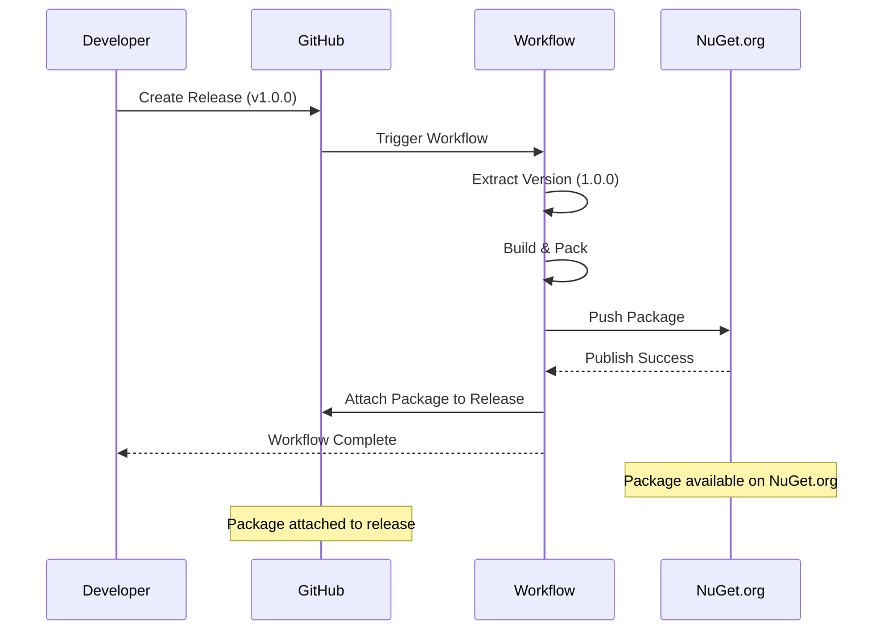

# CLI Publish Workflow

**Workflow File**: `.github/workflows/cli-publish.yml`
**Workflow Name**: `Release - CLI - Publish to NuGet`

## Overview

This workflow automatically packages and publishes the PackageScriptWriter CLI tool to NuGet.org whenever a new GitHub release is published. It handles version extraction, package creation, publishing, and attaching artifacts to the release.

## Triggers

### Automatic Triggers
- **GitHub Release**: Runs when a release is published
- **Repository**: Only runs in `prjseal/Package-Script-Writer`

### Manual Triggers
- This workflow is triggered by release events only (no manual trigger)

## Workflow Diagram



## Workflow Steps

### 1. Repository Check
```yaml
if: github.repository == 'prjseal/Package-Script-Writer'
```
Ensures the workflow only runs in the main repository, preventing accidental publishes from forks.

### 2. Checkout Repository
```yaml
- uses: actions/checkout@v4
  with:
    fetch-depth: 0
```
Checks out the full repository history for version tracking.

### 3. Setup .NET
```yaml
- uses: actions/setup-dotnet@v4
  with:
    dotnet-version: '10.0.x'
```
Installs .NET 10 SDK required for building and packing the CLI tool.

### 4. Extract Version from Release Tag
```powershell
$releaseTag = "${{ github.event.release.tag_name }}"
$version = $releaseTag -replace '^v', ''

# Validate version format (X.Y.Z or X.Y.Z-suffix)
if ($version -notmatch '^\d+\.\d+\.\d+(-.*)?$') {
    Write-Error "Invalid version format"
    exit 1
}
```

**Supported tag formats**:
- `v1.0.0` → Version: `1.0.0`
- `v2.1.0-beta` → Version: `2.1.0-beta`
- `1.0.0` → Version: `1.0.0`

### 5. Determine Prerelease Status
```powershell
$isPrerelease = if (${{ github.event.release.prerelease }} -eq 'true' -or $version -match '-') {
    'true'
} else {
    'false'
}
```

A package is marked as prerelease if:
- GitHub release is marked as prerelease, OR
- Version contains a suffix (e.g., `-beta`, `-rc1`)

### 6. Display Version Info
Shows release information including:
- Release tag
- Extracted version
- Prerelease status
- Release name

### 7. Restore Dependencies
```powershell
dotnet restore ./src/PackageCliTool/PackageCliTool.csproj
```
Restores all NuGet package dependencies for the CLI tool project.

### 8. Build CLI Tool
```powershell
dotnet build ./src/PackageCliTool/PackageCliTool.csproj `
  --configuration Release `
  --no-restore `
  /p:Version="${{ steps.version.outputs.version }}" `
  /p:RunPreBuildEvent=false
```

Builds the CLI tool with the extracted version number.

**Note**: `/p:RunPreBuildEvent=false` prevents `dotnet format` from running during builds.

### 9. Pack CLI Tool
```powershell
dotnet pack ./src/PackageCliTool/PackageCliTool.csproj `
  --configuration Release `
  --no-build `
  --output "./artifacts/nuget" `
  /p:Version="${{ steps.version.outputs.version }}" `
  /p:PackageVersion="${{ steps.version.outputs.version }}"
```

Creates the NuGet package (.nupkg) and optionally symbol package (.snupkg).

### 10. Upload Package as Artifact
```yaml
- uses: actions/upload-artifact@v4
  with:
    name: cli-nuget-package-${{ steps.version.outputs.version }}
    path: |
      ./artifacts/nuget/*.nupkg
      ./artifacts/nuget/*.snupkg
```

Uploads packages as GitHub workflow artifacts for verification.

### 11. Publish to NuGet.org
```powershell
dotnet nuget push $package.FullName `
  --api-key $env:NUGET_API_KEY `
  --source https://api.nuget.org/v3/index.json `
  --skip-duplicate
```

Publishes the package to NuGet.org using the API key from secrets.

**Symbol packages** are also published if present (non-critical).

### 12. Attach Package to Release
```powershell
gh release upload $releaseTag $package.FullName --clobber
```

Uploads the .nupkg file as an asset on the GitHub release.

### 13. Release Summary
Displays final summary including:
- Package name
- Version
- Release tag and URL
- Installation command

## Secrets Required

| Secret | Description | How to Get |
|--------|-------------|------------|
| `NUGET_API_KEY` | NuGet.org API key with push permissions | [Create at NuGet.org](https://www.nuget.org/account/apikeys) |

### Configuring Secrets
1. Go to repository **Settings** → **Secrets and variables** → **Actions**
2. Click **New repository secret**
3. Name: `NUGET_API_KEY`
4. Value: Your NuGet.org API key
5. Click **Add secret**

## Artifacts

| Artifact | Description | Retention |
|----------|-------------|-----------|
| `cli-nuget-package-{version}` | NuGet package files (.nupkg, .snupkg) | 90 days (default) |

## Environment

- **Runner**: `windows-latest`
- **Project**: `./src/PackageCliTool/PackageCliTool.csproj`
- **Configuration**: Release
- **.NET Version**: 10.0.x
- **NuGet Source**: https://api.nuget.org/v3/index.json

## Permissions

```yaml
permissions:
  contents: write  # Allow uploading release assets
```

## Success Criteria

✅ **Workflow succeeds when**:
- Repository check passes
- Version format is valid
- Build completes without errors
- Package is successfully published to NuGet.org
- Package is attached to GitHub release

❌ **Workflow fails when**:
- Invalid version format in release tag
- Build errors occur
- NuGet publish fails (e.g., invalid API key, version conflict)
- GitHub release asset upload fails

## Version Format

### Valid Formats
- ✅ `v1.0.0` (stable release)
- ✅ `1.2.3` (stable release without 'v' prefix)
- ✅ `v2.0.0-beta` (prerelease)
- ✅ `v1.5.0-rc.1` (prerelease with build number)

### Invalid Formats
- ❌ `v1.0` (missing patch version)
- ❌ `release-1.0.0` (invalid prefix)
- ❌ `1.0.0.0` (too many version segments)

## Publishing Flow



## Troubleshooting

### Version Extraction Fails

**Error**: `Invalid version format`

**Solution**:
- Ensure release tag follows format: `vX.Y.Z` or `X.Y.Z`
- Check for typos in the tag name
- Verify version has exactly 3 numeric segments

### NuGet Publish Fails

**Error**: `Failed to publish package`

**Possible causes**:
1. **Invalid API Key**: Verify `NUGET_API_KEY` secret is correct
2. **Version Conflict**: Package version already exists on NuGet.org
3. **Network Issues**: Temporary connectivity problems with NuGet.org
4. **Package Validation**: Package doesn't meet NuGet.org requirements

**Solutions**:
- Check API key has push permissions
- Increment version number for new release
- Wait and retry if network issue
- Review NuGet package validation errors

### Build Fails

**Error**: Build compilation errors

**Solution**:
- Ensure code builds successfully locally
- Check all dependencies are restored
- Verify .NET SDK version compatibility

## Post-Publication

After successful publication:

1. **Verify on NuGet.org**: Check package appears at https://www.nuget.org/packages/PackageScriptWriter.Cli
2. **Test Installation**:
   ```bash
   dotnet tool install --global PackageScriptWriter.Cli --version {version}
   ```
3. **Update Documentation**: Update README with new version
4. **Announce Release**: Share release notes with users

## Related Documentation

- [CLI Release Process](../CLI-RELEASE-PROCESS.md)
- [CLI Build and Test Workflow](./cli-build-and-test.md)
- [Development Guide](../development-guide.md)

## Maintenance

### Updating NuGet Source

To publish to a different NuGet feed, update the `--source` parameter:
```powershell
dotnet nuget push $package.FullName `
  --api-key $env:CUSTOM_FEED_KEY `
  --source https://your-custom-feed.com/v3/index.json
```

### Changing Package Metadata

Package metadata (description, tags, authors, etc.) is defined in:
- `src/PackageCliTool/PackageCliTool.csproj`

Update the `.csproj` file to change package information.

## Best Practices

- ✅ Use semantic versioning (X.Y.Z)
- ✅ Mark breaking changes as major version bumps
- ✅ Use prerelease tags for beta/RC versions
- ✅ Test package locally before creating release
- ✅ Write detailed release notes
- ❌ Don't reuse version numbers
- ❌ Don't publish untested code
- ❌ Don't skip release notes
