# Scheduled NuGet Package Updates Workflow

**Workflow File**: `.github/workflows/update-packages.yml`
**Workflow Name**: `Scheduled - Update NuGet Packages`

## Overview

This workflow automatically checks for and updates third-party NuGet packages in the repository on a daily schedule. It creates pull requests with package updates, allowing for review and testing before merging. This helps keep dependencies up-to-date and secure.

## Triggers

### Automatic Triggers
- **Schedule**: Runs daily at 08:10 UTC (`cron: '10 8 * * *'`)
- **Repository**: Only runs in `prjseal/Package-Script-Writer`

### Manual Triggers
- **workflow_dispatch**: Can be manually triggered with optional parameters

#### Manual Trigger Inputs

| Input | Description | Default | Required |
|-------|-------------|---------|----------|
| `dryRun` | Run without making changes (preview mode) | `false` | No |
| `includePrerelease` | Include prerelease package versions | `false` | No |
| `nugetSources` | Comma-separated custom NuGet source URLs | empty | No |

```bash
# Via GitHub CLI - Basic run
gh workflow run update-packages.yml

# Via GitHub CLI - Dry run (preview only)
gh workflow run update-packages.yml -f dryRun=true

# Via GitHub CLI - Include prerelease versions
gh workflow run update-packages.yml -f includePrerelease=true

# Via GitHub CLI - Custom NuGet sources
gh workflow run update-packages.yml -f nugetSources="https://www.myget.org/F/umbraco-dev/api/v3/index.json"
```

## Workflow Diagram

```mermaid
flowchart TD
    Start([Scheduled Trigger<br/>or Manual Run]) --> RepoCheck{Repository Check}
    RepoCheck -->|Not prjseal/Package-Script-Writer| Skip([Workflow Skipped])
    RepoCheck -->|prjseal/Package-Script-Writer| Checkout[Checkout Repository]

    Checkout --> SetupDotNet[Setup .NET 10]
    SetupDotNet --> CustomSources{Custom NuGet<br/>Sources?}
    CustomSources -->|Yes| ConfigSources[Configure Custom Sources]
    CustomSources -->|No| InstallGH[Install GitHub CLI]
    ConfigSources --> InstallGH

    InstallGH --> UpdatePackages[Run Package Update Script]
    UpdatePackages --> UpdateSuccess{Update Success?}
    UpdateSuccess -->|No| ShowFailure[Show Build Failure Summary]
    UpdateSuccess -->|Yes| CheckChanges{Changes Detected?}

    ShowFailure --> End1([Workflow Failed ❌])
    CheckChanges -->|No| NoChanges([No Updates Available])

    CheckChanges -->|Yes| DryRun{Dry Run Mode?}
    DryRun -->|Yes| End2([Preview Complete])
    DryRun -->|No| CommitPush[Commit & Push to Branch]

    CommitPush --> ReadSummary[Read Package Summary]
    ReadSummary --> CheckExistingPR{Existing PR<br/>for Updates?}

    CheckExistingPR -->|Yes| SkipPR[Show PR Skipped Summary]
    CheckExistingPR -->|No| CreatePR[Create Pull Request]

    SkipPR --> End3([PR Already Exists])
    CreatePR --> End4([PR Created ✅])

    style Start fill:#90EE90
    style End2 fill:#87CEEB
    style End3 fill:#FFD700
    style End4 fill:#50C878
    style End1 fill:#FFB6C6
    style NoChanges fill:#D3D3D3
    style Skip fill:#D3D3D3
```



## Workflow Steps

### 1. Repository Check
```yaml
if: github.repository == 'prjseal/Package-Script-Writer'
```
Ensures the workflow only runs in the main repository.

### 2. Checkout Repository
```yaml
- uses: actions/checkout@v3
  with:
    fetch-depth: 0
```
Checks out the full repository history for version tracking and branch operations.

### 3. Setup .NET
```yaml
- uses: actions/setup-dotnet@v4
  with:
    dotnet-version: '10.0.x'
```
Installs .NET 10 SDK required for package updates.

### 4. Configure Custom NuGet Sources
```powershell
# Only runs if nugetSources input is provided
./.github/workflows/powershell/Configure-CustomNuGetSourcesFromInput.ps1 `
  -SourcesInput '${{ github.event.inputs.nugetSources }}'
```

Configures additional NuGet package sources (e.g., MyGet, private feeds).

### 5. Install GitHub CLI
```powershell
choco install gh -y
```
Installs GitHub CLI for creating pull requests and checking for existing PRs.

### 6. Run Package Update Script
```powershell
./.github/workflows/powershell/UpdateThirdPartyPackages.ps1 `
  -RootPath "${{ github.workspace }}" `
  -DryRun:$dryRunFlag `
  -IncludePrerelease:$includePrereleaseFlag
```

**Logic**:
- **Scheduled runs**: Uses `SCHEDULED_INCLUDE_PRERELEASE` environment variable (default: `false`)
- **Manual runs**: Uses `includePrerelease` input parameter

Searches for package updates and modifies project files accordingly.

### 7. Build Failure Summary
```powershell
# Only runs if update script fails
./.github/workflows/powershell/Show-BuildFailureSummary.ps1 `
  -WorkspacePath "${{ github.workspace }}"
```

Displays detailed error information if package update fails.

### 8. Check for Changes
```powershell
./.github/workflows/powershell/Test-WorkflowChanges.ps1 `
  -WorkspacePath "${{ github.workspace }}"
```

Detects if any project files were modified (sets `has_changes` output).

### 9. Commit and Push Changes
```powershell
# Only runs if: not dry run AND changes detected
./.github/workflows/powershell/Invoke-CommitAndPush.ps1 `
  -WorkspacePath "${{ github.workspace }}" `
  -Repository "${{ github.repository }}" `
  -PatToken $env:PAT_TOKEN
```

Creates a new branch, commits changes, and pushes to remote (outputs `branchName`).

### 10. Read Package Summary
```powershell
./.github/workflows/powershell/Get-PackageSummary.ps1 `
  -WorkspacePath "${{ github.workspace }}"
```

Generates a summary of updated packages for the PR description.

### 11. Check for Existing PRs
```powershell
./.github/workflows/powershell/Test-ExistingPullRequest.ps1 `
  -WorkspacePath "${{ github.workspace }}"
```

Checks if a similar package update PR already exists (sets `skip` output).

### 12. Create Pull Request
```powershell
# Only runs if: not dry run AND changes AND no existing PR
./.github/workflows/powershell/New-PackageUpdatePullRequest.ps1 `
  -PackageSummary "${{ steps.read-summary.outputs.summary }}" `
  -IncludePrerelease "$includePrereleaseValue" `
  -NuGetSources "${{ github.event.inputs.nugetSources }}" `
  -BranchName "${{ steps.commit-and-push.outputs.branchName }}" `
  -WorkspacePath "${{ github.workspace }}"
```

Creates a pull request with:
- Package update summary
- List of updated packages
- Version changes
- Metadata (prerelease flag, custom sources)

### 13. PR Skipped Summary
```powershell
# Only runs if existing PR found
./.github/workflows/powershell/Show-PullRequestSkippedSummary.ps1 `
  -ExistingPrNumber "${{ steps.check-existing-pr.outputs.existing_pr_number }}" `
  -Repository "${{ github.repository }}"
```

Displays information about the existing PR to avoid duplicates.

## Update Flow


## Secrets Required

| Secret | Description | Usage |
|--------|-------------|-------|
| `PAT_TOKEN` | Personal Access Token with repo and PR permissions | Creating branches, commits, and pull requests |

### Configuring PAT Token

1. Generate a GitHub Personal Access Token:
   - Go to GitHub Settings → Developer settings → Personal access tokens
   - Click "Generate new token (classic)"
   - Select scopes: `repo`, `workflow`
   - Generate and copy the token

2. Add to repository secrets:
   - Go to repository Settings → Secrets and variables → Actions
   - Click "New repository secret"
   - Name: `PAT_TOKEN`
   - Value: Your generated token
   - Click "Add secret"

## Environment Variables

```yaml
env:
  SCHEDULED_INCLUDE_PRERELEASE: 'false'
```

Controls whether scheduled runs include prerelease packages:
- `'false'`: Only stable versions (default)
- `'true'`: Include prerelease versions

## Environment

- **Runner**: `windows-latest`
- **Schedule**: Daily at 08:10 UTC
- **.NET Version**: 10.0.x
- **Default NuGet Source**: NuGet.org

## Permissions

```yaml
permissions:
  contents: write      # Create branches and commits
  pull-requests: write # Create pull requests
```

## Success Criteria

✅ **Workflow succeeds when**:
- Package updates checked successfully
- Changes committed (if any)
- Pull request created (if changes and no existing PR)
- Or no updates available

❌ **Workflow fails when**:
- Package update script errors
- Git operations fail
- PR creation fails
- Authentication issues with PAT token

## Package Update Behavior

### Stable Releases (Default)
- Only updates to stable package versions
- Skips alpha, beta, RC versions
- Recommended for production dependencies

### Prerelease Versions
- Includes alpha, beta, RC versions
- Useful for testing new features
- Use with caution in manual runs

### Version Constraints
Respects version constraints in project files:
- `<PackageReference Include="Foo" Version="1.0.0" />` → Updates to latest 1.x
- `<PackageReference Include="Foo" Version="1.*" />` → Updates within 1.x
- `<PackageReference Include="Foo" Version="*" />` → Updates to any version

## Pull Request Content

Each automated PR includes:

### Title
```
chore: Update NuGet packages - {date}
```

### Description
- Summary of updated packages
- Version changes (old → new)
- Prerelease flag status
- Custom NuGet sources (if used)
- Automated workflow information

### Labels
- `dependencies`
- `automated`

### Reviewers
- Assigned based on CODEOWNERS (if configured)

## Troubleshooting

### No Updates Detected

**Symptom**: Workflow runs but reports no changes

**Possible causes**:
1. All packages are already up-to-date
2. No packages match update criteria
3. Version constraints prevent updates

**Solutions**:
- Check package versions manually: `dotnet list package --outdated`
- Review version constraints in project files
- Run with `includePrerelease=true` to see prerelease updates

### PAT Token Errors

**Error**: Authentication failed or permissions denied

**Solutions**:
- Verify `PAT_TOKEN` secret is configured correctly
- Check token has `repo` and `workflow` scopes
- Regenerate token if expired
- Ensure token belongs to a user with write access

### Duplicate PRs

**Symptom**: Multiple PRs for package updates

**Solutions**:
- Workflow should automatically detect existing PRs
- Check `Test-ExistingPullRequest.ps1` script logic
- Manually close duplicate PRs
- Investigate PR detection logic

### Update Script Fails

**Error**: Package update script exits with error

**Common causes**:
1. Invalid NuGet package version
2. Network connectivity issues
3. Private package authentication
4. Corrupted NuGet cache

**Solutions**:
- Check workflow logs for specific error
- Verify NuGet sources are accessible
- Clear NuGet cache if corrupted
- Test update script locally

## Dry Run Mode

Use dry run to preview changes without creating PRs:

```bash
gh workflow run update-packages.yml -f dryRun=true
```

**Dry run behavior**:
- ✅ Checks for package updates
- ✅ Shows which packages would be updated
- ✅ Displays version changes
- ❌ Does not commit changes
- ❌ Does not push branches
- ❌ Does not create pull requests

## Custom NuGet Sources

### Example: MyGet Feed
```bash
gh workflow run update-packages.yml \
  -f nugetSources="https://www.myget.org/F/umbraco-dev/api/v3/index.json"
```

### Example: Multiple Sources
```bash
gh workflow run update-packages.yml \
  -f nugetSources="https://source1.com/nuget,https://source2.com/nuget"
```

### Private Feeds
For private NuGet feeds requiring authentication:
1. Add feed credentials to NuGet.config
2. Or configure via workflow secrets
3. Update `Configure-CustomNuGetSourcesFromInput.ps1` script

## Monitoring

### Via GitHub Actions
1. Go to repository **Actions** tab
2. Select **"Scheduled - Update NuGet Packages"** workflow
3. View recent runs
4. Check for failures or created PRs

### Via Email Notifications
Configure GitHub notification settings to receive emails for:
- Workflow failures
- Pull request creations
- Workflow run summaries

## Reviewing Package Updates

When a package update PR is created:

### 1. Review Changes
- Check which packages were updated
- Review version changes
- Look for breaking changes in changelogs

### 2. Test Locally
```bash
git fetch origin
git checkout <update-branch>
dotnet build
dotnet test
```

### 3. Run Application
- Test website functionality
- Test CLI tool
- Verify no regressions

### 4. Check for Breaking Changes
- Review package release notes
- Check for deprecated APIs
- Look for migration guides

### 5. Merge or Request Changes
- Approve and merge if tests pass
- Request changes if issues found
- Close PR if updates not needed

## Schedule Configuration

To change the update schedule, modify the cron expression:

```yaml
schedule:
  - cron: '10 8 * * *'  # 08:10 UTC daily
```

### Common Schedules
- **Daily at 8 AM UTC**: `'0 8 * * *'`
- **Weekly on Monday at 8 AM UTC**: `'0 8 * * 1'`
- **Monthly on the 1st at 8 AM UTC**: `'0 8 1 * *'`
- **Twice daily (8 AM and 8 PM UTC)**: `'0 8,20 * * *'`

**Note**: GitHub Actions may delay scheduled workflows by up to 15 minutes during high load periods.

## Related Documentation

- [Development Guide](../development-guide.md)
- [Configuration](../configuration.md)
- [Testing Guide](../testing.md)

## Related PowerShell Scripts

Located in `.github/workflows/powershell/`:
- `UpdateThirdPartyPackages.ps1` - Main update logic
- `Configure-CustomNuGetSourcesFromInput.ps1` - NuGet source configuration
- `Test-WorkflowChanges.ps1` - Change detection
- `Invoke-CommitAndPush.ps1` - Git operations
- `Get-PackageSummary.ps1` - PR description generation
- `Test-ExistingPullRequest.ps1` - Duplicate PR detection
- `New-PackageUpdatePullRequest.ps1` - PR creation
- `Show-BuildFailureSummary.ps1` - Error reporting
- `Show-PullRequestSkippedSummary.ps1` - Skip notification

## Maintenance

### Updating the Schedule
1. Edit the cron expression in the workflow file
2. Commit and push changes
3. New schedule takes effect immediately

### Changing Prerelease Behavior
1. Update `SCHEDULED_INCLUDE_PRERELEASE` environment variable
2. Set to `'true'` to include prerelease versions by default
3. Or use manual workflow dispatch to override

### Modifying Update Logic
1. Edit PowerShell scripts in `.github/workflows/powershell/`
2. Test changes with dry run mode
3. Deploy with manual workflow trigger first
4. Monitor for issues before relying on scheduled runs

## Best Practices

- ✅ Review all package update PRs before merging
- ✅ Test updates in a staging environment
- ✅ Read package changelogs for breaking changes
- ✅ Keep dependencies up-to-date for security
- ✅ Use stable versions for production
- ✅ Monitor workflow failures
- ❌ Don't auto-merge package updates without review
- ❌ Don't ignore breaking changes
- ❌ Don't disable security updates
- ❌ Don't skip testing after updates

## Security Considerations

### Dependency Updates
- ✅ Regularly update packages to patch vulnerabilities
- ✅ Review security advisories for updated packages
- ✅ Test security-critical packages thoroughly
- ✅ Subscribe to security notifications

### Automated Updates
- ⚠️ Always review automated PRs
- ⚠️ Don't blindly trust automated updates
- ⚠️ Verify package sources are legitimate
- ⚠️ Watch for supply chain attacks

## Benefits

### Automation
- 🤖 Automatic daily checks for updates
- 🤖 Automated PR creation
- 🤖 Reduced manual effort

### Security
- 🔒 Stay up-to-date with security patches
- 🔒 Reduce vulnerability exposure
- 🔒 Automated dependency monitoring

### Maintenance
- 🔧 Keep dependencies current
- 🔧 Reduce technical debt
- 🔧 Easier major version upgrades

### Quality
- ✅ Review process for all updates
- ✅ Test before merging
- ✅ Controlled rollout of changes
