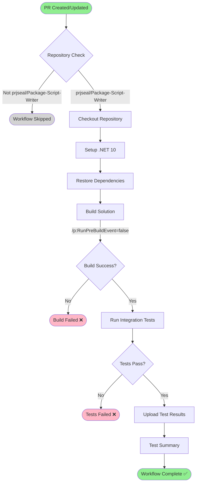
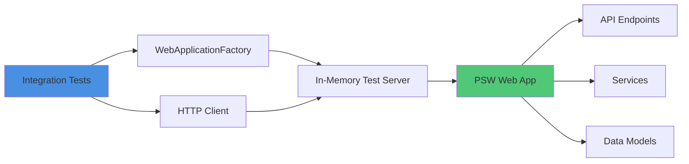

# Website Build and Test Workflow

**Workflow File**: `.github/workflows/website-build-and-test.yml`
**Workflow Name**: `PR - Website - Build and Test`

## Overview

This workflow automatically builds and runs integration tests for the Package Script Writer website whenever a pull request targeting `main` is created or updated. It ensures the website builds correctly and all integration tests pass before code is merged.

## Triggers

### Automatic Triggers
- **Pull Requests**: Runs on pull requests targeting the `main` branch
- **Repository**: Only runs in `prjseal/Package-Script-Writer`

### Manual Triggers
- **workflow_dispatch**: Can be manually triggered via GitHub Actions UI or CLI

```bash
# Via GitHub CLI
gh workflow run website-build-and-test.yml
```

## Workflow Diagram



## Workflow Steps

### 1. Repository Check
```yaml
if: github.repository == 'prjseal/Package-Script-Writer'
```
Ensures the workflow only runs in the main repository, not in forks.

### 2. Checkout Repository
```yaml
- uses: actions/checkout@v4
```
Checks out the repository code for the pull request.

### 3. Setup .NET
```yaml
- uses: actions/setup-dotnet@v4
  with:
    dotnet-version: '10.0.x'
```
Installs .NET 10 SDK required for building and testing the website.

### 4. Restore Dependencies
```bash
dotnet restore ./src/PSW.sln
```
Restores all NuGet package dependencies for the website solution.

### 5. Build Solution
```bash
dotnet build ./src/PSW.sln \
  --configuration Release \
  --no-restore \
  /p:RunPreBuildEvent=false
```

Builds the website solution in Release configuration.

**Note**: `/p:RunPreBuildEvent=false` prevents `dotnet format` from running during CI builds.

### 6. Run Integration Tests
```bash
dotnet test ./src/PSW.IntegrationTests/PSW.IntegrationTests.csproj \
  --configuration Release \
  --no-build \
  --verbosity normal \
  --logger "trx;LogFileName=test-results.trx" \
  --logger "console;verbosity=detailed"
```

Executes all integration tests and generates:
- TRX test result files
- Detailed console output

### 7. Upload Test Results
```yaml
- uses: actions/upload-artifact@v4
  if: always()
  with:
    name: integration-test-results-${{ github.run_number }}
    path: '**/test-results.trx'
```

Uploads test result files as artifacts (runs even if previous steps fail).

### 8. Test Summary
Displays a summary including:
- Workflow name
- Run number
- Branch name
- Actor (who triggered the workflow)

## Test Architecture

The integration tests use:
- **xUnit**: Testing framework
- **WebApplicationFactory**: In-memory test server
- **HTTP Client**: API endpoint testing



## Test Coverage

The integration tests cover:

### API Endpoints
- ✅ Package data retrieval
- ✅ Script generation
- ✅ Request validation
- ✅ Response formats
- ✅ Error handling

### Core Functionality
- ✅ Package script generation logic
- ✅ Umbraco version compatibility
- ✅ Package filtering and selection
- ✅ Output format generation

## Artifacts

| Artifact | Description | Retention |
|----------|-------------|-----------|
| `integration-test-results-{run-number}` | TRX test result files | 90 days (default) |

## Environment

- **Runner**: `ubuntu-latest`
- **Solution**: `./src/PSW.sln`
- **Test Project**: `./src/PSW.IntegrationTests/PSW.IntegrationTests.csproj`
- **Configuration**: Release
- **.NET Version**: 10.0.x

## Permissions

```yaml
permissions:
  contents: read
  pull-requests: read
```

- **contents**: Read repository contents
- **pull-requests**: Read PR metadata

## Success Criteria

✅ **Workflow succeeds when**:
- Repository check passes
- Website builds without errors
- All integration tests pass

❌ **Workflow fails when**:
- Build errors occur
- Any integration test fails
- Dependencies cannot be restored

## Troubleshooting

### Build Failures

**Error**: Build fails with compilation errors

**Solution**:
- Check the build output for specific compilation errors
- Ensure all required dependencies are properly referenced
- Verify .NET version compatibility
- Check for missing files or resources

### Test Failures

**Error**: Integration tests fail

**Common causes**:
1. **API Changes**: Endpoint signatures changed
2. **Service Issues**: Dependency injection configuration errors
3. **Data Issues**: Test data setup problems
4. **Assertion Failures**: Expected vs actual mismatch

**Solutions**:
- Review detailed test output in workflow logs
- Download test result artifacts for analysis
- Run tests locally to reproduce:
  ```bash
  dotnet test ./src/PSW.IntegrationTests/PSW.IntegrationTests.csproj --verbosity detailed
  ```
- Check recent code changes that might affect tests

### Restore Failures

**Error**: NuGet packages fail to restore

**Solution**:
- Check NuGet package sources are accessible
- Verify package versions exist in NuGet.org
- Check for network connectivity issues
- Ensure no private packages require authentication

## Viewing Results

### Via GitHub UI
1. Navigate to the Pull Request
2. Click the **"Checks"** tab
3. Select **"PR - Website - Build and Test"** workflow
4. Expand steps to see detailed logs
5. Click **"Test Summary"** to see test results

### Via GitHub CLI
```bash
# List workflow runs
gh run list --workflow=website-build-and-test.yml

# View specific run
gh run view <run-id>

# View logs
gh run view <run-id> --log

# Download test result artifacts
gh run download <run-id>
```

### Analyzing Test Results

Download and open TRX files:
```bash
# Download artifacts
gh run download <run-id>

# View with Visual Studio, Rider, or convert to HTML
```

## Integration Test Examples

### API Endpoint Test
```csharp
[Fact]
public async Task GetPackages_ReturnsSuccessStatusCode()
{
    // Arrange
    var client = _factory.CreateClient();

    // Act
    var response = await client.GetAsync("/api/packages");

    // Assert
    response.EnsureSuccessStatusCode();
    var content = await response.Content.ReadAsStringAsync();
    Assert.NotEmpty(content);
}
```

### Script Generation Test
```csharp
[Fact]
public async Task GenerateScript_WithValidRequest_ReturnsScript()
{
    // Arrange
    var client = _factory.CreateClient();
    var request = new ScriptRequest
    {
        Packages = new[] { "UmbracoForms" },
        UmbracoVersion = "13.0.0"
    };

    // Act
    var response = await client.PostAsJsonAsync("/api/script/generate", request);

    // Assert
    response.EnsureSuccessStatusCode();
    var script = await response.Content.ReadAsStringAsync();
    Assert.Contains("dotnet add package", script);
}
```

## Performance Considerations

- **Test Execution Time**: Keep total test time under 2 minutes
- **Parallel Execution**: xUnit runs tests in parallel by default
- **In-Memory Server**: Fast startup, no external dependencies
- **Resource Cleanup**: Tests clean up after themselves

## Related Documentation

- [Testing Guide](../testing.md)
- [Development Guide](../development-guide.md)
- [API Reference](../api-reference.md)
- [Architecture](../architecture.md)

## Maintenance

### Adding New Tests

1. Create test in `PSW.IntegrationTests` project
2. Follow existing test patterns
3. Use descriptive test names
4. Ensure tests are independent
5. Tests will automatically run in this workflow

### Updating .NET Version

Update the `dotnet-version` in the Setup .NET step:
```yaml
- uses: actions/setup-dotnet@v4
  with:
    dotnet-version: '11.0.x'  # Update version here
```

### Excluding Flaky Tests

If a test is flaky, fix it rather than skipping:
```csharp
[Fact(Skip = "Flaky - needs investigation")]  // Avoid this
public async Task FlakyTest() { }
```

Better approach:
- Identify root cause of flakiness
- Add proper waits/retries if needed
- Fix race conditions
- Ensure proper test isolation

## Best Practices

- ✅ Run tests locally before pushing
- ✅ Keep tests fast and focused
- ✅ Use meaningful test names
- ✅ Test both success and failure paths
- ✅ Clean up test data
- ✅ Fix failing tests immediately
- ❌ Don't skip failing tests
- ❌ Don't merge PRs with failing checks
- ❌ Don't write interdependent tests
- ❌ Don't test implementation details

## Continuous Improvement

- Monitor test execution times
- Add tests for new features
- Refactor slow tests
- Keep test coverage high
- Review and update test data
- Remove obsolete tests
