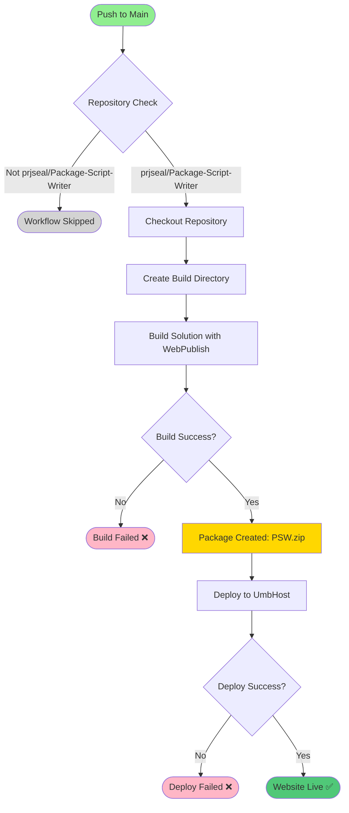
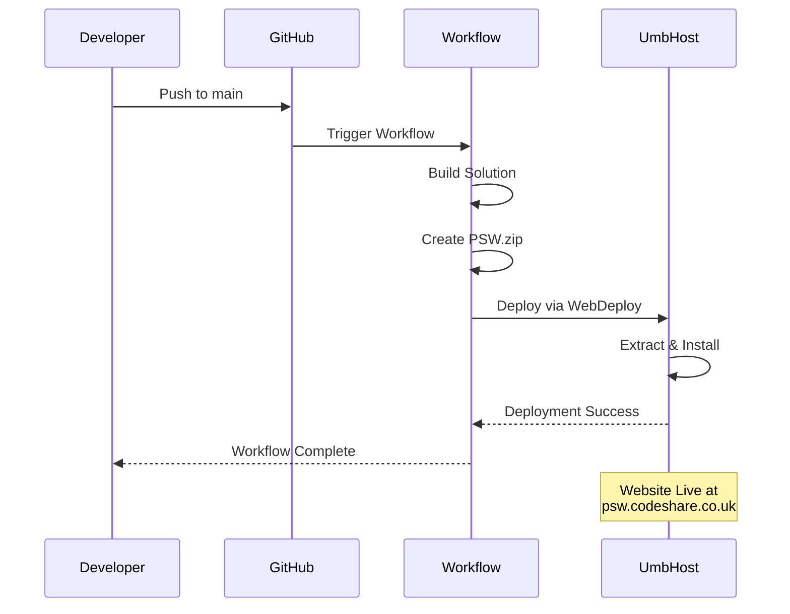

# Website Deploy to UmbHost Workflow

**Workflow File**: `.github/workflows/website-publish.yml`
**Workflow Name**: `PR - Website - Deploy to UmbHost`

## Overview

This workflow automatically builds and deploys the Package Script Writer website to UmbHost whenever code is pushed to the `main` branch. It packages the website into a WebDeploy package and uploads it to the production hosting environment.

**Note**: Despite the workflow name containing "PR", this workflow actually runs on pushes to `main`, not on pull requests. This is the production deployment workflow.

## Triggers

### Automatic Triggers
- **Push to Main**: Runs when code is pushed to the `main` branch
- **Repository**: Only runs in `prjseal/Package-Script-Writer`

### Manual Triggers
- No manual trigger configured

## Workflow Diagram



## Workflow Steps

### 1. Repository Check
```yaml
if: github.repository == 'prjseal/Package-Script-Writer'
```
Ensures the workflow only runs in the main repository, preventing accidental deploys from forks.

### 2. Checkout Repository
```yaml
- uses: actions/checkout@v3.0.0
```
Checks out the repository code from the `main` branch.

### 3. Create Build Directory
```powershell
mkdir _build
```
Creates a directory to store the WebDeploy package output.

### 4. Build Solution with WebPublish
```powershell
dotnet build .\src\${{env.SolutionName}} /nologo /nr:false \
  /p:DeployOnBuild=true \
  /p:DeployDefaultTarget=WebPublish \
  /p:WebPublishMethod=Package \
  /p:PackageAsSingleFile=true \
  /p:DeleteExistingFiles=True \
  /p:SkipInvalidConfigurations=true \
  /p:IncludeSetAclProviderOnDestination=False \
  /p:AutoParameterizationWebConfigConnectionStrings=False \
  /p:platform="${{env.BuildPlatform}}" \
  /p:configuration="${{env.BuildConfiguration}}" \
  /p:PackageLocation="../../_build" \
  /p:RunPreBuildEvent=false
```

**Build Parameters**:
- **DeployOnBuild=true**: Triggers deployment packaging during build
- **WebPublishMethod=Package**: Creates a WebDeploy package
- **PackageAsSingleFile=true**: Creates single .zip file
- **DeleteExistingFiles=True**: Removes old files during deployment
- **PackageLocation**: Output to `_build` directory
- **RunPreBuildEvent=false**: Skips dotnet format during build

**Output**: `_build/PSW.zip` - WebDeploy package ready for deployment

### 5. Deploy to UmbHost
```yaml
- uses: UmbHost/umbhost-web-deploy@v1.0.1
  with:
    website-name: ${{ secrets.WEBSITE_NAME }}
    server-computer-name: ${{ secrets.SERVER_COMPUTER_NAME }}
    server-username: ${{ secrets.USERNAME }}
    server-password: ${{ secrets.PASSWORD }}
    source-path: '_build'
    source-fileName: PSW.zip
```

Uploads and deploys the WebDeploy package to UmbHost using Microsoft Web Deploy (MSDeploy).

## Deployment Flow



## Secrets Required

| Secret | Description | Source |
|--------|-------------|--------|
| `SOLUTION_NAME` | Solution file name (e.g., `PSW.sln`) | Repository configuration |
| `WEBSITE_NAME` | UmbHost website identifier | UmbHost account |
| `SERVER_COMPUTER_NAME` | UmbHost server address | UmbHost account |
| `USERNAME` | Deployment username | UmbHost credentials |
| `PASSWORD` | Deployment password | UmbHost credentials |

### Configuring Secrets

1. Go to repository **Settings** → **Secrets and variables** → **Actions**
2. Click **New repository secret**
3. Add each secret with the corresponding value from UmbHost
4. Click **Add secret**

**Getting UmbHost Credentials**:
1. Log in to your UmbHost account
2. Navigate to your website settings
3. Find WebDeploy/Publishing credentials
4. Copy server name, username, and password

## Environment Variables

```yaml
env:
  SolutionName: ${{ secrets.SOLUTION_NAME }}
  BuildPlatform: Any CPU
  BuildConfiguration: Release
```

- **SolutionName**: Name of the solution file to build
- **BuildPlatform**: Target platform (Any CPU for cross-platform)
- **BuildConfiguration**: Build configuration (Release for production)

## Environment

- **Runner**: `windows-latest`
- **Solution**: Configured via `SOLUTION_NAME` secret
- **Configuration**: Release
- **Build Output**: `./_build/PSW.zip`
- **Deployment Method**: WebDeploy (MSDeploy)

## Permissions

```yaml
permissions:
  contents: read
```

Minimal permissions - only needs to read repository contents.

## Success Criteria

✅ **Workflow succeeds when**:
- Repository check passes
- Solution builds without errors
- WebDeploy package is created
- Deployment to UmbHost succeeds
- Website is live and accessible

❌ **Workflow fails when**:
- Build compilation errors occur
- WebDeploy package creation fails
- UmbHost deployment fails (wrong credentials, network issues)
- Server-side deployment errors

## WebDeploy Package Contents

The `PSW.zip` package includes:
- Compiled website binaries
- Static files (CSS, JavaScript, images)
- Configuration files (appsettings.json, web.config)
- Views and Razor pages
- Dependencies and libraries

**Excluded**:
- Source code files
- Development configuration
- Build artifacts
- Test projects

## Troubleshooting

### Build Failures

**Error**: Solution fails to build

**Solutions**:
- Check build logs for compilation errors
- Verify all dependencies are available
- Ensure solution name in secrets is correct
- Check that code builds locally first

### WebDeploy Package Creation Fails

**Error**: Package not created in `_build` directory

**Solutions**:
- Verify `PackageLocation` path is correct
- Check build output for MSBuild errors
- Ensure sufficient disk space
- Validate WebPublish parameters

### Deployment Failures

**Error**: UmbHost deployment fails

**Common causes**:
1. **Invalid Credentials**: Wrong username or password
2. **Server Name**: Incorrect server-computer-name
3. **Network Issues**: Connection timeout
4. **Permissions**: Insufficient deployment permissions
5. **Server-Side Errors**: Application startup failures

**Solutions**:
- Verify all secrets are correctly configured
- Check UmbHost account status
- Review UmbHost deployment logs
- Test credentials manually with Web Deploy tool
- Contact UmbHost support if server issues

### Post-Deployment Issues

**Error**: Website doesn't work after deployment

**Solutions**:
- Check UmbHost logs for application errors
- Verify database connection strings
- Ensure all required secrets are configured
- Check file permissions on server
- Verify .NET runtime version compatibility

## Monitoring Deployment

### Via GitHub Actions
1. Go to repository **Actions** tab
2. Select latest workflow run
3. View deployment logs
4. Check each step for errors

### Via UmbHost
1. Log in to UmbHost account
2. Check deployment history
3. Review application logs
4. Monitor website health

### Website Verification
After deployment completes:
1. Visit https://psw.codeshare.co.uk
2. Test main functionality
3. Check package generation
4. Verify API endpoints
5. Test CLI tool download

## Deployment Best Practices

### Pre-Deployment Checklist
- ✅ All tests pass in PR
- ✅ Code reviewed and approved
- ✅ Integration tests passing
- ✅ No known bugs in main branch
- ✅ Database migrations applied (if any)

### During Deployment
- ✅ Monitor workflow progress
- ✅ Watch for error messages
- ✅ Keep UmbHost dashboard open
- ✅ Be ready to rollback if needed

### Post-Deployment
- ✅ Verify website is accessible
- ✅ Test core functionality
- ✅ Check application logs for errors
- ✅ Monitor performance
- ✅ Announce deployment if major changes

## Rollback Procedure

If deployment causes issues:

1. **Immediate Fix Available**:
   ```bash
   # Fix the issue
   git commit -m "Fix production issue"
   git push origin main
   # New deployment will trigger automatically
   ```

2. **Revert to Previous Version**:
   ```bash
   # Revert the problematic commit
   git revert <commit-hash>
   git push origin main
   # Deployment triggers with reverted code
   ```

3. **Manual Rollback via UmbHost**:
   - Log in to UmbHost
   - Restore from backup
   - Or redeploy previous package manually

## Related Documentation

- [Website Build and Test Workflow](./website-build-and-test.md)
- [Development Guide](../development-guide.md)
- [Architecture](../architecture.md)
- [Deployment Guide](../deployment.md) _(if exists)_

## Security Considerations

### Secrets Management
- ✅ Never commit secrets to repository
- ✅ Rotate passwords periodically
- ✅ Use strong, unique passwords
- ✅ Limit access to repository secrets
- ✅ Monitor secret usage in logs

### Deployment Security
- ✅ Deploy only from `main` branch
- ✅ Require PR review before merge
- ✅ Run security scans before deployment
- ✅ Keep dependencies updated
- ✅ Monitor for vulnerabilities

## Maintenance

### Updating UmbHost Credentials

If credentials change:
1. Update secrets in GitHub repository settings
2. Test deployment with manual workflow run (if enabled)
3. Or make a small commit to trigger deployment

### Changing Deployment Target

To deploy to a different server:
1. Update `SERVER_COMPUTER_NAME` secret
2. Update `WEBSITE_NAME` secret
3. Update credentials (`USERNAME`, `PASSWORD`)
4. Test with a non-production commit first

### Modifying Build Parameters

To change how the website is built:
1. Edit the `Build Solution` step in the workflow
2. Modify MSBuild parameters as needed
3. Test changes in a separate branch first
4. Document any changes made

## Performance

- **Build Time**: ~2-5 minutes (depending on solution size)
- **Package Size**: ~10-50 MB (varies with dependencies)
- **Deployment Time**: ~1-3 minutes (upload + extraction)
- **Total Duration**: ~3-8 minutes from push to live

## UmbHost Web Deploy Action

This workflow uses the official UmbHost GitHub Action:
- **Action**: `UmbHost/umbhost-web-deploy@v1.0.1`
- **Documentation**: [UmbHost Web Deploy Action](https://github.com/UmbHost/umbhost-web-deploy)
- **Protocol**: Microsoft Web Deploy (MSDeploy)

## Alternative Deployment Methods

If WebDeploy is not available, consider:
- FTP/FTPS deployment
- CI/CD via Azure DevOps
- Docker containerization
- Manual deployment via SSH

## Continuous Improvement

- Monitor deployment success rate
- Track deployment duration trends
- Implement automated smoke tests post-deployment
- Add deployment notifications (Slack, email, etc.)
- Consider blue-green deployments for zero downtime
- Implement deployment approvals for production

## Best Practices

- ✅ Always test changes in PR before merging
- ✅ Deploy during low-traffic periods
- ✅ Monitor website after deployment
- ✅ Keep deployment logs for troubleshooting
- ✅ Have a rollback plan ready
- ❌ Don't deploy untested code
- ❌ Don't ignore deployment warnings
- ❌ Don't deploy during peak hours
- ❌ Don't skip pre-deployment checklist
