# Interactive CLI Mode - Process Flow

This document describes the complete flow of the interactive CLI mode for the Package Script Writer tool.

## Process Flow Diagram

```mermaid
flowchart TD
    Start([Start PSW CLI]) --> ParseArgs[Parse Command Line Arguments]
    ParseArgs --> InitLogging[Initialize Logging & Configuration]
    InitLogging --> CheckFlags{Check Flags}

    CheckFlags -->|--help| ShowHelp[Display Help]
    CheckFlags -->|--version| ShowVersion[Display Version]
    CheckFlags -->|--clear-cache| ClearCache[Clear Cache]
    CheckFlags -->|--update-packages| UpdateCache[Update Package Cache]
    CheckFlags -->|History Command| HistoryWorkflow[Run History Workflow]
    CheckFlags -->|Template Command| TemplateWorkflow[Run Template Workflow]
    CheckFlags -->|CLI Options| CliWorkflow[Run CLI Mode Workflow]
    CheckFlags -->|No Options| InteractiveMode[Enter Interactive Mode]

    ShowHelp --> End([Exit])
    ShowVersion --> End
    ClearCache --> CheckMore{More Flags?}
    UpdateCache --> CheckMore
    CheckMore -->|Yes| CheckFlags
    CheckMore -->|No| End

    HistoryWorkflow --> Success([Complete Successfully])
    TemplateWorkflow --> Success
    CliWorkflow --> Success

    %% Interactive Mode Main Flow
    InteractiveMode --> CtrlCHandler{Ctrl+C Handler Active}
    CtrlCHandler -->|User presses Ctrl+C| Restart[Clear Screen & Restart]
    Restart --> InteractiveMode

    CtrlCHandler -->|Normal Flow| DisplayBanner[Display Welcome Banner]
    DisplayBanner --> CheckUpdates[Check for Tool Updates]
    CheckUpdates --> PopulatePackages[Populate All Packages from API]
    PopulatePackages --> AskDefault{Ask: Generate Default Script?}

    %% Default Script Path
    AskDefault -->|Yes| DefaultPath[Generate Default Script Path]
    DefaultPath --> CreateDefaultModel[Create Default ScriptModel:<br/>- Template: Umbraco.Templates latest<br/>- ProjectName: MyProject<br/>- Solution: MySolution<br/>- StarterKit: clean<br/>- Database: SQLite<br/>- Unattended Install: Yes]
    CreateDefaultModel --> GenerateDefault[Generate Script via API]
    GenerateDefault --> DisplayDefaultScript[Display Generated Script]
    DisplayDefaultScript --> ScriptActions

    %% Custom Flow Path
    AskDefault -->|No| CustomPath[Custom Configuration Flow]

    CustomPath --> Step1[Step 1: Select Template]
    Step1 --> TemplateList[Show Template List:<br/>- Umbraco.Templates<br/>- Umbraco.Community.Templates.Clean<br/>- Umbraco.Community.Templates.UmBootstrap]
    TemplateList --> SelectTemplate[User Selects Template]

    SelectTemplate --> Step2[Step 2: Select Template Version]
    Step2 --> FetchTemplateVersions[Fetch Template Versions from NuGet]
    FetchTemplateVersions --> TemplateVersionList[Show Version Options:<br/>- Latest Stable<br/>- Pre-release<br/>- Specific Versions]
    TemplateVersionList --> SelectTemplateVersion[User Selects Version]

    SelectTemplateVersion --> Step3[Step 3: Select Packages]
    Step3 --> PackageMode{How to Add Packages?}

    PackageMode -->|Select from popular| ShowPopularPackages[Show All Packages from API]
    ShowPopularPackages --> MultiSelect[Multi-Select Packages<br/>Space to toggle, Enter to confirm]
    MultiSelect --> PackagesSelected

    PackageMode -->|Search for package| SearchLoop[Search Loop]
    SearchLoop --> EnterSearchTerm[Enter Search Term]
    EnterSearchTerm --> SearchPackages[Search in Title, PackageId, Authors]
    SearchPackages --> FoundMatches{Matches Found?}

    FoundMatches -->|Yes| ShowMatches[Display Matching Packages]
    ShowMatches --> SelectFromMatches[User Selects Package]
    SelectFromMatches --> AddToSelected[Add to Selected List]

    FoundMatches -->|No| ValidPackageId{Valid NuGet Package ID?}
    ValidPackageId -->|Yes| AskAddAnyway{Add Anyway?}
    AskAddAnyway -->|Yes| AddToSelected
    AskAddAnyway -->|No| AskSearchAgain
    ValidPackageId -->|No| AskSearchAgain{Search Again?}

    AddToSelected --> AskSearchAgain
    AskSearchAgain -->|Yes| SearchLoop
    AskSearchAgain -->|No| PackagesSelected

    PackageMode -->|None - skip| NoPackages[Skip Package Selection]
    NoPackages --> AskGenerateNoPackages{Generate Script?}
    AskGenerateNoPackages -->|Yes| Step5NoPackages[Jump to Step 5]
    AskGenerateNoPackages -->|No| End

    PackagesSelected --> CheckSelectedPackages{Packages Selected?}
    CheckSelectedPackages -->|No Packages| ShowWarning[Show Warning: No Packages]
    ShowWarning --> AskGenerateWarning{Generate Script?}
    AskGenerateWarning -->|Yes| Step5NoPackages
    AskGenerateWarning -->|No| End

    CheckSelectedPackages -->|Has Packages| Step4[Step 4: Select Versions for Each Package]
    Step4 --> VersionLoop[For Each Selected Package]
    VersionLoop --> FetchVersions[Fetch Package Versions from NuGet]
    FetchVersions --> VersionList[Show Version Options:<br/>- Latest Stable<br/>- Pre-release<br/>- Specific Versions]
    VersionList --> SelectVersion[User Selects Version]
    SelectVersion --> NextPackage{More Packages?}
    NextPackage -->|Yes| VersionLoop
    NextPackage -->|No| DisplaySelection[Display Final Selection Summary]

    DisplaySelection --> AskGenerate{Generate Complete Script?}
    AskGenerate -->|No| End
    AskGenerate -->|Yes| Step5[Step 5: Configure Project Options]

    Step5NoPackages --> Step5

    Step5 --> PromptConfig[Prompt for Configuration]
    PromptConfig --> ConfigTemplate[Template & Project Settings:<br/>- Project Name<br/>- Create Solution?<br/>- Solution Name]
    ConfigTemplate --> ConfigStarterKit[Starter Kit Options:<br/>- Include Starter Kit?<br/>- Select Starter Kit<br/>- Select Starter Kit Version]
    ConfigStarterKit --> ConfigDocker[Docker Options:<br/>- Include Dockerfile?<br/>- Include Docker Compose?]
    ConfigDocker --> ConfigUnattended[Unattended Install:<br/>- Use Unattended Install?<br/>- Database Type<br/>- Connection String if needed<br/>- Admin Name/Email/Password]
    ConfigUnattended --> ConfigOutput[Output Format:<br/>- One-liner Output?<br/>- Remove Comments?]

    ConfigOutput --> DisplayConfigSummary[Display Configuration Summary]
    DisplayConfigSummary --> ConfirmGeneration{Confirm Generation?}
    ConfirmGeneration -->|No| CancelGeneration[Cancel Generation]
    CancelGeneration --> End

    ConfirmGeneration -->|Yes| GenerateScript[Generate Script via API]
    GenerateScript --> DisplayScript[Display Generated Script]

    %% Script Actions
    DisplayScript --> ScriptActions{What to do with script?}

    ScriptActions -->|Run| PromptRunDir[Prompt for Directory Path]
    PromptRunDir --> CheckDirExists{Directory Exists?}
    CheckDirExists -->|No| AskCreateDir{Create Directory?}
    AskCreateDir -->|Yes| CreateDir[Create Directory]
    AskCreateDir -->|No| CancelRun[Cancel Execution]
    CreateDir --> RunScript[Execute Script in Directory]
    CheckDirExists -->|Yes| RunScript
    RunScript --> Success
    CancelRun --> End

    ScriptActions -->|Edit| EditConfig[Re-run Configuration with Existing Values as Defaults]
    EditConfig --> Step5

    ScriptActions -->|Copy| CopyToClipboard[Copy Script to Clipboard]
    CopyToClipboard --> AskContinue{Do Something Else?}
    AskContinue -->|Yes| ScriptActions
    AskContinue -->|No| End

    ScriptActions -->|Save| SaveAsTemplate[Save as Template]
    SaveAsTemplate --> PromptTemplateName[Prompt for:<br/>- Template Name<br/>- Description<br/>- Tags]
    PromptTemplateName --> CheckTemplateExists{Template Exists?}
    CheckTemplateExists -->|Yes| AskOverwrite{Overwrite?}
    AskOverwrite -->|No| CancelSave[Cancel Save]
    AskOverwrite -->|Yes| SaveTemplate[Save Template to Disk]
    CheckTemplateExists -->|No| SaveTemplate
    SaveTemplate --> ShowSaveSuccess[Show Success Message]
    ShowSaveSuccess --> AskContinueSave{Do Something Else?}
    AskContinueSave -->|Yes| ScriptActions
    AskContinueSave -->|No| End
    CancelSave --> End

    ScriptActions -->|Start Over| StartOver[Clear and Start Over]
    StartOver --> DisplayBanner

    style Start fill:#90EE90
    style End fill:#FFB6C1
    style Success fill:#90EE90
    style InteractiveMode fill:#87CEEB
    style DefaultPath fill:#FFE4B5
    style CustomPath fill:#FFE4B5
    style ScriptActions fill:#DDA0DD
    style Step1 fill:#F0E68C
    style Step2 fill:#F0E68C
    style Step3 fill:#F0E68C
    style Step4 fill:#F0E68C
    style Step5 fill:#F0E68C
```

## Key Decision Points

### 1. Entry Path Selection
- **Default Script**: Quick path with minimal configuration
- **Custom Flow**: Full configuration with all options

### 2. Package Selection Modes
- **Popular Packages**: Multi-select from full list loaded from API
- **Search**: Interactive search loop with term matching
- **None**: Skip package selection entirely

### 3. Version Selection Options
For both templates and packages:
- **Latest Stable**: Empty string (API default)
- **Pre-release**: `--prerelease` flag
- **Specific Version**: Exact version number

### 4. Post-Generation Actions
- **Run**: Execute script in specified directory
- **Edit**: Re-configure with existing values as defaults
- **Copy**: Copy to clipboard (can chain with other actions)
- **Save**: Save configuration as reusable template
- **Start Over**: Restart entire interactive flow

## Important Flow Characteristics

### Ctrl+C Handling
The entire interactive mode is wrapped in a Ctrl+C handler that:
- Catches `OperationCanceledException`
- Clears the screen
- Restarts the interactive flow from the beginning
- Allows users to quickly restart without exiting

### Async Spinners
Several operations show loading spinners:
- Checking for updates
- Loading all packages from API
- Fetching template versions
- Fetching package versions for each package
- Generating scripts

### Validation Points
- Project names, solution names (non-empty, valid characters)
- Email format for admin user
- Password minimum length (10 characters)
- Directory paths for script execution
- Template names when saving

### Caching
- Package list cached in memory (60 minutes)
- Package versions cached in memory (60 minutes)
- Script generation cache via ApiClient (1 hour TTL, configurable)

## Error Handling

### Non-Fatal Errors (Warnings)
- Failed to load packages → Continue with limited selection
- Failed to fetch versions → Use "Latest Stable" default
- Version check failed → Continue without showing update notice

### Fatal Errors
- Invalid project configuration
- API script generation failure
- Script execution errors

## Notes for Future Modifications

When editing this flow, consider:
1. Step numbering is hard-coded in the UI messages
2. The default script model must match website defaults
3. Package version format: `PackageName|Version` or `PackageName` for latest
4. Starter kit version format: `StarterKitName --version X.Y.Z` or just name
5. Template service saves to `~/.psw/templates/` directory
6. History service saves to `~/.psw/history/` directory
