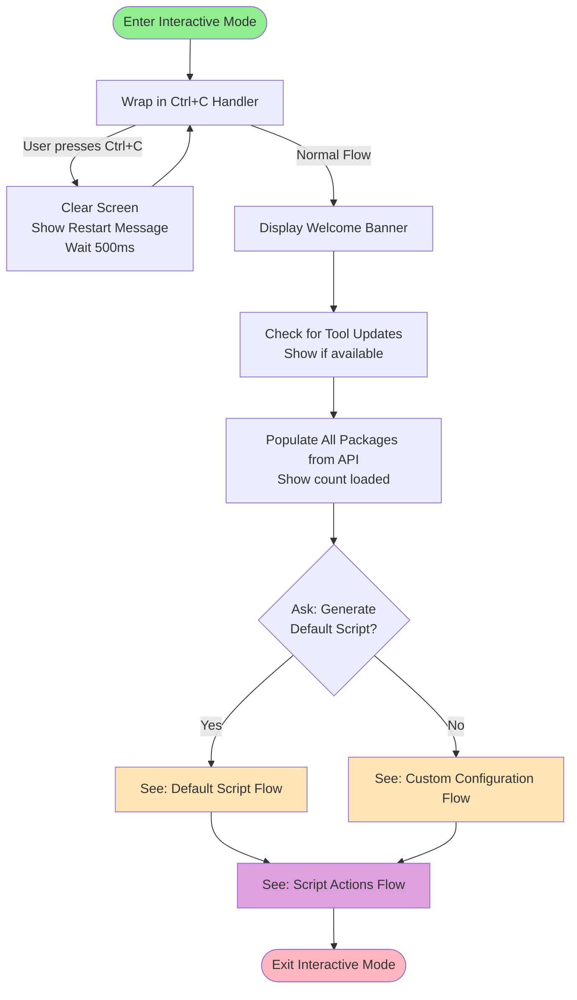

# Interactive CLI Mode - Process Flow

This document describes the complete flow of the interactive CLI mode for the Package Script Writer tool, broken down into separate process diagrams for clarity.

---

## 1. Main Entry Flow

This diagram shows how the CLI starts and determines which workflow to execute.

---

## 2. Interactive Mode - Main Flow

This diagram shows the high-level flow of interactive mode with the two main paths: Default and Custom.

---

## 3. Default Script Flow

This diagram shows the quick path for generating a default script with minimal configuration.

---

## 4. Custom Flow - Steps 1 & 2 (Template Selection)

This diagram shows template and template version selection.

---

## 5. Custom Flow - Step 3 (Package Selection)

This diagram shows the three different modes for selecting packages.

---

## 6. Custom Flow - Step 4 (Version Selection)

This diagram shows version selection for each selected package.

---

## 7. Custom Flow - Step 5 (Project Configuration)

This diagram shows the detailed project configuration prompts.

---

## 8. Script Actions Flow

This diagram shows what happens after a script is generated (applies to both Default and Custom flows).

---

## Summary of Flow Organization

### Flow Progression
1. **Main Entry Flow** → Determines which mode to use
2. **Interactive Mode - Main Flow** → Splits into Default or Custom path
3. **Default Script Flow** → Quick generation → Script Actions
4. **Custom Flow** → Steps 1-5 → Script Actions
   - **Step 1 & 2**: Template Selection
   - **Step 3**: Package Selection (3 modes)
   - **Step 4**: Version Selection for packages
   - **Step 5**: Project Configuration
5. **Script Actions Flow** → Run, Edit, Copy, Save, or Start Over

### Key Features

#### Ctrl+C Restart
- Entire interactive mode wrapped in try-catch for `OperationCanceledException`
- Clears screen, shows restart message, loops back to beginning
- Allows quick restart without exiting the application

#### Async Operations with Spinners
- Checking for updates
- Loading packages from API
- Fetching template versions
- Fetching package versions
- Generating scripts

#### Validation Points
- Project names (non-empty, valid characters)
- Solution names (if creating solution)
- Email format (for admin user)
- Password length (minimum 10 characters)
- Directory paths (for script execution)
- Template names (when saving)
- NuGet package ID format (when manually adding)

#### Caching Strategy
- Package list: 60 minutes in memory cache
- Package versions: 60 minutes in memory cache
- API responses: 1 hour TTL via ApiClient (configurable with `--no-cache`)

#### Error Handling
**Non-Fatal (Warnings):**
- Failed to load packages → Continue with limited selection
- Failed to fetch versions → Default to "Latest Stable"
- Version check failed → Continue without update notice

**Fatal (Exceptions):**
- Invalid project configuration (validation failures)
- API script generation failure
- Script execution errors

---

## Notes for Editing

When modifying these flows, consider:

1. **Step Numbers**: Hard-coded in UI messages - if you change step order, update the strings
2. **Default Values**: Default script model must match website defaults
3. **Package Format**:
   - Latest: `PackageName`
   - Prerelease: `PackageName --prerelease`
   - Specific: `PackageName|Version`
4. **Starter Kit Format**:
   - Latest: `StarterKitName`
   - Specific: `StarterKitName --version X.Y.Z`
5. **Storage Locations**:
   - Templates: `~/.psw/templates/`
   - History: `~/.psw/history/`
6. **Template Version**: Empty string means latest stable, `--prerelease` means latest prerelease

---

## How to Use This Documentation

1. **Review each diagram** to understand the current flow
2. **Identify changes** you want to make to each specific process
3. **Edit the mermaid diagrams** to reflect your desired flow
4. **Update the notes** to document any new behavior or requirements
5. **Share the updated document** for implementation
