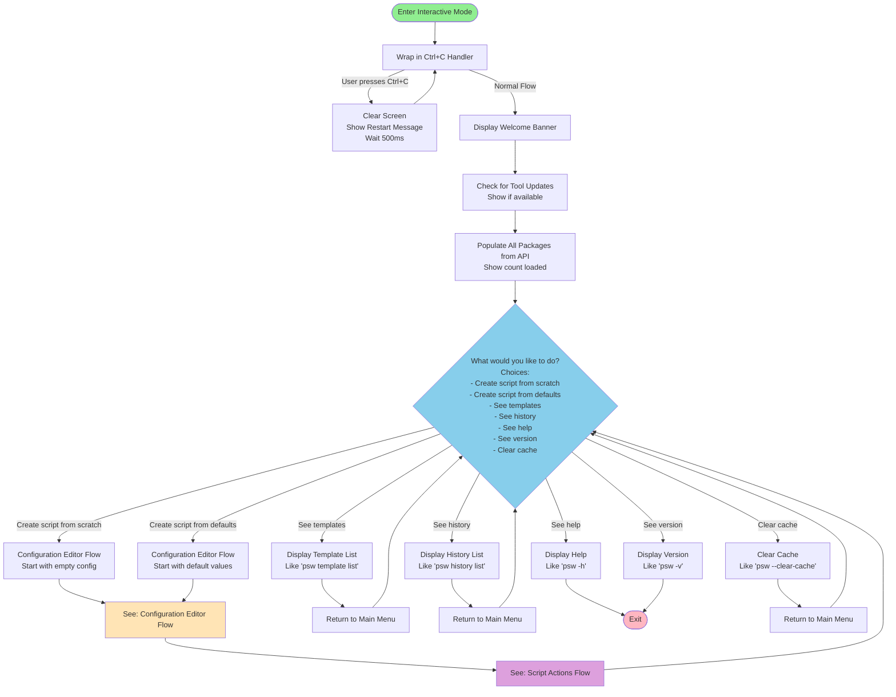
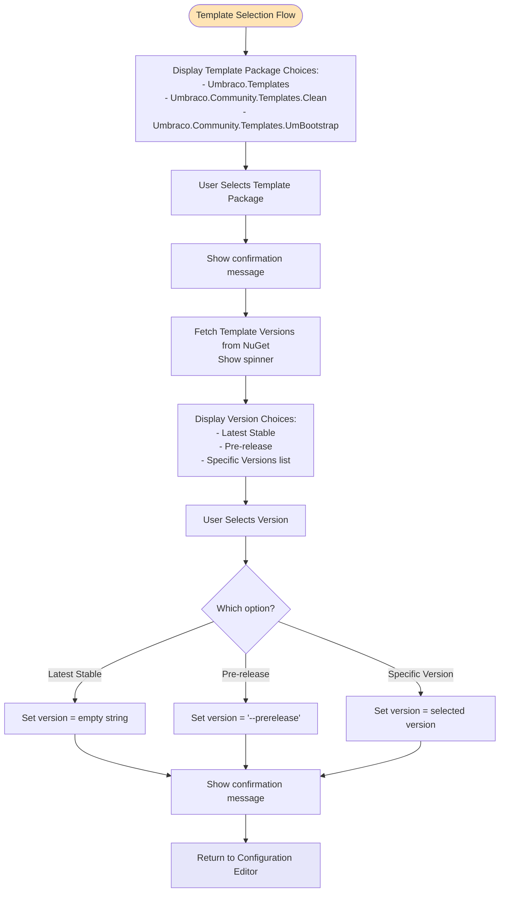
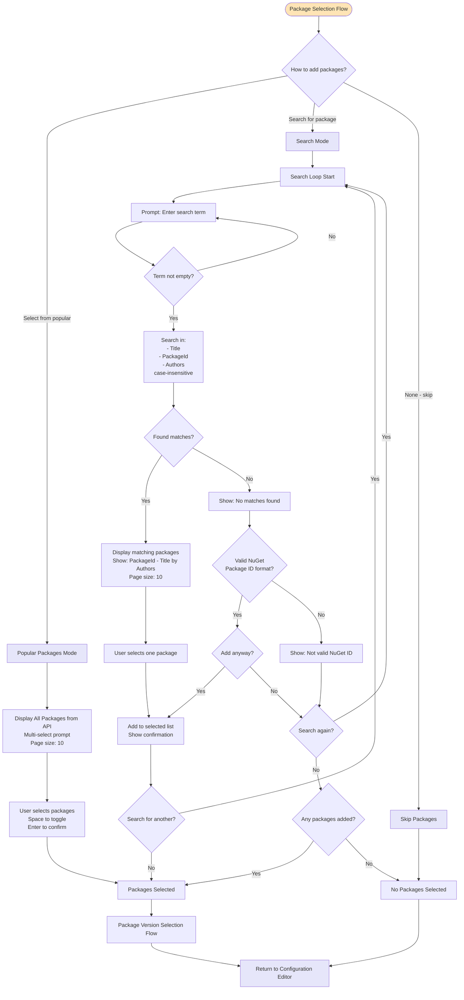
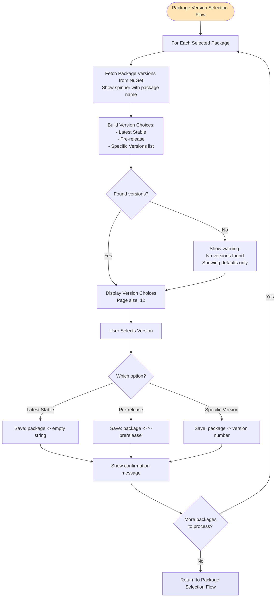
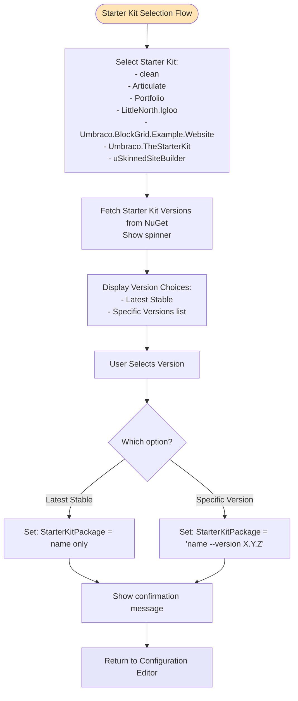
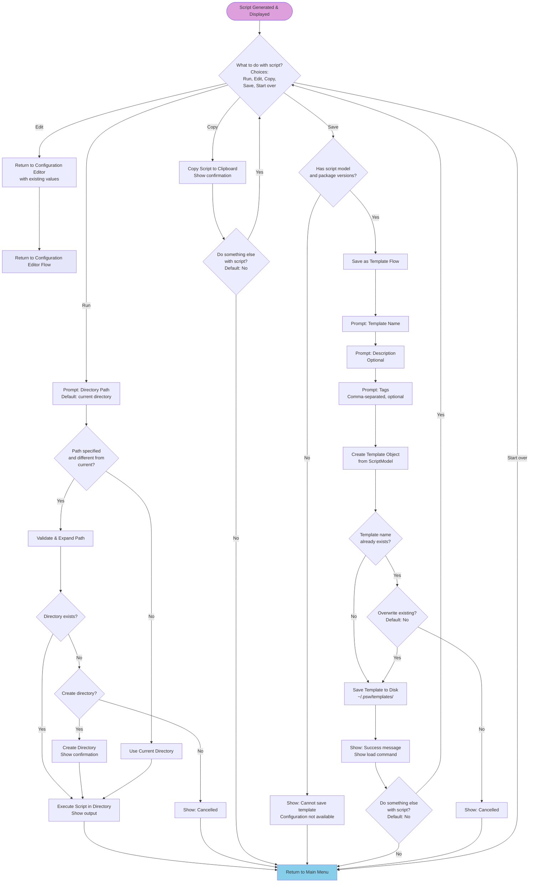

# Interactive CLI Mode - Process Flow

This document describes the complete flow of the interactive CLI mode for the Package Script Writer tool, broken down into separate process diagrams for clarity.

---

## 1. Main Entry Flow

This diagram shows how the CLI starts and determines which workflow to execute.


---

## 2. Interactive Mode - Main Flow

This diagram shows the high-level flow of interactive mode with the main menu offering multiple options.



---

## 3. Configuration Editor Flow

This diagram shows the new configuration editor that allows users to selectively edit only the configuration options they want to change.

```mermaid
flowchart TD
    Start([Configuration Editor Flow]) --> LoadConfig{Starting with<br/>defaults or empty?}

    LoadConfig -->|Empty/Scratch| InitEmpty[Initialize Configuration:<br/>All fields empty/false]
    LoadConfig -->|Defaults| InitDefaults[Initialize Configuration:<br/>Default values as per old flow]

    InitEmpty --> DisplayConfig
    InitDefaults --> DisplayConfig

    DisplayConfig[Display Multi-Select List:<br/>Current configuration.<br/>Please select which options<br/>you would like to edit:<br/><br/>☐ Template (package & version) - value<br/>☐ Project name - value<br/>☐ Include starter kit - value<br/>☐ Packages - value<br/>☐ Include docker file - value<br/>☐ Include docker compose - value<br/>☐ Create a solution file - value<br/>☐ Solution name - value<br/>☐ Starter kit package - value<br/>☐ Use unattended install - value<br/>☐ Database type - value<br/>☐ Connection string - value<br/>☐ User email - value<br/>☐ User password - value<br/>☐ User friendly name - value<br/>☐ One liner output - value<br/>☐ Remove comments - value<br/><br/>No paging, all visible]

    DisplayConfig --> UserSelects[User selects items<br/>Space to toggle<br/>Enter to confirm]

    UserSelects --> ProcessSelected[Process Each Selected Field]

    ProcessSelected --> CheckField{Next field to edit?}

    CheckField -->|Template| TemplateFlow[Template Selection Flow<br/>Select template package name<br/>Select template version]
    CheckField -->|Project name| ProjectInput[Prompt: Project Name<br/>Validated with project name regex]
    CheckField -->|Include starter kit| StarterKitToggle[Toggle: Include starter kit?<br/>true/false]
    CheckField -->|Packages| PackageFlow[Package Selection Flow<br/>Select packages<br/>Select versions]
    CheckField -->|Include docker file| DockerfileToggle[Toggle: Include Dockerfile?<br/>true/false]
    CheckField -->|Include docker compose| DockerComposeToggle[Toggle: Include Docker Compose?<br/>true/false]
    CheckField -->|Create solution file| SolutionToggle[Toggle: Create solution file?<br/>true/false]
    CheckField -->|Solution name| SolutionInput[Prompt: Solution Name<br/>Default: Project name if set<br/>Validated with solution name regex]
    CheckField -->|Starter kit package| StarterKitFlow[Starter Kit Selection Flow<br/>Select starter kit<br/>Select version]
    CheckField -->|Use unattended install| UnattendedToggle[Toggle: Use unattended install?<br/>true/false]
    CheckField -->|Database type| DatabaseSelect[Select Database Type:<br/>- SQLite<br/>- LocalDb<br/>- SQLServer<br/>- SQLAzure<br/>- SQLCE<br/>If SQLServer/SQLAzure selected,<br/>prompt for connection string]
    CheckField -->|Connection string| ConnectionStringInput[Prompt: Connection String<br/>String input<br/>Only needed for SQLServer/SQLAzure]
    CheckField -->|User email| EmailInput[Prompt: User Email<br/>Validate: Email format]
    CheckField -->|User password| PasswordInput[Prompt: User Password<br/>Secret input<br/>Min 10 characters]
    CheckField -->|User friendly name| NameInput[Prompt: User Friendly Name<br/>String input]
    CheckField -->|One liner output| OnelinerToggle[Toggle: One-liner output?<br/>true/false]
    CheckField -->|Remove comments| CommentsToggle[Toggle: Remove comments?<br/>true/false]

    TemplateFlow --> UpdateConfig[Update Configuration Value]
    ProjectInput --> UpdateConfig
    StarterKitToggle --> UpdateConfig
    PackageFlow --> UpdateConfig
    DockerfileToggle --> UpdateConfig
    DockerComposeToggle --> UpdateConfig
    SolutionToggle --> UpdateConfig
    SolutionInput --> UpdateConfig
    StarterKitFlow --> UpdateConfig
    UnattendedToggle --> UpdateConfig
    DatabaseSelect --> UpdateConfig
    ConnectionStringInput --> UpdateConfig
    EmailInput --> UpdateConfig
    PasswordInput --> UpdateConfig
    NameInput --> UpdateConfig
    OnelinerToggle --> UpdateConfig
    CommentsToggle --> UpdateConfig

    UpdateConfig --> MoreFields{More selected<br/>fields to process?}
    MoreFields -->|Yes| CheckField
    MoreFields -->|No| DisplayTable[Display Configuration Table<br/>Show all current values]

    DisplayTable --> AskNext{What would you<br/>like to do now?<br/>Choices:<br/>- Edit configuration<br/>- Generate script}

    AskNext -->|Edit configuration| DisplayConfig
    AskNext -->|Generate script| GenerateScript[Generate Script via API<br/>Show spinner animation]

    GenerateScript --> DisplayScript[Display Generated Script]
    DisplayScript --> NextStep[Continue to Script Actions Flow]

    style Start fill:#FFE4B5
    style DisplayConfig fill:#E6E6FA
    style DisplayTable fill:#98FB98
    style NextStep fill:#DDA0DD
```

---

## 4. Template Selection Flow

This diagram shows template package name and template version selection (called from Configuration Editor).



---

## 5. Package Selection Flow

This diagram shows the three different modes for selecting packages (called from Configuration Editor).



---

## 6. Package Version Selection Flow

This diagram shows version selection for each selected package (called from Package Selection Flow).



---

## 7. Starter Kit Selection Flow

This diagram shows starter kit and version selection (called from Configuration Editor).



---

## 8. Script Actions Flow

This diagram shows what happens after a script is generated. All actions return to the main menu to continue the workflow.



---

## Summary of Flow Organization

### Flow Progression
1. **Main Entry Flow** → Determines which mode to use
2. **Interactive Mode - Main Flow** → Main menu with 7 options:
   - Create script from scratch → Configuration Editor
   - Create script from defaults → Configuration Editor
   - See templates → List templates, return to menu
   - See history → List history, return to menu
   - See help → Show help, return to menu
   - See version → Show version, return to menu
   - Clear cache → Clear cache, return to menu
3. **Configuration Editor Flow** → Multi-select configuration editing
   - Select which fields to edit
   - Edit only selected fields (calls sub-flows as needed)
   - Display configuration table
   - Choice: Edit again or Generate script
4. **Template Selection Flow** → Sub-flow for selecting template and version
5. **Package Selection Flow** → Sub-flow for selecting packages (3 modes)
6. **Package Version Selection Flow** → Sub-flow for selecting versions for each package
7. **Starter Kit Selection Flow** → Sub-flow for selecting starter kit and version
8. **Script Actions Flow** → Run, Edit, Copy, Save, or Start Over

### Key Features

#### NEW: Configuration Editor
- **Multi-select editing**: Choose only the fields you want to configure
- **No paging**: All configuration options visible at once
- **Visual feedback**: Display configuration in a table after editing
- **Iterative editing**: Can edit configuration multiple times before generating
- **Field-specific validation**: Each field has appropriate validation
- **Sub-flows**: Template, Package, and Starter Kit selections integrated
- **Default value support**: Can start with defaults or from scratch

#### Ctrl+C Restart
- Entire interactive mode wrapped in try-catch for `OperationCanceledException`
- Clears screen, shows restart message, loops back to beginning
- Allows quick restart without exiting the application

#### Main Menu Loop
- After viewing templates, history, help, version, or clearing cache
- User returns to main menu to continue with other actions
- Only exits when script generation is complete or user chooses to exit

#### Async Operations with Spinners
- Checking for updates
- Loading packages from API
- Fetching template versions
- Fetching package versions
- Generating scripts

#### Validation Points
- **Project names**: Regex `^[A-Za-z_][A-Za-z0-9_]*(?:\.[A-Za-z_][A-Za-z0-9_]*)*$`
- **Solution names**: Regex `^[^\0\/:*?"<>|]+$`
- **Email format**: Standard email validation (for admin user)
- **Password length**: Minimum 10 characters (secret input)
- **Directory paths**: Valid path format (for script execution)
- **Template names**: Valid name format (when saving)
- **NuGet package ID format**: Standard NuGet ID format (when manually adding)
- **Toggle fields**: Boolean true/false selection
- **Database type**: Pre-defined list selection (SQLite, LocalDb, SQLServer, SQLAzure, SQLCE)

#### Caching Strategy
- Package list: 60 minutes in memory cache
- Package versions: 60 minutes in memory cache
- API responses: 1 hour TTL via ApiClient (configurable with `--no-cache`)

#### Error Handling
**Non-Fatal (Warnings):**
- Failed to load packages → Continue with limited selection
- Failed to fetch versions → Default to "Latest Stable"
- Version check failed → Continue without update notice

**Fatal (Exceptions):**
- Invalid project configuration (validation failures)
- API script generation failure
- Script execution errors

---

## Notes for Editing

When modifying these flows, consider:

1. **Configuration Editor Fields**: The multi-select list shows all 17 configuration options
   - Order matters for user experience
   - Each field has specific input type (string, toggle, sub-flow)
   - Validation happens per field
   - Solution name can be pre-populated from project name if available

2. **Conditional Logic & Field Dependencies**: Important logic to preserve
   - **Database Type → Connection String**:
     - If user selects "Database type" and chooses "SQLServer" or "SQLAzure"
     - MUST also prompt for "Connection string" immediately after
     - Connection string is REQUIRED for SQLServer and SQLAzure
     - Connection string is NOT needed for SQLite, LocalDb, or SQLCE

   - **Use Unattended Install Dependencies**:
     - If "Use unattended install" is FALSE, the following fields are ignored in script generation:
       - Database type
       - Connection string
       - User email
       - User password
       - User friendly name
     - Users can still set these values, but they won't be used in the script
     - If "Use unattended install" is TRUE, all these fields are active and used

   - **Password Field**:
     - MUST be at least 10 characters
     - Input should be masked (secret/password field)
     - Default value: "1234567890"

   - **Solution Name**:
     - If "Create solution file" is FALSE, solution name is ignored
     - If "Create solution file" is TRUE and solution name is empty, use project name
     - Pre-populate with project name if available

3. **Main Menu Options**: 7 options in the main menu
   - Create script from scratch → Empty configuration
   - Create script from defaults → Pre-filled configuration
   - See templates/history/help/version/clear cache → Returns to menu

3. **Default Values** for "Create script from defaults":
   - Template package: Umbraco.Templates
   - Template version: Latest stable
   - Project name: MyProject
   - Create solution: true
   - Solution name: MySolution
   - Include starter kit: true
   - Starter kit package: clean
   - Use unattended install: true
   - Database type: SQLite
   - User email: admin@example.com
   - User password: 1234567890
   - User friendly name: Administrator
   - All other fields: false

4. **Package Format**:
   - Latest: `PackageName`
   - Prerelease: `PackageName --prerelease`
   - Specific: `PackageName|Version`

5. **Starter Kit Format**:
   - Latest: `StarterKitName`
   - Specific: `StarterKitName --version X.Y.Z`

6. **Storage Locations**:
   - Templates: `~/.psw/templates/`
   - History: `~/.psw/history/`

7. **Template Configuration**:
   - **Template Package**: The NuGet package name (optional)
     - Can be set via CLI with `--template-package <name>`
     - If not specified, no template installation command will be generated
     - Interactive mode prompts for selection from available packages
   - **Template Version**: Empty string means latest stable, `--prerelease` means latest prerelease
     - Can be set via CLI with `--template-version <version>`
     - Interactive mode prompts for version selection

8. **Regex Patterns**:
   - Project name: `^[A-Za-z_][A-Za-z0-9_]*(?:\.[A-Za-z_][A-Za-z0-9_]*)*$`
   - Solution name: `^[^\0\/:*?"<>|]+$`

---

## How to Use This Documentation

1. **Review each diagram** to understand the current flow
2. **Identify changes** you want to make to each specific process
3. **Edit the mermaid diagrams** to reflect your desired flow
4. **Update the notes** to document any new behavior or requirements
5. **Share the updated document** for implementation
