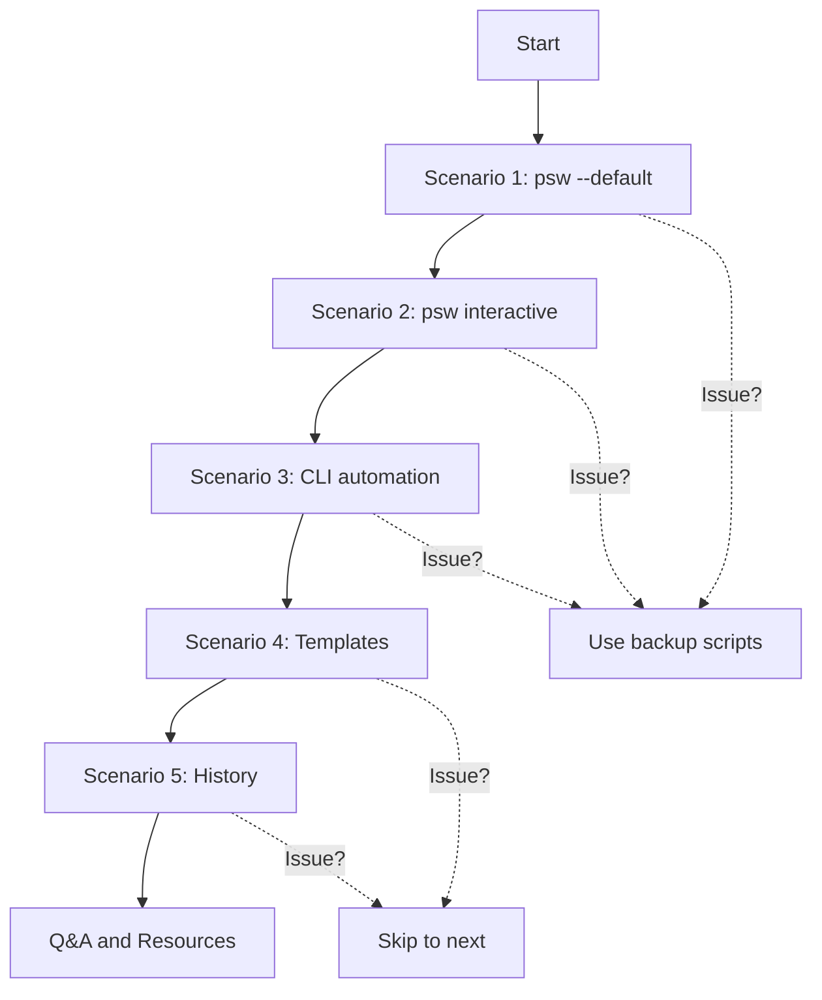

# Package Script Writer CLI - Demo Resources

Complete demo kit for the Umbraco Sydney Meetup presentation.

---

## 📦 What's Included

This demo kit contains everything you need for a compelling CLI tool demonstration:

### 1. **DEMO_SCENARIOS.md** - Complete Demo Guide
   - 5 detailed demo scenarios with full walk-throughs
   - Narrative arc and storytelling suggestions
   - Key talking points for each scenario
   - Timing guidance (10-12 minute total demo)
   - Tips for audience engagement

### 2. **DEMO_CHEAT_SHEET.md** - Quick Reference
   - One-page cheat sheet for during the demo
   - All commands ready to copy-paste
   - Key talking points condensed
   - Emergency backup plan
   - Perfect for printing or second monitor

### 3. **prepare-demo.sh** / **prepare-demo.ps1** - Setup Scripts
   - Automated demo preparation
   - Primes the cache for smooth demo
   - Creates backup scripts
   - Populates sample data
   - Validates system readiness
   - **Run this before your demo!**

### 4. **DEMO_TROUBLESHOOTING.md** - Problem Solving
   - Solutions for common demo issues
   - Quick fixes you can do live
   - Recovery strategies
   - How to handle errors gracefully
   - **Security question handling** - Proactive responses
   - Pre-demo checklist

### 6. **SECURITY_FAQ.md** - Security Reference
   - Comprehensive security Q&A
   - Command validation explained
   - Trust and transparency details
   - Best practices for production use
   - **Print this for reference during Q&A**

### 5. **This File (DEMO_README.md)** - Overview
   - Navigation guide for all demo resources

---

## 🚀 Quick Start - Day Before Demo

### Step 1: Prepare Your System

**macOS/Linux:**
```bash
cd /path/to/Package-Script-Writer
chmod +x prepare-demo.sh
./prepare-demo.sh
```

**Windows:**
```powershell
cd C:\path\to\Package-Script-Writer
.\prepare-demo.ps1
```

This will:
- ✅ Verify PSW CLI is installed
- ✅ Prime the package cache
- ✅ Create demo workspace at `~/psw-demo-sydney/`
- ✅ Generate backup scripts
- ✅ Create sample templates
- ✅ Populate history
- ✅ Test network connectivity
- ✅ Create quick reference files

### Step 2: Review Demo Scenarios

Read through `DEMO_SCENARIOS.md` and choose which scenarios to include:

**Recommended flow (10-12 minutes)**:
1. Quick Win (30s) - `psw --default`
2. Interactive Magic (3-4min) - Full guided workflow
3. Power User (2min) - CLI automation examples
4. Team Templates (2min) - Template system
5. History Replay (1min) - History feature

**Adjust based on your audience**:
- Beginners? Focus on #1-2 (interactive mode)
- Developers? Emphasize #3 (CLI automation)
- Teams? Highlight #4 (templates)
- All audiences? Do all 5!

### Step 3: Print/Prepare Cheat Sheet

**Option A**: Print it
```bash
# macOS
open DEMO_CHEAT_SHEET.md  # Then print from preview

# Linux
libreoffice --headless --convert-to pdf DEMO_CHEAT_SHEET.md
lp DEMO_CHEAT_SHEET.pdf

# Windows
start DEMO_CHEAT_SHEET.md  # Then print from browser/editor
```

**Option B**: Second monitor
- Open `DEMO_CHEAT_SHEET.md` on your laptop screen
- Project main terminal to audience screen

### Step 4: Practice

Run through each scenario once:
```bash
cd ~/psw-demo-sydney

# Test default
psw --default

# Test interactive (Ctrl+C to exit)
psw

# Test CLI mode
psw -p "uSync,Diplo.GodMode" -n TestProject -s TestSolution

# Test templates
psw template list

# Test history
psw history list
```

---

## 🎯 Demo Day - Final Checklist

### 15 Minutes Before

- [ ] Run `prepare-demo.sh` again (fresh cache)
- [ ] Open `DEMO_CHEAT_SHEET.md` for reference
- [ ] Open `DEMO_TROUBLESHOOTING.md` (just in case)
- [ ] **Print or open `SECURITY_FAQ.md` for Q&A reference**
- [ ] Test network: `curl -I https://marketplace.umbraco.com`
- [ ] Navigate to demo workspace: `cd ~/psw-demo-sydney`
- [ ] Clear terminal for clean start: `clear`
- [ ] Adjust terminal size: 120+ columns, 30+ rows
- [ ] Test colors: `psw --version` (should show colors)
- [ ] Open backup browser tabs:
  - https://psw.codeshare.co.uk (web version)
  - https://github.com/prjseal/Package-Script-Writer (repo)
  - https://github.com/prjseal/Package-Script-Writer/blob/main/src/PackageCliTool/Validation/CommandValidator.cs (validator)

### Right Before You Start

- [ ] Close unnecessary applications
- [ ] Silence notifications
- [ ] Connect to power (don't drain battery)
- [ ] Confirm screen is mirroring correctly
- [ ] Test audio/mic if presenting virtually
- [ ] Have water nearby
- [ ] Take a deep breath 😊

---

## 📖 How to Use This Demo Kit

### During the Demo

1. **Follow the flow** in DEMO_SCENARIOS.md
2. **Glance at** DEMO_CHEAT_SHEET.md for commands
3. **If issues arise**, check DEMO_TROUBLESHOOTING.md
4. **Stay calm** - issues make demos more authentic!

### Command Flow



### Backup Plans

**If live demo fails completely**:
1. **Plan A**: Show pre-generated scripts in `~/psw-demo-sydney/`
2. **Plan B**: Switch to web version at https://psw.codeshare.co.uk
3. **Plan C**: Walk through code on GitHub
4. **Plan D**: Show documentation and architecture

---

## 🎨 Customization Tips

### Make It Your Own

These demos are templates - customize them:

**Project Names**: Use names relevant to Sydney
```bash
# Instead of "MyProject"
psw -n UmbracoSydney -s SydneyMeetup

# Or Sydney landmarks
psw -n SydneyHarbour -s OperaHouse
psw -n BondiCMS -s SydneyBeaches
```

**Packages**: Use packages your audience knows
```bash
# Popular in Australia
psw -p "uSync,Umbraco.Forms,Umbraco.Deploy"

# Popular community packages
psw -p "Diplo.GodMode,Umbraco.Community.BlockPreview,Contentment"
```

**Talking Points**: Add your personal experiences
- "I use this every time I start a new client project"
- "This saved me 2 hours last week when onboarding a new dev"
- "Our team has 5 different templates for different project types"

---

## 📊 Demo Scenarios Quick Reference

| # | Name | Time | Focus | Audience |
|---|------|------|-------|----------|
| 1 | Quick Win | 30s | Speed & simplicity | Everyone |
| 2 | Interactive Magic | 3-4min | UI & Features | Beginners |
| 3 | Power User | 2min | Automation & CLI | Developers |
| 4 | Team Templates | 2min | Collaboration | Team leads |
| 5 | History Replay | 1min | Workflow | Everyone |
| Bonus | AI-Assisted Dev | 1-2min | AI Integration | Tech enthusiasts |

**Total**: 10-12 minutes + Q&A (+ optional bonus)

---

## 🎤 Presentation Flow

### Opening (30 seconds)
*"How many of you have forgotten to install your favorite packages until after you'd started coding?"*

### Demo (10-12 minutes)
- Scenario 1: 30-second default script
- Scenario 2: Interactive mode walkthrough
- Scenario 3: CLI automation examples
- Scenario 4: Template system
- Scenario 5: History feature

### Closing (30 seconds)
*"Free, open-source, available now on NuGet. Try it and let me know what you think!"*

### Q&A (5-10 minutes)
Common questions:
- "Does it work with Umbraco 14?" - Yes!
- "Can I customize the scripts?" - Yes, they're just bash/PowerShell!
- "Is it free?" - Yes, MIT licensed!
- "Works offline?" - Yes, after first cache!
- "How to contribute?" - GitHub PRs welcome!

---

## 🌐 Resources to Share

**At the end of your demo, share these**:

### Installation
```bash
dotnet tool install -g PackageScriptWriter.Cli
```

### Links
- **Website**: https://psw.codeshare.co.uk
- **GitHub**: https://github.com/prjseal/Package-Script-Writer
- **NuGet**: https://www.nuget.org/packages/PackageScriptWriter.Cli/
- **Docs**: In the GitHub repo
- **Umbraco AI Skill**: https://github.com/umbraco/Umbraco-CMS-Backoffice-Skills/blob/main/plugins/umbraco-backoffice-skills/skills/package-script-writer/SKILL.md

### Social Media
Prepare a tweet/post for attendees:
```
Just saw an amazing demo of Package Script Writer CLI at #UmbracoSydney!
Generate Umbraco installation scripts in seconds 🚀

Install: dotnet tool install -g PackageScriptWriter.Cli
Try it: https://psw.codeshare.co.uk
⭐ Repo: https://github.com/prjseal/Package-Script-Writer

#Umbraco #DotNet #CLI
```

---

## 🎯 Success Metrics

Your demo is successful if attendees:

- [ ] **Understand** what PSW does (script generation)
- [ ] **See** the value (speed, automation, standardization)
- [ ] **Want to try** it themselves
- [ ] **Remember** the key command (`psw`)
- [ ] **Know where** to find it (NuGet, website)

**Bonus wins**:
- [ ] Someone stars the GitHub repo during the demo
- [ ] Someone asks about contributing
- [ ] Someone wants to share a template
- [ ] Someone mentions a use case you hadn't thought of

---

## 🔗 File Navigation

```
Package-Script-Writer/
├── DEMO_README.md              ← You are here
├── DEMO_SCENARIOS.md           ← Detailed scenarios (includes Scenario 8: Security!)
├── DEMO_CHEAT_SHEET.md         ← Quick reference (includes security quick answers)
├── DEMO_TROUBLESHOOTING.md     ← Problem solving (includes security Q&A handling)
├── SECURITY_FAQ.md             ← Comprehensive security reference
├── AI_INTEGRATION.md           ← AI skill integration guide
├── prepare-demo.sh             ← Setup script (Unix)
└── prepare-demo.ps1            ← Setup script (Windows)
```

---

## 💡 Pro Tips

### Engagement
- **Ask questions** during waits: "Who uses uSync?"
- **Share stories**: "This saved me X hours last week"
- **Be authentic**: "Let's see if this works..." builds tension
- **Show personality**: Your enthusiasm is contagious!

### Technical
- **Use verbose mode** when educational: `PSW_VERBOSE=1 psw`
- **Show the files**: `cat script.sh` or open in editor
- **Explain as you go**: Don't just run commands silently
- **Compare approaches**: "Interactive vs CLI mode"

### Timing
- **Don't rush**: Better to do 3 scenarios well than 5 poorly
- **Watch the clock**: Have a simple watch/timer visible
- **Buffer time**: Leave 5min for Q&A
- **Cut if needed**: Skip history/templates if running long

---

## 🚀 Day-Of Command Reference

Keep these commands handy on demo day:

```bash
# Navigate to demo workspace
cd ~/psw-demo-sydney

# Scenario 1: Quick Win (30s)
psw --default

# Scenario 2: Interactive (3-4min)
psw

# Scenario 3: CLI Examples (2min)
psw -p "uSync|17.0.0,Diplo.GodMode" -n UmbracoSydney -s SydneyMeetup --database-type SQLite
psw --template "Bootstrap Starter Kit" -p "uSync" -n ClientSite --auto-run

# Scenario 4: Templates (2min)
psw template list
psw template load DemoTeamStandard -n NewProject

# Scenario 5: History (1min)
psw history list
psw history show 1
psw history rerun 1

# Bonus: Versions
psw versions

# Emergency: Show backup
cat backup-default-script.sh
cat backup-full-script.sh
```

---

## 📞 Support

If you have questions about these demo materials:

- **GitHub Issues**: https://github.com/prjseal/Package-Script-Writer/issues
- **Discussions**: https://github.com/prjseal/Package-Script-Writer/discussions

---

## ✅ Final Pre-Demo Checklist

**24 Hours Before**:
- [ ] Run `prepare-demo.sh`
- [ ] Practice full demo once
- [ ] Test all commands
- [ ] Prepare backup materials

**1 Hour Before**:
- [ ] Run `prepare-demo.sh` again
- [ ] Test network connection
- [ ] Open reference materials
- [ ] Clear terminal
- [ ] Adjust terminal size
- [ ] Test screen mirroring

**Right Before**:
- [ ] Deep breath
- [ ] Silence notifications
- [ ] Water nearby
- [ ] Backup tabs open
- [ ] Ready to go!

---

## 🎊 Post-Demo

After your demo:

1. **Gather feedback**: Ask attendees what resonated
2. **Share resources**: Post links in chat/email
3. **Follow up**: Answer questions in Discussions
4. **Improve**: Note what worked/didn't for next time
5. **Celebrate**: You did it! 🎉

---

## ⚠️ CRITICAL: Proactive Security Discussion

**IMPORTANT: Address security BEFORE questions arise!**

After Scenario 1 or 2 (around minute 3-4), take 60-90 seconds to address security:

### The Script (What to Say)

> *"Before we go further - I know some of you might be thinking 'auto-run sounds risky.' Let me show you why it's actually safe..."*

### The Demo (What to Show)

```bash
# 1. Generate WITHOUT auto-run (15 sec)
psw -d -n SecurityDemo -s SecurityDemo -u \
    --database-type SQLite \
    --admin-email admin@demo.com \
    --admin-password Demo123! \
    -o script.sh

# 2. Show the script (20 sec)
cat script.sh | head -30
# Point out: "See? Just standard dotnet commands"

# 3. Mention alternatives (10 sec)
"You can use --copy to review yourself, or -o to save and edit"

# 4. Show the validator (20 sec)
"Plus there's strict validation - here's the code..."
# Open: https://github.com/prjseal/Package-Script-Writer/blob/main/src/PackageCliTool/Validation/CommandValidator.cs
```

### Why This Matters

✅ **Builds trust** before skepticism sets in
✅ **Shows you've thought** about their concerns
✅ **Turns objection into** selling point
✅ **Reduces Q&A friction** later
✅ **Demonstrates transparency** and confidence

### Resources to Have Ready

- [ ] **SECURITY_FAQ.md** - printed or on second screen
- [ ] **GitHub tab** - CommandValidator.cs already open
- [ ] **Example script** - already generated to show
- [ ] **Confidence** - practice this section!

---

**Good luck with your Umbraco Sydney Meetup demo! 🚀**

*Remember: Your enthusiasm and knowledge are more important than a perfect demo. Address security proactively and have fun with it!*

---

## 📝 Notes Space

Use this area for demo-specific notes:

**Attendee Count**: _____

**Key Questions Asked**:
-
-
-

**Security Concerns Raised**:
-
-
-

**What Resonated Most**:
-
-
-

**What To Improve**:
-
-
-

**Follow-Up Items**:
-
-
-
