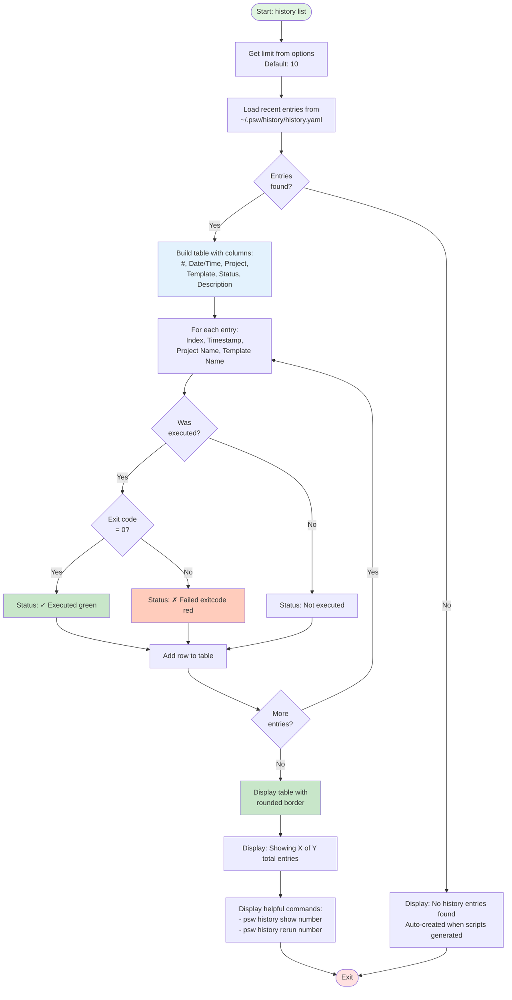
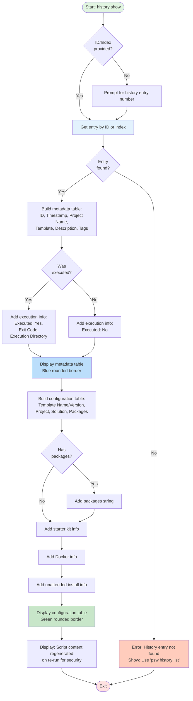
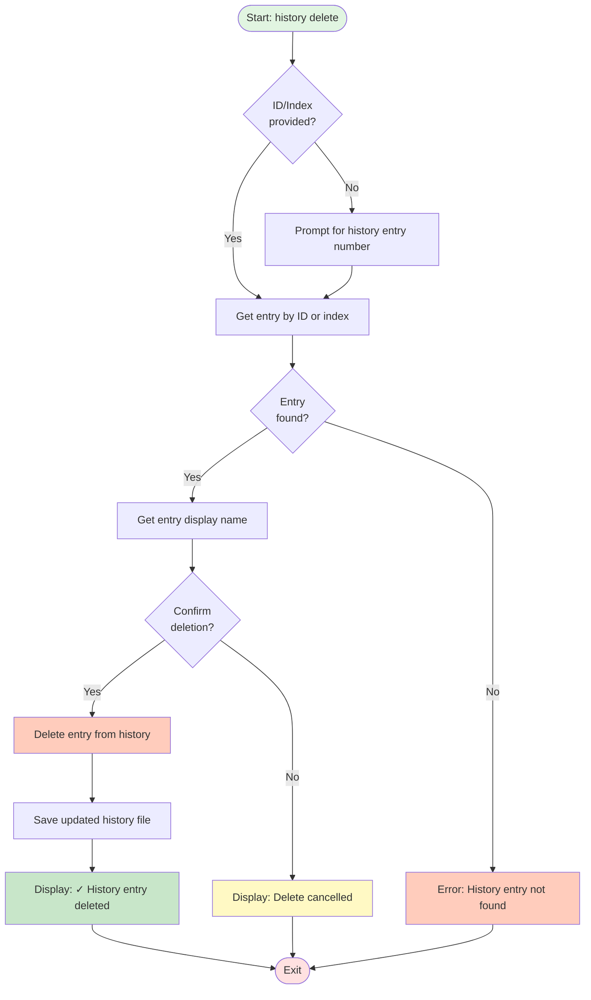
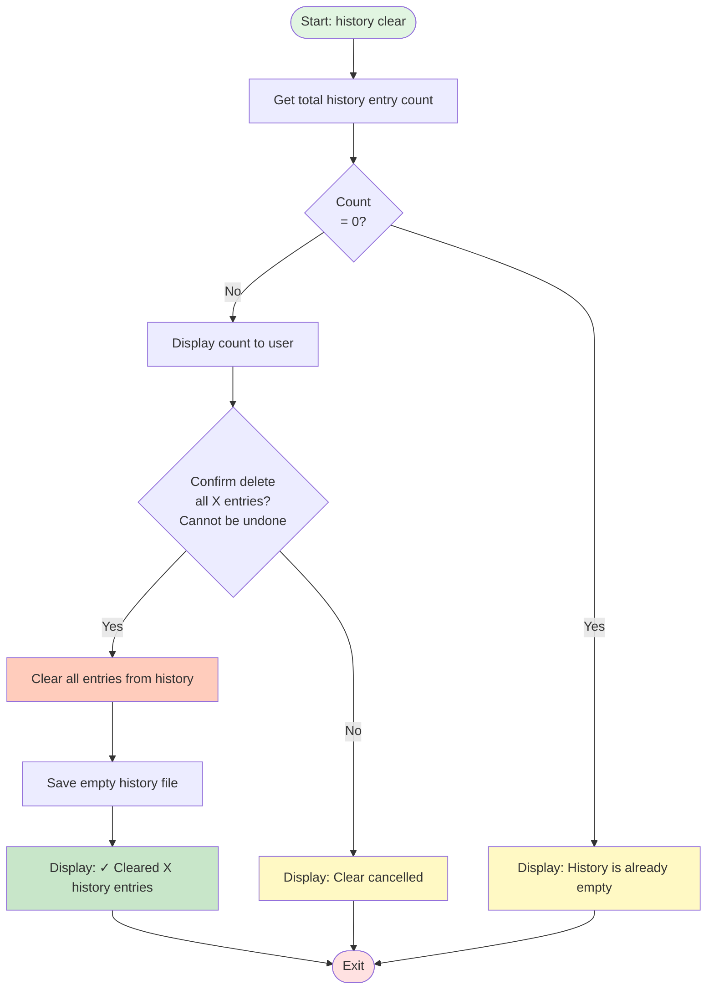
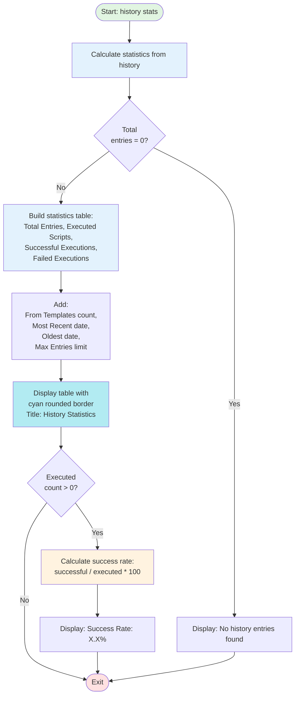
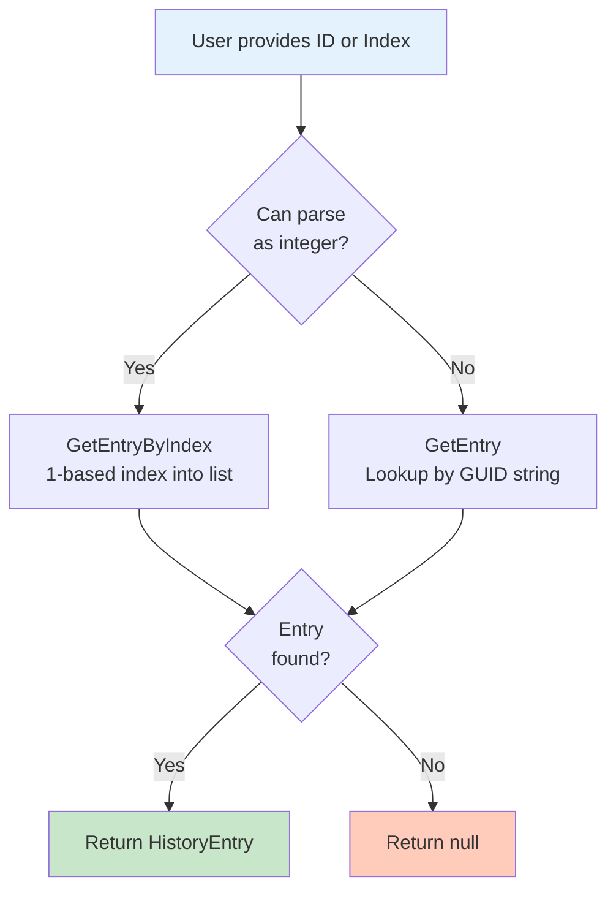
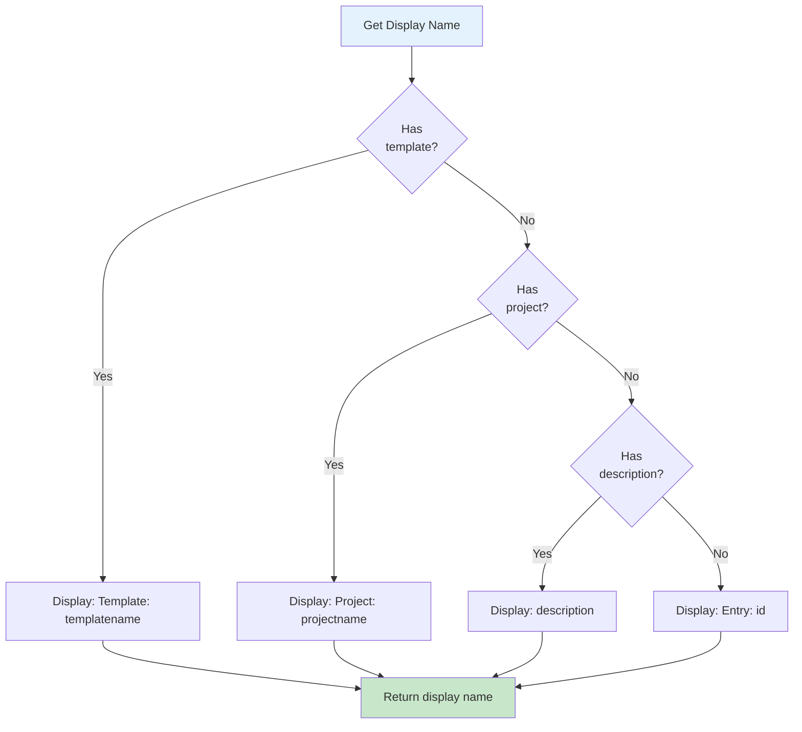
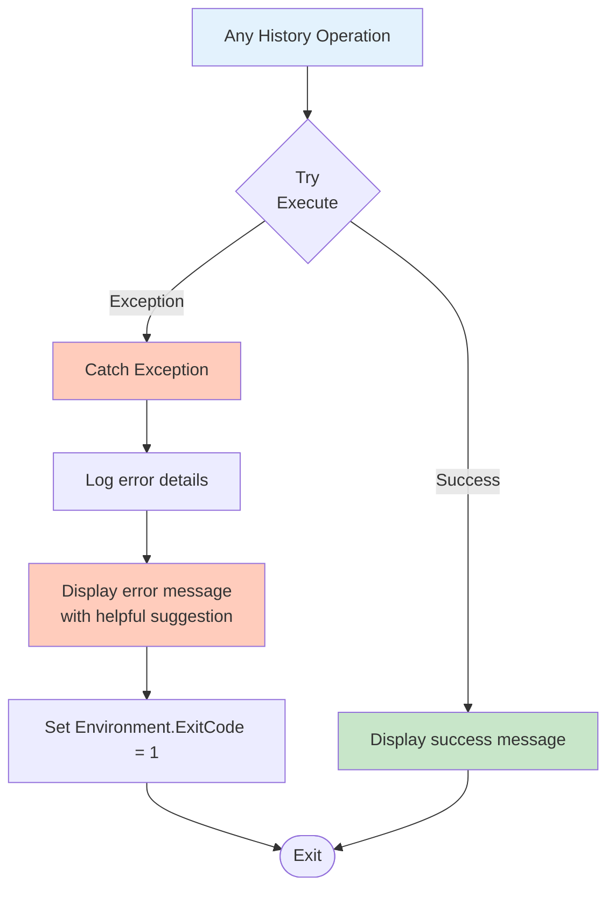
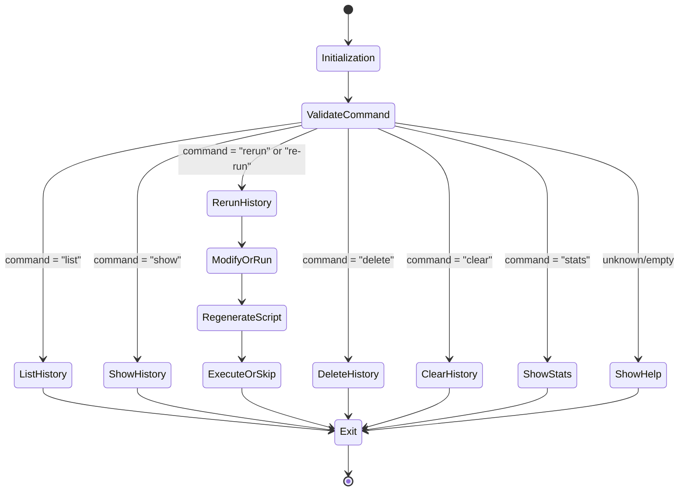

# History Commands - Process Flow Diagrams

This document contains detailed process flow diagrams for all `psw history` commands using Mermaid flowcharts.

## Table of Contents
- [History List](#history-list)
- [History Show](#history-show)
- [History Rerun](#history-rerun)
- [History Delete](#history-delete)
- [History Clear](#history-clear)
- [History Stats](#history-stats)

---

## History List

**Command**: `psw history list [--limit <number>]`

**Purpose**: Lists recent history entries in table format.

**File Reference**: `src/PackageCliTool/Workflows/HistoryWorkflow.cs:95-143`



**Key States**:
1. `Initialization` → Get limit parameter
2. `LoadEntries` → Read from history file
3. `CheckEmpty` → Validate count
4. `BuildTable` → Format entries
5. `DisplayTable` → Show output
6. `Exit`

---

## History Show

**Command**: `psw history show <id>`

**Purpose**: Displays detailed metadata and configuration of a specific history entry.

**File Reference**: `src/PackageCliTool/Workflows/HistoryWorkflow.cs:148-224`



**Key States**:
1. `Initialization` → Check if ID provided
2. `GetEntry` → Retrieve from history
3. `ValidateExists` → Check entry found
4. `DisplayMetadata` → Show entry information
5. `DisplayConfiguration` → Show script settings
6. `Exit`

---

## History Rerun

**Command**: `psw history rerun <id>` or `psw history re-run <id>`

**Purpose**: Re-runs a script from history with optional modifications.

**File Reference**: `src/PackageCliTool/Workflows/HistoryWorkflow.cs:229-352`

```mermaid
flowchart TD
    Start([Start: history rerun]) --> CheckId{ID/Index<br/>provided?}
    CheckId -->|No| PromptId[Prompt for history entry number]
    CheckId -->|Yes| GetEntry[Get entry by ID or index]
    PromptId --> GetEntry

    GetEntry --> EntryExists{Entry<br/>found?}

    EntryExists -->|No| NotFound[Error: History entry not found<br/>Use 'psw history list']
    EntryExists -->|Yes| ShowInfo[Display: Re-running entry<br/>Show original timestamp]

    ShowInfo --> DisplayCurrentConfig[Display current configuration table]
    DisplayCurrentConfig --> PromptAction{User<br/>choice?}

    PromptAction -->|Run same config| UseOriginal[Use original ScriptModel]
    PromptAction -->|Modify first| ModifyConfig[Interactive modification workflow]
    PromptAction -->|Cancel| CancelRerun[Display: Re-run cancelled]

    ModifyConfig --> PromptFields[Prompt for changes:<br/>Project Name, Template Version,<br/>Packages, Solution, Starter Kit,<br/>Database settings]
    PromptFields --> UpdateModel[Update ScriptModel with changes]
    UpdateModel --> ShowUpdated[Display: ✓ Configuration updated]
    ShowUpdated --> Regenerate

    UseOriginal --> Regenerate[Regenerate script<br/>ScriptGeneratorService]

    Regenerate --> ShowRegenerated[Display: ✓ Script regenerated]
    ShowRegenerated --> DisplayScript[Display regenerated script<br/>in panel with rounded border]

    DisplayScript --> ConfirmExecute{Execute<br/>script?}

    ConfirmExecute -->|No| End([Exit])
    ConfirmExecute -->|Yes| PromptDir[Prompt for run directory<br/>Blank = current directory]

    PromptDir --> DirProvided{Directory<br/>specified?}
    DirProvided -->|No| UseCurrent[Use current directory]
    DirProvided -->|Yes| ExpandPath[Expand to full path]

    UseCurrent --> ExecuteScript
    ExpandPath --> DirExists{Directory<br/>exists?}

    DirExists -->|Yes| ExecuteScript[Execute script in directory]
    DirExists -->|No| ConfirmCreate{Confirm<br/>create?}

    ConfirmCreate -->|No| CancelExec[Display: Execution cancelled]
    ConfirmCreate -->|Yes| CreateDir[Create directory]
    CreateDir --> ShowCreated[Display: ✓ Created directory]
    ShowCreated --> ExecuteScript

    ExecuteScript --> AddNewEntry[Add new history entry:<br/>"Re-run of: originalname"]
    AddNewEntry --> UpdateExec[Update execution info:<br/>Directory, Exit code 0]

    UpdateExec --> End
    CancelRerun --> End
    CancelExec --> End
    NotFound --> End

    style Start fill:#e1f5e1
    style End fill:#ffe1e1
    style GetEntry fill:#e3f2fd
    style Regenerate fill:#fff3e0
    style ExecuteScript fill:#c8e6c9
    style ModifyConfig fill:#e1bee7
    style NotFound fill:#ffccbc
    style CancelRerun fill:#fff9c4
```

**Key States**:
1. `Initialization` → Check if ID provided
2. `GetEntry` → Retrieve from history
3. `DisplayConfig` → Show current settings
4. `AskAction` → Run same, modify, or cancel
5. `ModifyOrRun` → Optional interactive modification
6. `RegenerateScript` → Create fresh script
7. `ExecuteOrCancel` → Optional execution
8. `UpdateHistory` → Save new entry
9. `Exit`

**Modification Workflow** (when user chooses "Modify first"):

```mermaid
flowchart TD
    StartMod([Start Modification]) --> ShowTitle[Display: Modify Configuration<br/>Press Enter to keep current]

    ShowTitle --> PromptProject[Prompt: Project Name]
    PromptProject --> ChangeTemplate{Change<br/>template?}

    ChangeTemplate -->|Yes| PromptVersion[Prompt: Template Version]
    ChangeTemplate -->|No| ChangePackages
    PromptVersion --> ChangePackages{Change<br/>packages?}

    ChangePackages -->|Yes| PromptPackages[Prompt: Packages comma-separated]
    ChangePackages -->|No| ChangeSolution
    PromptPackages --> ChangeSolution{Change<br/>solution?}

    ChangeSolution -->|Yes| PromptSolutionFile[Prompt: Create solution file?]
    ChangeSolution -->|No| ChangeStarterKit
    PromptSolutionFile --> ConfirmSolution{Create<br/>solution?}

    ConfirmSolution -->|Yes| PromptSolutionName[Prompt: Solution Name]
    ConfirmSolution -->|No| ChangeStarterKit
    PromptSolutionName --> ChangeStarterKit{Change<br/>starter kit?}

    ChangeStarterKit -->|Yes| PromptStarterKit[Prompt: Include starter kit?]
    ChangeStarterKit -->|No| CheckUnattended
    PromptStarterKit --> ConfirmStarterKit{Include<br/>starter kit?}

    ConfirmStarterKit -->|Yes| PromptKitPackage[Prompt: Starter Kit Package]
    ConfirmStarterKit -->|No| CheckUnattended
    PromptKitPackage --> CheckUnattended{Unattended<br/>enabled?}

    CheckUnattended -->|No| ReturnModel
    CheckUnattended -->|Yes| ChangeDatabase{Change<br/>database?}

    ChangeDatabase -->|Yes| SelectDbType[Select database type:<br/>SQLite, LocalDb, SQLServer,<br/>SQLAzure, SQLCE]
    ChangeDatabase -->|No| ReturnModel

    SelectDbType --> NeedsConnStr{Needs<br/>connection<br/>string?}
    NeedsConnStr -->|Yes| PromptConnStr[Prompt: Connection string]
    NeedsConnStr -->|No| ReturnModel
    PromptConnStr --> ReturnModel[Return modified ScriptModel]

    ReturnModel --> EndMod([End Modification])

    style StartMod fill:#e1f5e1
    style EndMod fill:#ffe1e1
    style ReturnModel fill:#c8e6c9
    style SelectDbType fill:#e1bee7
```



---

## History Delete

**Command**: `psw history delete <id>`

**Purpose**: Deletes a specific history entry after confirmation.

**File Reference**: `src/PackageCliTool/Workflows/HistoryWorkflow.cs:357-386`



**Key States**:
1. `Initialization` → Check if ID provided
2. `GetEntry` → Retrieve from history
3. `ValidateExists` → Check entry found
4. `PromptConfirmation` → Ask user to confirm
5. `DeleteFromStorage` → Remove entry
6. `SaveHistory` → Persist changes
7. `Exit`

---

## History Clear

**Command**: `psw history clear`

**Purpose**: Clears all history entries after confirmation.

**File Reference**: `src/PackageCliTool/Workflows/HistoryWorkflow.cs:391-413`



**Key States**:
1. `Initialization`
2. `GetCount` → Check total entries
3. `CheckEmpty` → Handle empty history
4. `PromptConfirmation` → Ask for confirmation
5. `DeleteAllEntries` → Clear history
6. `SaveHistory` → Persist changes
7. `Exit`

---

## History Stats

**Command**: `psw history stats`

**Purpose**: Displays comprehensive statistics about command history.

**File Reference**: `src/PackageCliTool/Workflows/HistoryWorkflow.cs:418-455`



**Key States**:
1. `Initialization`
2. `CalculateStats` → Compute metrics
3. `CheckEmpty` → Handle no entries
4. `DisplayStatistics` → Show table
5. `CalculateSuccessRate` → Optional rate calculation
6. `Exit`

**Statistics Calculated**:
- Total Entries
- Executed Scripts count
- Successful Executions (exit code 0)
- Failed Executions (exit code != 0)
- From Templates count
- Most Recent date/time
- Oldest date/time
- Max Entries (configuration limit)
- Success Rate percentage (if any executed)

---

## Common Workflow Elements

### Entry Identification

All history commands support both ID and index-based lookup:



### History Entry Display Name



### Error Handling

All history commands include error handling:



---

## State Transition Summary

### History Command Router



---

## History Storage Details

### File Structure

**History Storage**: `~/.psw/history/history.yaml`

**YAML Format**:
```yaml
maxEntries: 100
entries:
  - id: "guid-string"
    timestamp: "2024-01-15T10:30:00Z"
    scriptModel:
      projectName: "MyProject"
      templateName: "Umbraco.Templates"
      templateVersion: "17.0.0"
      # ... all ScriptModel properties
    templateName: "my-template"
    description: "From template: my-template"
    tags: ["tag1", "tag2"]
    wasExecuted: true
    executionDirectory: "/path/to/dir"
    exitCode: 0
```

### Automatic History Creation

History entries are automatically created when:
- Generating scripts in interactive mode
- Loading templates with `template load`
- Running scripts in CLI mode
- Re-running history entries

### Entry Pruning

The history automatically maintains a maximum of 100 entries (configurable). Oldest entries are removed when the limit is exceeded.

---

## Source Files

**Workflow Orchestration**: `src/PackageCliTool/Workflows/HistoryWorkflow.cs`

**Service Layer**: `src/PackageCliTool/Services/HistoryService.cs`

**Models**:
- `src/PackageCliTool/Models/History/HistoryEntry.cs` - Entry model
- `src/PackageCliTool/Models/History/ScriptHistory.cs` - History collection
- `src/PackageCliTool/Services/HistoryService.cs:245-267` - HistoryStats class

**UI Display**: `src/PackageCliTool/UI/ConsoleDisplay.cs` - Display methods

---

## Notes

1. All history operations use YAML serialization/deserialization
2. History is stored in a single `history.yaml` file in the user's home directory
3. Entries can be referenced by 1-based index (1, 2, 3...) or by GUID
4. Scripts are **not stored** in history - only the `ScriptModel` configuration
5. Scripts are regenerated on `rerun` for security reasons
6. History automatically tracks execution status, exit codes, and directories
7. Maximum 100 entries by default (oldest entries auto-pruned)
8. Success rate calculation only shown if there are executed scripts
9. Entry display names prioritize: Template name > Project name > Description > Entry ID
10. All timestamps are stored in UTC and displayed in local time

---

## Command Examples

```bash
# List recent history
psw history list
psw history list --limit 20

# Show specific entry
psw history show 1
psw history show a3b4c5d6-e7f8-9012-3456-789012345678

# Re-run from history
psw history rerun 1
psw history re-run 5

# Delete entry
psw history delete 3

# Clear all history
psw history clear

# View statistics
psw history stats
```

---

## Integration Points

### With Template Commands
- `template load` creates history entries
- History entries remember which template was used
- Can re-run template-based entries with modifications

### With CLI Mode
- CLI script generation creates history entries
- `--auto-run` flag execution updates history with results
- History tracks all CLI-generated scripts

### With Interactive Mode
- Interactive script generation creates history entries
- Manual execution updates history entry with results
- Full ScriptModel saved for future re-runs
